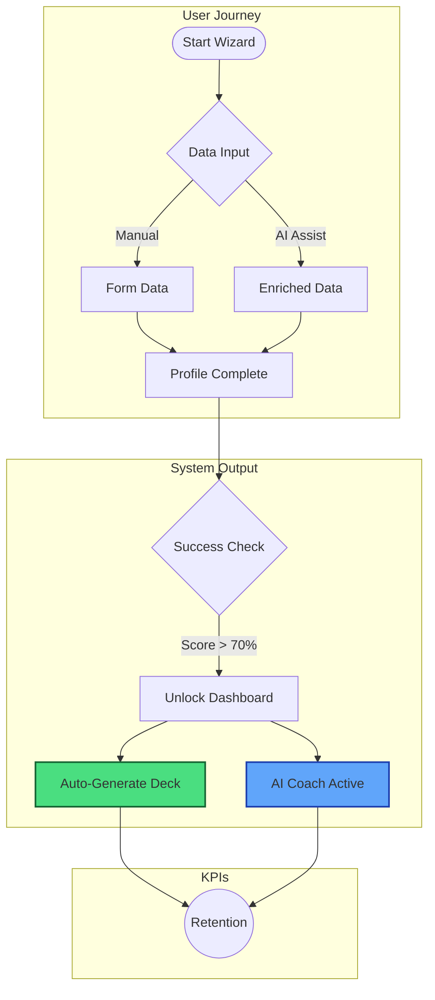

# Startup Wizard & AI Core Implementation Plan

**Version:** 1.0 | **Status:** Implementation Phase

## 📋 Overview
This document outlines the systematic implementation of the **Startup Wizard**, a core "P0" onboarding flow. This wizard serves as the primary data ingestion engine, capturing the founder's vision and using Gemini AI to auto-generate the initial business chassis (Decks, Models, Strategy).

---

## 🚀 Step-by-Step Implementation Prompts

### 1. Setup and Validate Initial Data Structure
**Objective:** Define the schema for persistence and security.
*   **Prompt:** "Create a database schema for storing startup profiles. Include tables for startups, founders, competitors, metrics snapshots, and AI coach insights. Ensure data persistence and implement granular Row-Level Security (RLS) for user isolation."
*   **Validation:** Verify schema via TypeScript interfaces in `types.ts` and mock data in `data/mockDatabase.ts`.

### 2. Profile Wizard Implementation
**Objective:** Create the user interface for data collection.
*   **Prompt:** "Develop a 9-step profile wizard interface with inputs for startup name, tagline, stage, problem, solution, business model, traction metrics, team, funding goals, and profile review. Ensure data flows to the database after user completion."
*   **Validation:** React `Wizard` component with step-state management.

### 3. AI Enrichment of Startup Profile
**Objective:** Use Gemini to reduce user friction.
*   **Prompt:** "Integrate Gemini 3 AI to auto-analyze startup descriptions (via URL context) and enrich the profile with a professional tagline, description, and mission. Incorporate AI insights for problem/solution refinement."
*   **Validation:** "Magic Wand" button in UI that populates fields.

### 4. Dashboard Display and Real-Time Data Binding
**Objective:** Visualizing the captured data.
*   **Prompt:** "Develop a dashboard interface that displays startup data, including KPIs like MRR, runway, and growth metrics. Ensure dynamic binding to the Supabase database and real-time updates based on user actions."
*   **Validation:** Dashboard KPI cards reflect Wizard inputs.

### 5. AI Coach Integration in Dashboard
**Objective:** Active feedback loop.
*   **Prompt:** "Integrate AI Coach insights into the dashboard. Use Gemini 3 to provide personalized recommendations, detect risks, and offer next steps based on the startup’s progress. Display insights and actions in a sidebar."
*   **Validation:** Dynamic "AI Recommendations" list on Dashboard.

### 6. Profile Strength and Completion Feedback
**Objective:** Gamification of onboarding.
*   **Prompt:** "Implement a profile strength score on the dashboard based on user input. Display a progress bar showing the completion level and guide users on improving their profile by adding missing information."
*   **Validation:** Circular progress indicator with "Next Best Action".

### 7. AI-Generated Pitch Deck and Document Tools
**Objective:** Deliver value immediately.
*   **Prompt:** "Enable AI generation of pitch decks from the user’s startup profile. Allow users to select content sections (Problem, Solution, Business Model, etc.) and have Gemini 3 auto-generate slide content."
*   **Validation:** "Generate Deck" button works in Documents module.

### 8. Final Testing and Validation
**Objective:** E2E Reliability.
*   **Prompt:** "Test the full profile wizard and dashboard to ensure smooth flow from user input to data storage, real-time updates, and AI-powered suggestions. Validate all data with edge cases."
*   **Validation:** User can complete flow from Signup -> Wizard -> Dashboard -> Generated Deck.

### 9. Production Readiness
**Objective:** Scale and Security.
*   **Prompt:** "Ensure all components are production-ready by validating security, performance, and scalability. Follow best practices for data security (RLS, encryption) and UI responsiveness."
*   **Validation:** Lighthouse score > 90, Mobile responsive check.

---

## 🏆 Success Criteria Diagrams

---

## 📊 Feature Task Matrix

| Feature / Step | Status | % Complete | Working? | Notes |
| :--- | :---: | :---: | :---: | :--- |
| **1. Data Schema** | 🟢 Completed | 100% | Yes | Interfaces in `types.ts`, Mock Data in `data/mockDatabase.ts`. |
| **2. Profile Wizard UI** | 🔴 Todo | 0% | No | Needs new `/onboarding` route & component. |
| **3. AI Enrichment** | 🔴 Todo | 0% | No | Needs Gemini API integration hook. |
| **4. Dashboard Binding** | 🟡 In Progress | 60% | Partial | UI exists, currently uses Mock Data. |
| **5. AI Coach** | 🟡 In Progress | 40% | Partial | Static UI in Dashboard, needs logic. |
| **6. Profile Score** | 🔴 Todo | 0% | No | Visual logic needed on Dashboard. |
| **7. Pitch Deck Gen** | 🟡 In Progress | 30% | Partial | Templates exist in Documents module. |
| **8. E2E Testing** | 🔴 Todo | 0% | No | Pending feature completion. |
| **9. Prod Readiness** | 🔴 Todo | 0% | No | Performance tuning needed. |

### Legend
*   🟢 **Completed**: Fully functional and polished.
*   🟡 **In Progress**: UI exists or partial logic implemented.
*   🔴 **Todo**: Not started or only conceptual.
