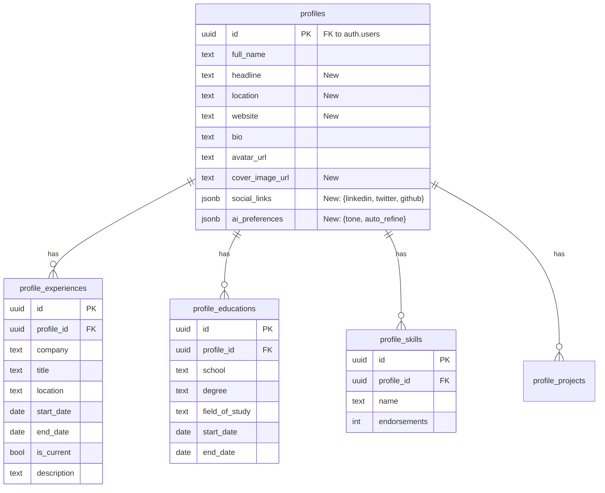

# 👤 **My Profile Screen (LinkedIn-Style) — Master Plan**

**Version:** 1.3 | **Status:** 🏗️ In Progress  
**Owner:** Product Engineering Team  

---

## 📊 **Progress Tracker**

**Overall Completion:** 50% (Components Implemented)

| Phase | Status | Progress | Notes |
|-------|--------|----------|-------|
| **0. Infrastructure** | 🟢 Done | 100% | Route, Sidebar Link, Type defs added |
| **1. Structure & Wireframe** | 🟢 Done | 100% | Structural layout & skeleton components implemented |
| **2. Layout & Responsive** | 🟢 Done | 100% | Responsive Grid, Sticky Header/Sidebar implemented |
| **3. Component Architecture** | 🟢 Done | 100% | React Components created (Header, About, Exp, Skills, Sidebar) |
| **4. Content & Microcopy** | 🟡 In Progress | 80% | Labels and basic copy added to components |
| **5. Visual Design** | 🟡 In Progress | 80% | Tailwind styling applied, refinement needed |
| **6. Interactions & State** | 🟡 In Progress | 50% | Local states for editing added; animations pending |
| **7. Schema & SQL** | 🔴 Todo | 0% | Supabase migrations & RLS |
| **8. Backend Integration** | 🔴 Todo | 0% | Edge Functions (AI/LinkedIn) |
| **9. Frontend Integration** | 🔴 Todo | 0% | Data binding & mutations |

---

## 🧩 **Architecture Diagrams**

### **1. Component Hierarchy**

```mermaid
graph TD
    Page[Page: /profile] --> Layout[ProfileLayout]
    
    Layout --> ColLeft[Left Column (Main)]
    Layout --> ColRight[Right Column (Sidebar)]
    
    ColLeft --> Header[ProfileHeader]
    ColLeft --> About[AboutSection]
    ColLeft --> Exp[ExperienceSection]
    ColLeft --> Edu[EducationSection]
    ColLeft --> Skills[SkillsSection]
    ColLeft --> Projects[ProjectsSection]
    
    Header --> Avatar[AvatarUpload]
    Header --> Cover[CoverImage]
    Header --> HeaderInfo[EditableInfo]
    Header --> Actions[ActionButtons]
    
    Exp --> ExpList[ExperienceList]
    ExpItem --> EditModal[EditModal]
    
    ColRight --> Socials[SocialLinksCard]
    ColRight --> Contact[ContactInfoCard]
    ColRight --> AI[AIPreferencesCard]
    ColRight --> Security[SecuritySettings]
```

### **2. Entity Relationship Diagram (ERD)**


