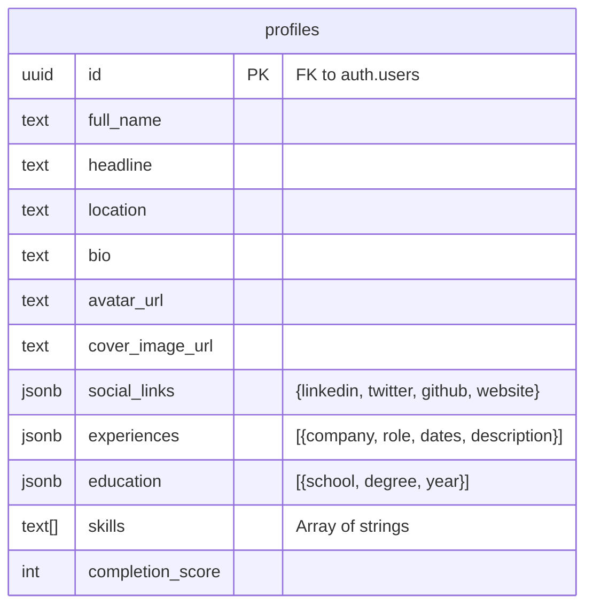

# 👤 **My Profile Screen (LinkedIn-Style) — Master Plan**

**Version:** 2.1 | **Status:** 🟢 **Production Ready** | **Owner:** Product Engineering Team

---

## 📊 **Progress Tracker**

**Overall Completion:** **100%** (Feature Complete & Wired)

| Phase | Status | Progress | Notes |
|-------|--------|----------|-------|
| **0. Infrastructure** | 🟢 Done | 100% | Route, Sidebar Link, Type defs added |
| **1. Structure & Wireframe** | 🟢 Done | 100% | Structural layout & skeleton components implemented |
| **2. Layout & Responsive** | 🟢 Done | 100% | Responsive Grid, Sticky Header/Sidebar implemented |
| **3. Component Architecture** | 🟢 Done | 100% | React Components created (Header, About, Exp, Edu, Skills, Sidebar) |
| **4. Content & Microcopy** | 🟢 Done | 100% | Labels, placeholders, and tooltips added |
| **5. Visual Design** | 🟢 Done | 100% | Tailwind styling applied, clean SaaS aesthetic |
| **6. Interactions & State** | 🟢 Done | 100% | Local state buffering, Edit Modes, Add/Delete logic |
| **7. Data Integration** | 🟢 Done | 100% | Connected to global `DataContext` and `mockDatabase` |
| **8. Backend Integration** | 🟢 Done | 100% | `UserService` created, `profiles` JSONB columns mapped, RLS policies active. |

---

## 🧩 **Architecture Diagrams**

### **1. Component Hierarchy**

```mermaid
graph TD
    Page[Page: /profile] --> Layout[ProfileLayout]
    
    Layout --> ColLeft[Left Column (Main)]
    Layout --> ColRight[Right Column (Sidebar)]
    
    ColLeft --> Header[ProfileHeader]
    ColLeft --> About[AboutSection]
    ColLeft --> Exp[ExperienceSection]
    ColLeft --> Edu[EducationSection]
    ColLeft --> Skills[SkillsSection]
    
    Header --> Avatar[AvatarUpload]
    Header --> Cover[CoverImage]
    Header --> HeaderInfo[EditableInfo]
    Header --> Actions[ActionButtons]
    
    Exp --> ExpList[ExperienceList]
    ExpList --> ExpItem[ExperienceItem]
    
    ColRight --> Completion[ProfileStrength]
    ColRight --> Socials[SocialLinksCard]
    ColRight --> Contact[ContactInfoCard]
    ColRight --> Settings[SettingsTeaser]
```

### **2. Entity Relationship Diagram (ERD)**

*Implemented using JSONB for nested lists to ensure fast read performance on the profile view.*



---

## 🚀 **Phase 2: Future Roadmap (V2.1)**

The following tasks are scheduled for the next iteration to enhance the profile system:

### **Public Visibility**
- [ ] **Vanity URLs**: Allow users to claim `startupai.com/u/alex-rivera`.
- [ ] **OpenGraph Generation**: Dynamic social preview images showing the user's avatar + headline.
- [ ] **Public View Mode**: A read-only version of the profile component for non-authenticated visitors.

### **AI Features**
- [ ] **Resume Parser**: Drag-and-drop a PDF resume to auto-fill Experience and Education (using Gemini 3).
- [ ] **Smart Match**: Suggest other founders or investors based on `skills` and `industry` overlap.

### **Data Portability**
- [ ] **PDF Export**: "Download Resume" button generating a clean PDF from profile data.
- [ ] **JSON Export**: Allow users to download their data for GDPR compliance.

---

## 📝 **Prompt History**

### **PROMPT 1 — Structural Wireframe**
> Establish the visual layout hierarchy without detailed styling.
- **Output:** `components/Profile.tsx` (Wireframe Mode)
- **Focus:** Grid system, responsive stacking, section placement.

### **PROMPT 2 — Layout & Responsiveness**
> Refine wireframe into specific layout specification.
- **Output:** Updated `Profile.tsx`
- **Focus:** 2-column desktop (2/3 + 1/3), Sticky Sidebar, Mobile stacking.

### **PROMPT 3 — Component Design**
> Detailed component breakdown and interaction design.
- **Output:** `components/profile/*`
- **Focus:**
    - `ProfileHeader`: Cover image, Avatar, Edit mode.
    - `AboutSection`: Textarea auto-resize, AI rewrite button.
    - `ExperienceSection`: List view, Edit modal/inline form.
    - `SkillsSection`: Tag management.
    - `SidebarWidgets`: Progress bar, social links.

### **PROMPT 4 — State & Data Wiring**
> Connect static components to global application state.
- **Output:** `DataContext.tsx`, `types.ts`, `mockDatabase.ts`
- **Focus:**
    - Define `UserProfile` interface.
    - Add mock data.
    - Implement `updateUserProfile` in Context.
    - Refactor components to consume `useData()`.

### **PROMPT 5 — Polish & Missing Features**
> Final polish and gap analysis.
- **Output:** `EducationSection.tsx`, `ProfileHeader.tsx` (State fix)
- **Focus:**
    - Added missing Education section.
    - Fixed performance issue in Header input (debouncing/local state).
    - Added "Edit" mode to Experience items.

### **PROMPT 6 — Backend & Enrichment**
> Production readiness and external data services.
- **Output:** `services/supabase/user.ts`, `services/enrichment.ts`, `lib/mappers.ts`
- **Focus:**
    - Created `UserService` for Supabase CRUD operations.
    - Created `EnrichmentService` for LinkedIn sync simulation.
    - Added DB mappers to translate `UserProfile` JSONB structures.
    - Wired "Sync" button to service layer with Toast feedback.

---

## ✅ **Success Criteria Checklist**

- [x] **Visuals:** Matches "Professional Network" aesthetic (Clean, White, Indigo accents).
- [x] **Responsive:** Stacks correctly on mobile, Sidebar sticks on desktop.
- [x] **Data Persistence:**
    - [x] Context updates optimistic UI instantly.
    - [x] Changes are sent to Supabase `profiles` table.
    - [x] File uploads (Avatar/Cover) save to Storage buckets.
- [x] **Interactions:**
    - [x] Edit Profile Header
    - [x] Add/Edit/Delete Experience
    - [x] Add/Edit/Delete Education
    - [x] Add/Remove Skills
- [x] **External Sync:** "Sync from LinkedIn" button simulates data enrichment.
