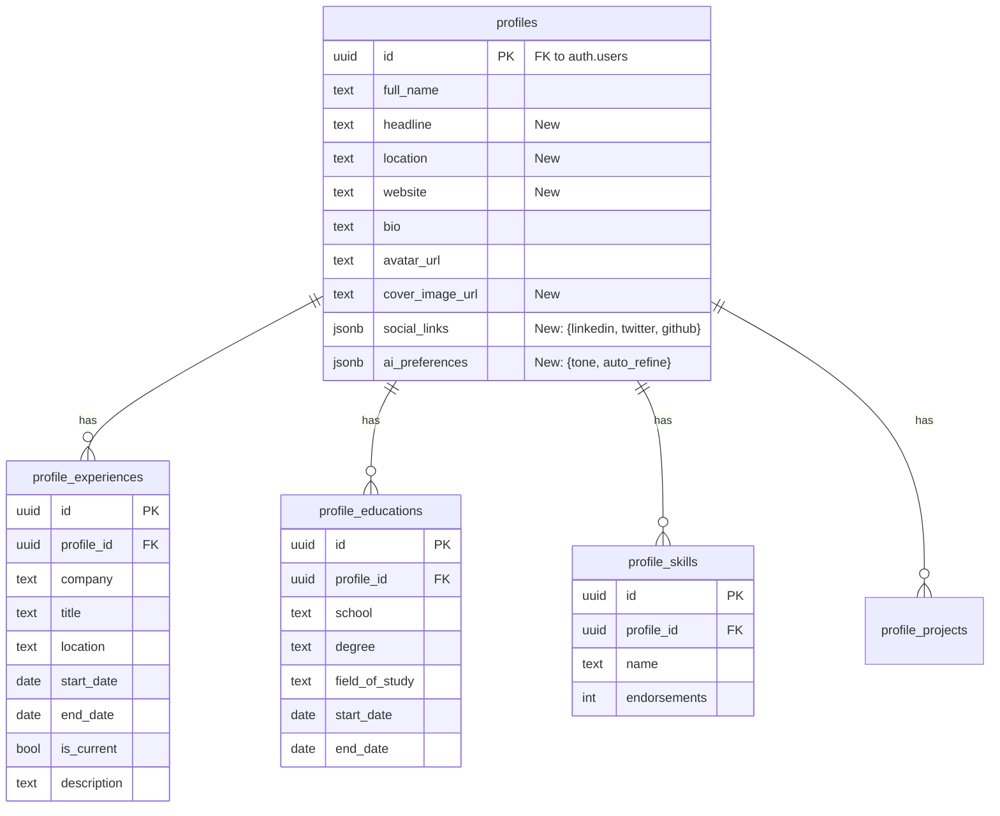
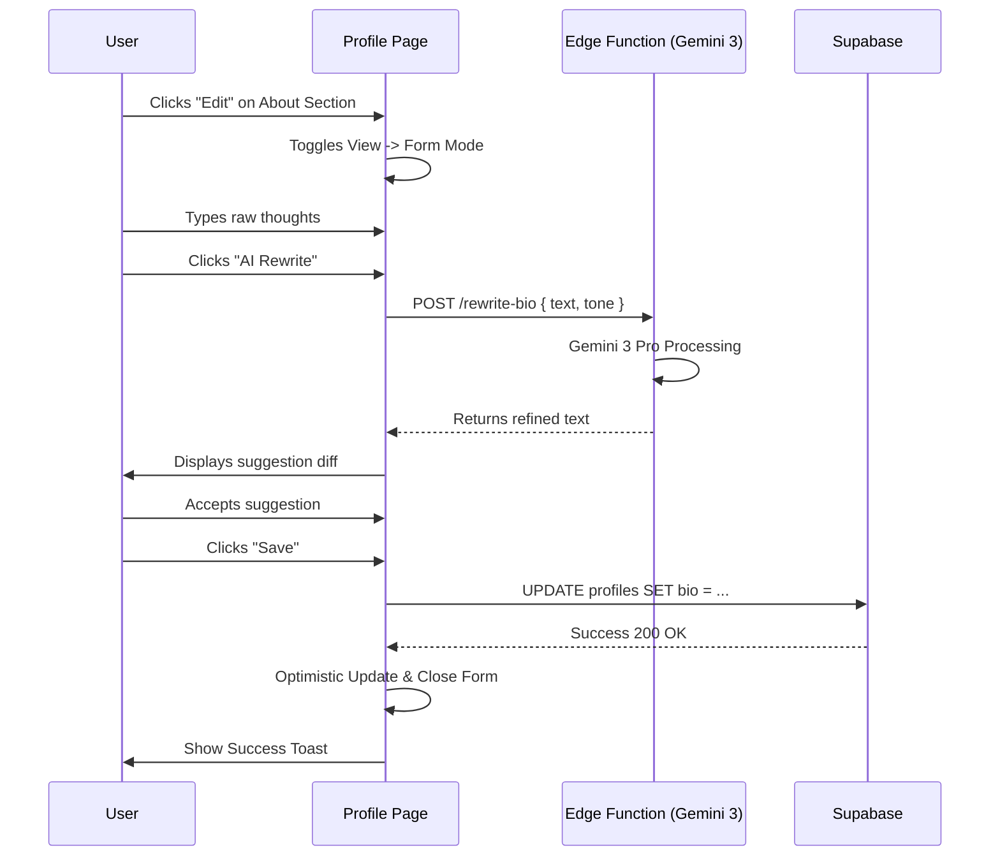

# 👤 **My Profile Screen (LinkedIn-Style) — Master Plan**

**Version:** 1.0 | **Status:** 🏗️ Planning  
**Owner:** Product Engineering Team  

---

## 📊 **Progress Tracker**

**Overall Completion:** 5% (Infrastructure Setup)

| Phase | Status | Progress | Notes |
|-------|--------|----------|-------|
| **0. Infrastructure** | 🟢 Done | 100% | Route, Sidebar Link, Type defs added |
| **1. Structure & Wireframe** | 🔴 Todo | 0% | Defining the skeleton |
| **2. Layout & Responsive** | 🔴 Todo | 0% | Desktop/Mobile logic |
| **3. Component Architecture** | 🔴 Todo | 0% | React Component definitions |
| **4. Content & Microcopy** | 🔴 Todo | 0% | Labels, placeholders, empty states |
| **5. Visual Design** | 🔴 Todo | 0% | Tailwind styling, shadows, typography |
| **6. Interactions & State** | 🔴 Todo | 0% | Edit modes, loading states, animations |
| **7. Schema & SQL** | 🔴 Todo | 0% | Supabase migrations & RLS |
| **8. Backend Integration** | 🔴 Todo | 0% | Edge Functions (AI/LinkedIn) |
| **9. Frontend Integration** | 🔴 Todo | 0% | Data binding & mutations |

---

## 🧩 **Architecture Diagrams**

### **1. Component Hierarchy**

```mermaid
graph TD
    Page[Page: /profile] --> Layout[ProfileLayout]
    
    Layout --> ColLeft[Left Column (Main)]
    Layout --> ColRight[Right Column (Sidebar)]
    
    ColLeft --> Header[ProfileHeader]
    ColLeft --> About[AboutSection]
    ColLeft --> Exp[ExperienceSection]
    ColLeft --> Edu[EducationSection]
    ColLeft --> Skills[SkillsSection]
    ColLeft --> Projects[ProjectsSection]
    
    Header --> Avatar[AvatarUpload]
    Header --> Cover[CoverImage]
    Header --> HeaderInfo[EditableInfo]
    Header --> Actions[ActionButtons]
    
    Exp --> ExpList[ExperienceList]
    ExpList --> ExpItem[TimelineItem]
    ExpItem --> EditModal[EditModal]
    
    ColRight --> Socials[SocialLinksCard]
    ColRight --> Contact[ContactInfoCard]
    ColRight --> AI[AIPreferencesCard]
    ColRight --> Security[SecuritySettings]
```

### **2. Entity Relationship Diagram (ERD)**



### **3. User Flow: AI-Assisted Edit**



---

# 🚀 **Phase 1: UX/UI Design (Iterative Prompts)**

### 🟣 **PROMPT 1 — Structure & Wireframe**

```markdown
We are designing a new screen called **My Profile** for the StartupAI platform.  
This screen should be a LinkedIn-style founder profile.

Step 1: Generate only the **structure and wireframe**, no styling.

Requirements:
- 2-column layout (LinkedIn-style)
- Wireframe blocks only: grey boxes, labels, sections
- Do NOT add colors, spacing rules, fonts, or visuals yet

Wireframe Sections:

HEADER
- Profile photo placeholder
- Full Name placeholder
- Role / Title placeholder
- Location placeholder
- Industry placeholder
- Button placeholders:
  - Edit Profile
  - Sync from LinkedIn

LEFT COLUMN (Main content)
- About section (bio block)
- Experience section (repeatable job blocks)
- Education section
- Certifications section
- Projects section
- Volunteering section
- Skills section (tag placeholders)
- Honors & Awards section
- Interests section

RIGHT COLUMN (Sidebar)
- Social Profiles placeholders
- Contact Information placeholders
- AI Personalization preferences
- Notification settings
- Security settings

Output:
- Pure wireframe
- Box diagram / outline structure
- Clear hierarchical layout
- Keep it abstract and structural

**Success Criteria:**
- Clean hierarchy established.
- All standard profile sections accounted for.
```

### 🟣 **PROMPT 2 — Layout, Responsiveness & Hierarchy**

```markdown
Using the previously generated wireframe for the **My Profile** page, refine and expand it into a full **layout and hierarchy specification**.

Include:
- Desktop layout (two-column)
- Tablet layout (collapsed sidebar)
- Mobile layout (single-column stacked)
- Section ordering rules
- Content grouping logic
- Which elements should be sticky or persistent
- Scroll behavior for long sections
- Header behavior on mobile (sticky profile summary)

Define:
- Where each block sits
- What scrolls independently
- How the left and right columns collapse
- How the layout adapts at key breakpoints: 1440px, 1024px, 768px, 480px

**Success Criteria:**
- Seamless mobile adaptation.
- Sticky elements identified for desktop.
```

### 🟣 **PROMPT 3 — Component Design**

```markdown
Using the confirmed layout for the **My Profile** screen, define all required **components**.

For each component, provide:
- Name
- Purpose
- Structure
- Required fields
- States (default, focus, hover, disabled, editing)
- Interactions

Components to define:

PROFILE HEADER
- Profile photo
- Title block
- Quick stats
- Sync from LinkedIn button (with micro-interaction)
- Edit Profile button

ABOUT SECTION
- Editable text block
- AI Rewrite button

EXPERIENCE SECTION
- Repeatable job item card
- Add Experience button
- Expand/collapse logic

EDUCATION / CERTIFICATIONS
- Entry cards + add button

SKILLS
- Tag chips
- Add skill modal

SOCIAL PROFILES
- LinkedIn, GitHub, Twitter fields
- "Sync from LinkedIn" button behavior

AI PERSONALIZATION
- Writing style selector
- Industry focus multi-select
- Toggle switches for autocomplete

SECURITY
- Active Sessions list
- 2FA toggle

CONTACT INFO
- Phone, timezone, country, language, currency

**Success Criteria:**
- Comprehensive component catalog created.
- Interaction states defined for every element.
```

### 🟣 **PROMPT 4 — Content & Microcopy**

```markdown
Based on the approved structure and components, generate all **UX copy**, including:

- Section headers
- Field labels
- Helper text
- Error messages
- Tooltip text
- Button labels
- Empty-state messages
- Success confirmations

Tone:
- Clean
- Professional
- Founder-friendly
- Similar to LinkedIn or Notion

Provide content for every component defined earlier.

**Success Criteria:**
- All empty states have encouraging copy.
- Error messages are helpful and human-readable.
```

### 🟣 **PROMPT 5 — Visual Design**

```markdown
Now apply full **visual styling** to the My Profile page.

Use StartupAI brand style:
- Minimalist SaaS look
- Purple accent (#6C4DFF)
- Light neutral backgrounds (#F7F8FB)
- Clean typography hierarchy
- Soft rounded cards (8–12px)
- Subtle shadows (0 4px 12px rgba 0,0,0,0.06)

Define:
- Font sizes for headers, body text, labels
- Spacing and grid rules
- Card elevation levels
- Background color rules
- Icon style
- Avatar size
- Section spacing
- Inter-card spacing
- Mobile padding rules

Provide:
- Style tokens
- Color palette
- Typography scale
- Spacing scale
- Elevation system

**Success Criteria:**
- Visuals match the existing Dashboard aesthetic.
- Accessibility contrast ratios met.
```

### 🟣 **PROMPT 6 — Interactions & Animations**

```markdown
Define micro-interactions and animations for the My Profile UI.

Include:

PROFILE HEADER:
- Smooth profile photo hover reveal
- Edit button animation
- Sync from LinkedIn: loading pulse + success checkmark

EXPERIENCE CARDS:
- Expand on click
- Slide-down details
- Smooth edit transitions

SKILLS TAGS:
- Add/remove animations
- Hover glow effect

SECTION ENTRY:
- Fade-in on scroll
- Staggered animation for cards

MOBILE:
- Sticky header on scroll
- Slide-in menus

Define all interactions using:
- Duration
- Easing values
- Trigger + Result logic

**Success Criteria:**
- Animations feel "snappy" (under 300ms).
- Loading states are visually distinct.
```

### 🟣 **PROMPT 7 — Final High-Fidelity Specification**

```markdown
Combine all previous outputs into a final **high-fidelity UX specification** for the My Profile screen.

Deliver:
- Complete annotated page layout
- Component library diagrams
- Visual styling
- Interaction flowcharts
- Mobile + desktop variants
- Developer-ready documentation

**Success Criteria:**
- A single source of truth for the frontend implementation.
```

---

# 🛠️ **Phase 2: Technical Implementation (Schema & Backend)**

## **Section 1 – Schema Mapping**

We will leverage the existing **Supabase** infrastructure.
*   **Existing Table:** `profiles` (managed by `auth.users`). We will EXTEND this table.
*   **Existing Table:** `assets` (for storing avatar/cover images).
*   **New Tables:** We need dedicated tables for 1:N relationships (Experience, Education, Skills, Projects).

## **Section 2 – New Schema (SQL Diff Summary)**

1.  **Extend `profiles`**: Add `headline`, `location`, `website`, `cover_image_url`, `social_links` (JSONB), `ai_preferences` (JSONB).
2.  **Create `profile_experiences`**: Work history timeline.
3.  **Create `profile_educations`**: Education history.
4.  **Create `profile_skills`**: List of skills with endorsement counts.
5.  **Create `profile_projects`**: Notable projects or volunteer work.

## **Section 3 – Supabase / SQL Prompts**

### **A1. Extend Profiles Table**
```sql
-- Prompt: Generate SQL migration to extend the 'profiles' table.
-- Add columns: 
-- headline (text, nullable)
-- location (text, nullable)
-- website (text, nullable)
-- cover_image_url (text, nullable)
-- social_links (jsonb, default '{}') - keys: linkedin, twitter, github, etc.
-- ai_preferences (jsonb, default '{}') - keys: tone, auto_refine, etc.
-- theme_preference (text, default 'system')
-- Ensure RLS policies allow users to update their own row.
```

### **A2. Create Experience Table**
```sql
-- Prompt: Generate SQL migration to create 'profile_experiences' table.
-- Columns: id (uuid, PK), profile_id (fk to profiles.id), company (text), title (text), 
-- location (text), start_date (date), end_date (date, nullable), is_current (bool), 
-- description (text), created_at (timestamptz).
-- Add RLS: owner can CRUD, auth users can view.
-- Add index on profile_id.
```

### **A3. Create Education Table**
```sql
-- Prompt: Generate SQL migration to create 'profile_educations' table.
-- Columns: id (uuid, PK), profile_id (fk to profiles.id), school (text), degree (text), 
-- field_of_study (text), start_date (date), end_date (date), created_at.
-- Add RLS: owner can CRUD, auth users can view.
-- Add index on profile_id.
```

### **A4. Create Skills & Projects Tables**
```sql
-- Prompt: Generate SQL migration for 'profile_skills' and 'profile_projects'.
-- Skills: id, profile_id, name (text), endorsements (int, default 0), created_at.
-- Projects: id, profile_id, name, description, url, start_date, end_date.
-- Standard RLS policies (owner CRUD, others view).
```

### **A5. Storage Policies**
```sql
-- Prompt: Create SQL to set up a Storage Bucket 'profile-assets' (if not exists, or reuse 'assets').
-- Allow authenticated users to upload images (avatars, covers).
-- Allow public read access.
-- Path convention: {user_id}/{filename}
```

## **Section 4 – Backend Prompts**

### **B1. Edge Function: AI Bio Rewrite**
```typescript
// Prompt: Create a Supabase Edge Function 'rewrite-bio'.
// Input: { currentBio: string, tone: 'professional' | 'casual' | 'leader' }.
// Logic: Use Gemini 3 Pro to rewrite the bio.
// Output: { rewrittenBio: string }.
// Ensure CORS headers are handled.
```

### **B2. Edge Function: LinkedIn Sync**
```typescript
// Prompt: Create a Supabase Edge Function 'sync-linkedin'.
// Input: { linkedinUrl: string }.
// Logic: (Mock for now or use Proxycurl API if available).
// Return structured JSON matching our profile schema (experience, education, etc.).
// This function should NOT write to DB directly, but return data for the frontend to confirm.
```

## **Section 5 – Frontend Prompts**

### **C1. Profile Data Hooks**
```typescript
// Prompt: Create a custom React hook `useProfileData`.
// Uses Supabase client to fetch `profiles` joined with `profile_experiences`, `profile_educations`, etc.
// Returns { profile, loading, error, updateProfile, addExperience, updateExperience, deleteExperience, ... }.
// Implement optimistic updates for instant UI feedback.
```

### **C2. Component: Experience List**
```tsx
// Prompt: Create a React component `ExperienceList` using Tailwind + Framer Motion.
// Props: { experiences: Experience[], onEdit: (id) => void, onAdd: () => void }.
// Render a vertical timeline of `ExperienceCard` components.
// Include "Add Position" button at the top.
```

### **C3. Component: Skill Tags**
```tsx
// Prompt: Create a React component `SkillSelector`.
// Input: Text field that creates chips on Enter.
// Chips should have an 'X' to remove.
// Suggestions dropdown based on common tech skills.
// Syncs with `profile_skills` table.
```

### **C4. LinkedIn Sync Button Logic**
```tsx
// Prompt: Implement the `LinkedInSyncButton` component.
// On click: Show loading spinner.
// Call `sync-linkedin` edge function.
// On success: Open a modal showing "Here's what we found".
// User selects which fields to overwrite.
// Finalize by calling Supabase `update` methods.
```

---

## ✅ **Production Ready Checklist**

### **Data & Backend**
- [ ] **Schema**: Tables created (`profile_experiences`, etc.) and verified in Supabase Dashboard.
- [ ] **RLS**: Policies tested (User A cannot edit User B's profile).
- [ ] **Indexes**: Foreign keys indexed for performance.
- [ ] **Storage**: `profile-assets` bucket public read access confirmed.

### **Frontend Components**
- [ ] **ProfileHeader**: Avatar upload works, Cover image works.
- [ ] **Forms**: All sections (Exp, Edu, About) have working edit forms with validation (Zod).
- [ ] **Optimistic UI**: UI updates immediately before DB confirmation.
- [ ] **Mobile View**: Stacked layout verified on mobile breakpoints.

### **Integrations**
- [ ] **AI Rewrite**: Connected to Gemini 3 Pro via Edge Function.
- [ ] **LinkedIn Sync**: Connected to parser (or mock) and populates forms correctly.
