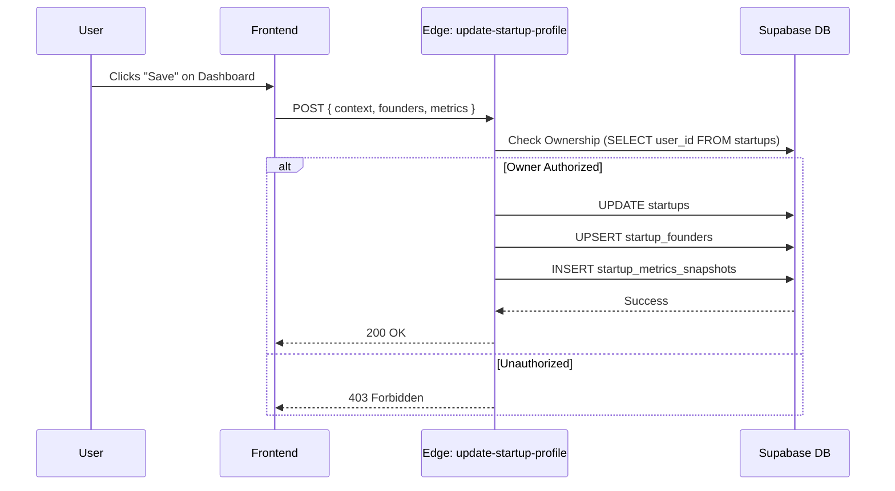

# 🗄️ Supabase Architecture & Roadmap

**Status:** 🟡 In Progress
**Version:** 2.0
**Architect:** System Administrator

This document outlines the current database schema, security posture, and the roadmap for **User Profile Enrichment** and **Startup Wizard** data persistence.

---

## 📊 Progress Tracker

| Area | Status | Progress | Notes |
| :--- | :--- | :--- | :--- |
| **Core Schema** | 🟢 Ready | 100% | `profiles`, `startups`, `founders` tables active. |
| **RLS Policies** | 🟢 Ready | 100% | Row Level Security enabled on all core tables. |
| **Edge Functions** | 🟡 In Progress | 70% | `update-startup-profile` active; enrichment functions pending. |
| **Profile Enrichment** | 🔴 Pending | 0% | Normalization of Experience/Education tables needed. |
| **Data Integrity** | 🟡 In Progress | 80% | Transactional logic moved to Edge Functions. |
| **Search & Indexing** | 🔴 Pending | 0% | `tsvector` and GIN indexes required for performance. |

---

## 1️⃣ Schema Overview

The database is designed around a **multi-tenant** architecture where a `User` (auth.users) manages one or more `Startups`.

### **Core Domains**
1.  **Identity:** Users (`profiles`) and their professional history.
2.  **Startup Core:** The company entity (`startups`), team (`startup_founders`), and competitors.
3.  **Traction:** Financials (`startup_metrics_snapshots`) and fundraising goals.
4.  **Workflows:** CRM (`crm_deals`), Tasks (`tasks`), and Documents (`investor_docs`).

---

## 2️⃣ Tables & Relationships

### **Core Tables**

| Table | Description | Key Relationship |
| :--- | :--- | :--- |
| `profiles` | Extended user data (Avatar, Bio). | `id` → `auth.users.id` (1:1) |
| `startups` | The main company entity. | `user_id` → `auth.users.id` (Owner) |
| `startup_founders` | Team members linked to a startup. | `startup_id` → `startups.id` (N:1) |
| `startup_links` | Social & Web links. | `startup_id` → `startups.id` (N:1) |
| `startup_metrics_snapshots` | Historical MRR/User data. | `startup_id` → `startups.id` (N:1) |

### **Planned Tables (Profile Enrichment)**
*To be implemented in Phase 3.*

| Table | Description | Key Relationship |
| :--- | :--- | :--- |
| `profile_experience` | Work history (normalized). | `profile_id` → `profiles.id` |
| `profile_education` | Academic history (normalized). | `profile_id` → `profiles.id` |
| `profile_skills` | Junction table for skills. | `profile_id` → `profiles.id` |

---

## 3️⃣ RLS & Security Review

**Current Status:** ✅ **Safe**
Row Level Security is enabled. Policies are scoped to `auth.uid()`.

*   **`profiles`**: Users can only update their own row. Public read (for networking features).
*   **`startups`**: Users can only select/update startups where `user_id == auth.uid()`.
*   **`startup_founders`**: Inherits access via `startup_id`.

**⚠️ Risks:**
*   **Edge Function Bypass:** The `update-startup-profile` function uses `service_role`. Logic *must* manually verify `user.id` against the resource before writing (Currently implemented, but requires vigilance).

---

## 4️⃣ Edge Functions & Data Flow

### **Catalog**

1.  **`update-startup-profile`** (`supabase/functions/update-startup-profile/index.ts`)
    *   **Purpose:** Atomic updates for the Dashboard/Wizard. Handles Profile, Team, and Metrics in one transaction.
    *   **Security:** Verifies JWT ownership before writing.
    *   **Tables:** `startups`, `startup_founders`, `startup_metrics_snapshots`.

2.  **`ai-helper`** (`supabase/functions/ai-helper/index.ts`)
    *   **Purpose:** Wraps Google Gemini 3 Pro API calls to keep API keys server-side.
    *   **Features:** `rewrite_field`, `generate_summary`, `analyze_business`.

### **Data Flow: Startup Wizard Save**

---

## 5️⃣ Recommended Improvements (Roadmap)

### **Priority 1: Profile Normalization (Enrichment)**
**Why:** Storing Experience/Education as JSONB in `profiles` limits our ability to query "Founders who worked at Google".
**Action:**
*   Create `profile_experience` and `profile_education` tables.
*   Migrate existing JSONB data to these tables.
*   Create `calculate_profile_score` Database Trigger to auto-update `completion_score`.

### **Priority 2: Materialized Views for Dashboard**
**Why:** Calculating "Profile Strength" and aggregating metrics on the fly is expensive.
**Action:**
*   Create a view `view_startup_stats` that pre-calculates MRR growth and completion percentages.

### **Priority 3: External Data Sync**
**Why:** Users hate manual data entry.
**Action:**
*   Implement `enrich-profile` Edge Function to scrape LinkedIn/Website data (via Proxycurl or similar) and auto-populate `profile_experience`.

### **Priority 4: Indexes**
**Why:** Dashboard load times will degrade as data grows.
**Action:**
*   Add **GIN Index** on `profiles.skills` (Fast filtering).
*   Add **B-Tree Index** on `startup_metrics_snapshots(startup_id, snapshot_date DESC)` (Fast chart loading).

---

## 6️⃣ Implementation Steps (Next 48h)

1.  [ ] **Migration:** Create SQL migration for `profile_experience` and `profile_education`.
2.  [ ] **Backend:** Update `UserService.ts` to read/write from new tables.
3.  [ ] **Frontend:** Update `ExperienceSection` and `EducationSection` to use new normalized data structure.
4.  [ ] **AI:** Wire `enrich-profile` Edge Function to the "Sync LinkedIn" button.
