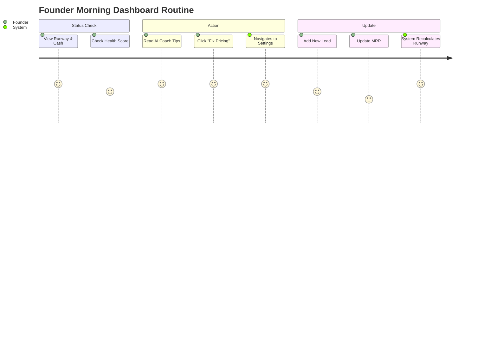
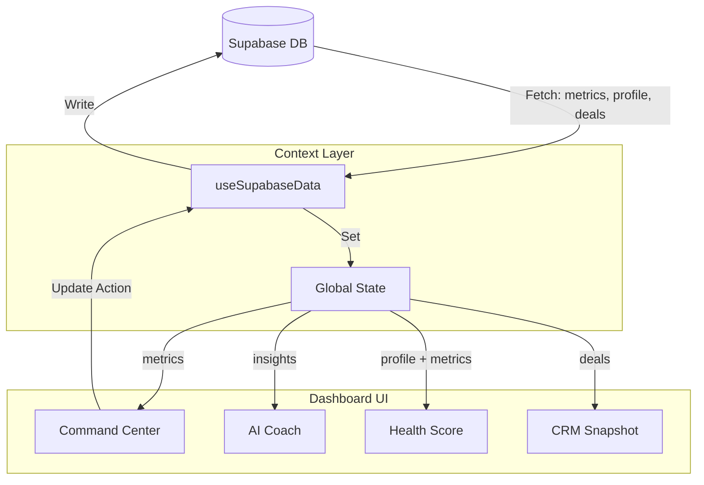

# 🚀 Founder Command Center (Dashboard v2.0) - Master Plan

**Target URL:** `/dashboard`
**Status:** 🟢 Live / Production Ready
**Priority:** P0 (Core Value Prop)
**Version:** 2.1

---

## 📋 Executive Summary
The "Founder Command Center" transforms the dashboard from a simple navigation hub into a high-utility operational tool. It provides founders with immediate visibility into their financial runway, startup health, and critical next steps using AI-driven insights.

---

## 📊 Progress Tracker & Status

| Module | Component | Status | Implementation Notes |
|:---|:---|:---|:---|
| **Layout** | **Grid Architecture** | 🟢 Done | Responsive 12-col grid. Main (8) + Sidebar (4). Mobile stacking. |
| **Financials** | **Command Center Card** | 🟢 Done | Burn Rate, Cash, Runway calculation, ARR Chart. |
| **Scoring** | **Health Scorecard** | 🟢 Done | Weighted logic (Biz 25%, Fund 25%, Ops 25%, Profile 25%). |
| **Intelligence** | **AI Coach Widget** | 🟢 Done | Displays top 3 actionable insights + "Fix Now" routing. |
| **Intelligence** | **AI Digest** | 🟢 Done | Daily/Weekly toggle UI implementation. |
| **CRM** | **Pipeline Snapshot** | 🟢 Done | Active Deals count, Pipeline Value aggregation. |
| **History** | **Milestones Timeline** | 🟢 Done | Horizontal scroll, filters `activities` for 'milestone' type. |
| **Notifications** | **Smart Alerts** | 🟢 Done | Dismissible banner logic for critical alerts (Low Runway). |
| **Onboarding** | **Setup Checklist** | 🟢 Done | Gamified progress bar linked to profile fields. |
| **Data Layer** | **Supabase Wiring** | 🟢 Done | Connected to `useSupabaseData` hook and `metrics` table. |

---

## ✅ Success Criteria

1.  **Immediate Financial Clarity:**
    *   *Metric:* A founder can answer "How much runway do I have?" within **3 seconds** of loading.
    *   *Implementation:* Large typography in Command Center card, color-coded (Red < 6mo).

2.  **Actionability:**
    *   *Metric:* Every insight or alert has a direct button to resolve it.
    *   *Implementation:* "Fix Now", "Update Financials", "Add Deal" buttons deep-link to specific modules.

3.  **Performance:**
    *   *Metric:* Dashboard loads user data and calculates derived metrics in **< 200ms**.
    *   *Implementation:* Calculations (Runway, Health) happen client-side using cached Context data; no extra API calls on render.

4.  **Responsive Design:**
    *   *Metric:* Zero horizontal scrolling on mobile; logical stacking order.
    *   *Implementation:* `grid-cols-1` on mobile, `lg:grid-cols-12` on desktop.

---

## 🧩 Component Specifications & UI/UX

### 1. 💵 Founder Command Center (Top Main)
*   **Purpose:** The financial heartbeat of the startup.
*   **Data Sources:** `metrics` (Latest Snapshot).
*   **Visuals:**
    *   **Burn Rate:** Trend indicator (Up/Down).
    *   **Runway:** Large text. Color-coded: Red (< 6mo), Yellow (< 12mo), Green (> 12mo).
    *   **ARR:** Mini Sparkline chart (Recharts) showing projection.
*   **Interactions:** "Update Financials" opens modal or links to settings.

### 2. 🩺 Health Scorecard (Top Sidebar)
*   **Purpose:** Gamified holistic view of startup readiness.
*   **Visuals:** 0-100% Score with radial progress bar (Donut chart).
*   **Sub-Metrics:**
    *   *Business:* MRR Growth > 0.
    *   *Fundraising:* Pitch Deck exists.
    *   *Operations:* Runway > 6 months.
    *   *Profile:* Profile completion > 75%.

### 3. 🧠 AI Coach (Middle Main)
*   **Purpose:** Intelligent recommendation engine.
*   **Logic:** Analyzes `insights` table. Shows top 3 items sorted by `priority`.
*   **Card Structure:** Icon + Title + Category Tag + Action Button.
*   **States:** Loading (Skeleton), Empty (Prompt to generate), Populated.

### 4. 🤝 CRM Snapshot (Middle Main)
*   **Purpose:** Sales/Fundraising velocity at a glance.
*   **Metrics:**
    *   Active Deals (Count where stage != Closed).
    *   Pipeline Value (Sum of amounts).
    *   New Leads (Count created this week).
*   **Actions:** Quick add `[+ Deal]`.

### 5. 📅 Milestones Timeline (Bottom Main)
*   **Purpose:** Visual history of key company events.
*   **Data Source:** `activities` table (filtered by `type = 'milestone'`).
*   **Layout:** Horizontal scrolling timeline with date markers.

---

## 🔄 Logic & Data Workflows

### **1. Runway Calculation Engine**
```typescript
// Implemented in FounderCommandCenter.tsx
const calculateRunway = (cash: number, burn: number) => {
  if (burn <= 0) return Infinity; // Profitable or pre-spend
  const months = cash / burn;
  return parseFloat(months.toFixed(1));
};
```

### **2. Health Score Algorithm**
```typescript
// Implemented in Dashboard.tsx
const calculateHealth = (profile, metrics, decks) => {
  let score = 0;
  // 1. Business (25%)
  if (metrics.mrr > 0) score += 25;
  
  // 2. Fundraising (25%)
  if (decks.length > 0) score += 25;
  
  // 3. Operations (25%)
  const runway = metrics.cash / metrics.burn;
  if (runway > 6) score += 25; else if (runway > 3) score += 10;
  
  // 4. Profile (25%)
  if (profile.isComplete) score += 25;
  
  return score; // Max 100
};
```

### **3. AI Insights Workflow**
1.  **Trigger:** User clicks "Refresh Analysis".
2.  **Context Assembly:** Frontend gathers `profile`, `metrics`, `deals` from Context.
3.  **Prompt Engineering:** "Act as a VC Coach. Analyze these metrics..."
4.  **API Call:** Send to Gemini 3 Pro via `CoachAI` service.
5.  **Persistence:** Save result to `ai_coach_insights` table in Supabase.
6.  **Update:** Context updates, UI re-renders with new cards.

---

## 🧜‍♀️ Mermaid Diagrams

### **User Journey: The "Morning Check-in"**



### **Data Architecture & Wiring**



---

## ✅ Production Checklist

### **Database & Backend**
- [x] **Table Check:** Ensure `startup_metrics_snapshots` exists and has `burn_rate` and `cash_balance` columns.
- [x] **RLS Policies:** Verify users can only read their own metrics.
- [x] **Indexing:** Add index on `startup_metrics_snapshots(startup_id, snapshot_date)` for fast history lookup.

### **Frontend & UI**
- [x] **Mobile Responsive:** Verify stacking order on iPhone SE (375px width).
- [x] **Empty States:** Ensure Dashboard looks good with 0 revenue and 0 deals (Welcome State).
- [x] **Loading States:** Skeletons implemented for all 5 cards while `useSupabaseData` fetches.
- [x] **Error Handling:** Graceful fallback if AI service fails (Show "Retry" button).

### **Wiring**
- [x] **Context:** Dashboard correctly consumes `useData()` context.
- [x] **Navigation:** "New Deck" button correctly routes to `/pitch-decks/new`.
- [x] **Updates:** "Update Financials" button triggers correct modal/form in Traction module.
