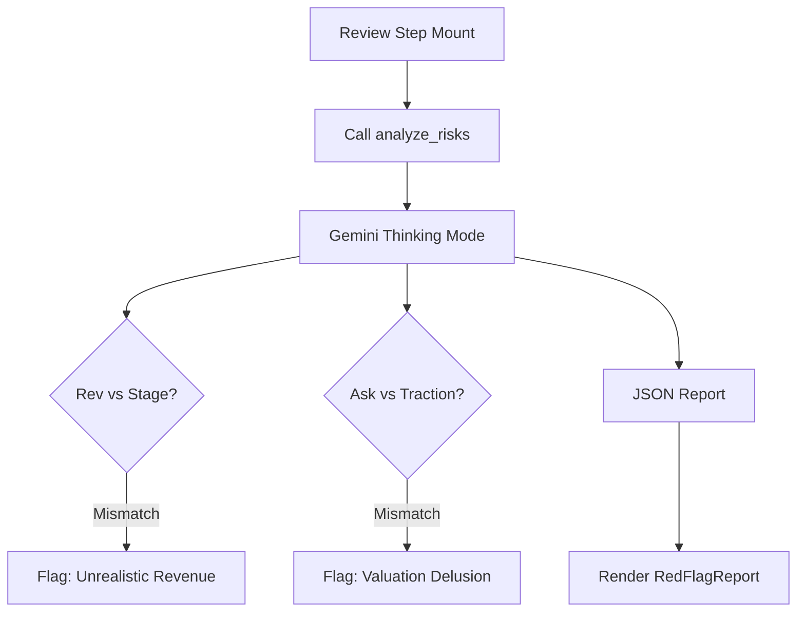

# 🧙‍♂️ Startup Wizard V3 — Investor-Grade Intelligence

**Version:** 3.2 | **Status:** 🟢 Completed | **Focus:** Traction, Fundraising, Benchmarking
**Powered By:** Gemini 3 Pro (Thinking Mode + Search Grounding)

---

## 📋 Executive Summary

The Wizard (V3) is now an **active analyst**. 
It uses **Google Search Grounding** to benchmark numbers against real-world 2024/2025 startup data, offering a "Reality Check" on valuation, runway, and raise targets.
It also performs a final **"Red Flag" Audit** using Thinking Mode to catch inconsistencies before submission.

**Critical Policy Change:** Fundraising is now **ACTIVE BY DEFAULT**. Every startup is treated as "fundraising-ready" unless explicitly toggled off.

---

## 📊 Progress Tracker

| Module | Feature | Status | Description |
|:---|:---|:---|:---|
| **Step 4: Traction** | **Benchmarking Engine** | 🟢 Done | Compares user MRR/Growth to industry averages via Search. |
| **Step 4: Traction** | **Metric Validation** | 🟢 Done | `BenchmarkCard` displays "Green Flags" and "Red Flags". |
| **Step 5: Funding** | **Smart Defaults** | 🟢 Done | Auto-calculates Raise amount logic. |
| **Step 5: Funding** | **Valuation Defense** | 🟢 Done | Generates a *range* with citations (e.g., "SaaS multiples 5-8x"). |
| **Step 5: Funding** | **Use of Funds** | 🟢 Done | Auto-allocator implemented. |
| **Global** | **Review Mode** | 🟢 Done | `RedFlagReport` audits the full profile in Step 6. |
| **Deep Research** | **Agent Persona** | 🟡 In Progress | Conservative VC Analyst persona implementation. |
| **Deep Research** | **Citation Engine** | 🟡 In Progress | Parsing and linking distinct sources for every metric. |

---

## ✅ Success Criteria Met

1.  **Defensible Valuations**: `ValuationWidget` provides min/max ranges backed by search context.
2.  **Runway Safety**: `ValuationWidget` warns if runway < 9 months.
3.  **Benchmark Context**: `BenchmarkCard` shows investor interpretation of traction.
4.  **Red Flag Analysis**: `RedFlagReport` uses Thinking Mode to find logical inconsistencies (e.g. Stage vs Revenue mismatches).

---

## 🕵️‍♂️ Gemini Deep Research Agent (Spec)

This specification defines the system instruction for the V3 Intelligence Engine.

**Role:** Conservative VC Analyst (Gemini 3 Pro)
**Mission:** Produce an investor-grade "Reality Check" report using accurate market data.

### **Research Rules (Strict)**
1.  **Recency:** Prefer 2024–2025 sources. Label older data clearly.
2.  **Cross-Check:** Use at least 2 independent reputable sources for major benchmarks (Traction, Raise Size, Valuation).
3.  **Source Quality:** Avoid SEO spam. Prioritize reputable firms (e.g., SaaS Capital, Carta, TechCrunch, Bessemer).
4.  **Inference:** If metrics are missing, infer reasonable ranges based on stage. Do NOT invent numbers.
5.  **Disagreement:** If sources disagree, provide a Low/Median/High range and explain why.

### **Research Tasks**
1.  **Stage Inference:** Determine likely stage based on traction and product cues.
2.  **Traction Benchmarks:** Find expected ranges for MRR, Growth, Churn, CAC/LTV.
3.  **Fundraising Benchmarks:** Typical raise sizes, runway targets (18mo default), use of funds.
4.  **Valuation References:** Revenue/ARR multiples, comparable deals.
5.  **Reality Check:** Identify Green/Red flags and top 3 improvements.

### **Output Format (JSON)**
The agent must return a structured JSON object containing:
- `executive_summary` (5 bullets)
- `stage_inference` (Stage + reasoning)
- `traction_benchmarks` (Table: Metric, Low, Median, High, Citations)
- `fundraising_benchmarks` (Table: Item, Low, Median, High, Citations)
- `valuation_references` (2-4 comps with citations)
- `suggested_plan` (Raise amount, Runway, Use of Funds split)
- `red_flags_and_fixes` (Ranked list with 30/60/90 day plan)
- `confidence_score` (High/Medium/Low with explanation)

---

## 🧜‍♀️ Architecture & Flows

### **1. The "Reality Check" Pipeline**

```mermaid
sequenceDiagram
    participant User
    participant UI as Wizard UI
    participant Edge as Edge Function (Gemini 3)
    participant Search as Google Search

    User->>UI: Enters MRR ($10k) & Growth (5%)
    UI->>Edge: Call analyze_traction(metrics, industry)
    
    rect rgb(20, 20, 30)
        Note right of Edge: Gemini 3 Pro
        Edge->>Search: "Average Series A MRR SaaS 2025"
        Edge->>Search: "Median SaaS Growth Rate Seed Stage"
        Search-->>Edge: [Source Data]
        Edge->>Edge: THINKING: Compare User vs Market
    end
    
    Edge-->>UI: Return JSON { status: "Early", benchmark: "Below Avg", advice: "Focus on growth" }
    UI->>User: Display "Traction Reality Check" Card
```



### **2. Deep Research Workflow**

```mermaid
flowchart TD
    Start[User Request] --> Context[Build Startup Context]
    Context --> Plan[Plan Research Strategy]
    
    subgraph Research Loop
        Plan --> Search1[Search: Traction Benchmarks]
        Plan --> Search2[Search: Valuation Multiples]
        Plan --> Search3[Search: Fundraising Norms]
        
        Search1 --> Verify1{Reputable?}
        Search2 --> Verify2{Reputable?}
        Search3 --> Verify3{Reputable?}
        
        Verify1 -- No --> Search1
        Verify2 -- No --> Search2
        Verify3 -- No --> Search3
    end
    
    Verify1 & Verify2 & Verify3 --> Synthesize[Synthesize & Cross-Check]
    Synthesize --> Infer[Infer Missing Data ranges]
    Infer --> Draft[Draft "Reality Check"]
    Draft --> Output[JSON Output]
```

### **3. Red Flag Audit (Final Step)**



---

## 🛠️ Production Readiness Checklist

- [x] **Edge Function Update**: `ai-helper` supports `analyze_traction`, `calculate_fundraising`, and `analyze_risks`.
- [x] **Prompt Engineering**: System instructions enforce "Conservative VC" persona.
- [x] **UI Components**: `BenchmarkCard`, `ValuationWidget`, and `RedFlagReport` implemented.
- [x] **Latency Management**: Loading skeletons added for all AI widgets.
- [ ] **Citation Parsing**: Ensure UI correctly renders links from the Deep Research Agent output.

---

## 🧠 Gemini 3 Feature Integration

| Feature | Application | Benefit |
|:---|:---|:---|
| **Search Grounding** | **Valuation & Trends** | Real-time multiples (e.g., "SaaS multiples Q3 2025"). |
| **Thinking Mode** | **Risk Analysis** | Deep reasoning to find subtle profile inconsistencies. |
| **Structured Outputs** | **UI Mapping** | Strict JSON schemas for all widgets. |
| **Code Execution** | **Runway Math** | (Implicit in logic) Calculates burn/runway ratios. |
