# 🧙‍♂️ Startup Wizard V3 — Investor-Grade Intelligence

**Version:** 3.0 | **Status:** 🟡 Planned | **Focus:** Traction, Fundraising, Benchmarking
**Powered By:** Gemini 3 Pro (Thinking Mode + Search Grounding)

---

## 📋 Executive Summary

The current Wizard (V2) excels at data *intake*. V3 transforms it into an **active analyst**. 
Instead of just accepting user numbers, V3 uses **Google Search Grounding** to benchmark those numbers against real-world 2024/2025 startup data, offering a "Reality Check" on valuation, runway, and raise targets.

**Critical Policy Change:** Fundraising is now **ACTIVE BY DEFAULT**. Every startup is treated as "fundraising-ready" unless explicitly toggled off, ensuring financial discipline from Day 1.

---

## 📊 Progress Tracker

| Module | Feature | Status | Description |
|:---|:---|:---|:---|
| **Step 4: Traction** | **Benchmarking Engine** | 🔴 Pending | Compare user MRR/Growth to industry averages via Search. |
| **Step 4: Traction** | **Metric Validation** | 🔴 Pending | AI "Sanity Check" on entered numbers (e.g., "100% churn is fatal"). |
| **Step 5: Funding** | **Smart Defaults** | 🔴 Pending | Auto-calculate Raise amount based on Burn * 18 months. |
| **Step 5: Funding** | **Valuation Defense** | 🔴 Pending | Generate a *range* with citations (e.g., "SaaS multiples are 5-8x"). |
| **Step 5: Funding** | **Use of Funds** | 🔴 Pending | Auto-allocate raise based on stage gaps (e.g., "Hire Sales"). |
| **Global** | **Review Mode** | 🔴 Pending | "Investor Red Flags" report before final submission. |

---

## ✅ Success Criteria

1.  **Defensible Valuations**: The user receives a valuation range backed by *at least 2* real-world citations or market multiple references found via Google Search.
2.  **Runway Safety**: The system prevents users from submitting a plan with < 9 months runway without a critical warning.
3.  **Benchmark Context**: Users entering "$10k MRR" see context like *"This places you in the top 20% of Pre-Seed startups"* (or similar grounded stat).
4.  **Zero "Vanity Metrics"**: The AI automatically flags metrics that don't matter to investors (e.g., "Cumulative Signups" vs "Active Users").

---

## 🛠️ Production Readiness Checklist

- [ ] **Edge Function Update**: `ai-helper` must support `googleSearch` tool for the `estimate_valuation` action.
- [ ] **Prompt Engineering**: System instructions must enforce "Conservative VC" persona to prevent hallucinated high valuations.
- [ ] **UI Components**: New `BenchmarkCard` and `ValuationRange` components needed for Step 4/5.
- [ ] **Latency Management**: Search Grounding takes 3-5s. UI must show "Researching market..." skeletons.

---

## 🧠 Gemini 3 Feature Integration

| Feature | Application | Benefit |
|:---|:---|:---|
| **Search Grounding** | **Valuation & Trends** | Real-time multiples (e.g., "SaaS multiples Q3 2025"). Prevents outdated advice. |
| **Thinking Mode** | **Strategy Reasoning** | Connects dots: *"High churn + High burn = Fix product before raising".* |
| **Structured Outputs** | **UI Mapping** | Returns strict JSON for charts (High/Low/Median) regardless of search text. |
| **Code Execution** | **Runway Math** | Calculates exact burn-down charts based on complex inputs (hiring plans). |

---

## 🧜‍♀️ Architecture & Flows

### **1. The "Reality Check" Pipeline**

```mermaid
sequenceDiagram
    participant User
    participant UI as Wizard UI
    participant Edge as Edge Function (Gemini 3)
    participant Search as Google Search

    User->>UI: Enters MRR ($10k) & Growth (5%)
    UI->>Edge: Call analyze_traction(metrics, industry)
    
    rect rgb(20, 20, 30)
        Note right of Edge: Gemini 3 Pro
        Edge->>Search: "Average Series A MRR SaaS 2025"
        Edge->>Search: "Median SaaS Growth Rate Seed Stage"
        Search-->>Edge: [Source Data]
        Edge->>Edge: THINKING: Compare User vs Market
    end
    
    Edge-->>UI: Return JSON { status: "Early", benchmark: "Below Avg", advice: "Focus on growth" }
    UI->>User: Display "Traction Reality Check" Card
```



### **2. Valuation & Fundraising Logic**

```mermaid
flowchart TD
    Start[User Inputs Financials] --> Default{Fundraising?}
    Default -- Yes (Default) --> CalcRunway[Calculate Implied Runway]
    
    CalcRunway --> CheckRunway{Runway < 9mo?}
    CheckRunway -- Yes --> Alert[⚠️ CRITICAL ALERT: Raise Needed]
    CheckRunway -- No --> Opt[Optimization Mode]
    
    Alert --> Search[🔍 Google Search: Valuation Multiples]
    Search --> Range[Calculate Valuation Range]
    
    Range --> Output[Generate Deal Terms]
    Output --> UI[Display: "Ask for $1.5M at $8M-10M Val"]
```

---

## 📝 Product Specification: New Features

### **1. Traction Analysis (Step 4)**
*   **Input**: MRR, Growth Rate, Churn, CAC.
*   **AI Action**:
    *   Search for industry benchmarks.
    *   Compare user metrics to "Fundable Milestones".
*   **Output UI**:
    *   **"Investor View" Panel**: A card showing "Green Flags" (e.g., Low Churn) and "Red Flags" (e.g., Slow Growth).
    *   **Next Milestone**: Specific numeric target (e.g., "Reach $25k MRR to unlock Series A conversations").

### **2. Fundraising Calculator (Step 5)**
*   **Logic Change**: Toggle defaults to `TRUE`.
*   **Smart Calc**:
    *   User inputs `Current Cash` and `Net Burn`.
    *   AI calculates `Runway`.
    *   If `Runway < 12 months`, AI suggests `Raise Amount` = `(Burn * 18) - Cash`.
*   **Valuation Engine**:
    *   Uses `industry` + `stage` + `growth_rate` to find a revenue multiple via Search.
    *   Displays: *"Based on 5-8x revenue multiples for Healthtech in 2025..."*

### **3. The "Red Flag" Report (Step 6 Review)**
*   Before submission, Gemini scans the entire profile for inconsistencies.
*   *Example:* "You claim 'Product Market Fit' but have high churn."
*   *Example:* "You are raising $5M but only have $2k MRR (Unrealistic)."

---

## 📅 Implementation Plan

### **Day 1: Backend Intelligence**
1.  Update `supabase/functions/ai-helper/index.ts`.
2.  Add `analyze_traction` case using `googleSearch` tool.
3.  Add `calculate_fundraising` case with robust math prompts.

### **Day 2: UI Components**
1.  Create `components/wizard/intelligence/BenchmarkCard.tsx`.
2.  Create `components/wizard/intelligence/ValuationWidget.tsx`.
3.  Update `StepTraction.tsx` to display real-time feedback.

### **Day 3: Wiring & Polish**
1.  Connect Step 4 inputs to Edge Function triggers (debounced).
2.  Implement "Red Flag" modal in Step 6.
3.  Update `metadata.json` to reflect AI capabilities.

