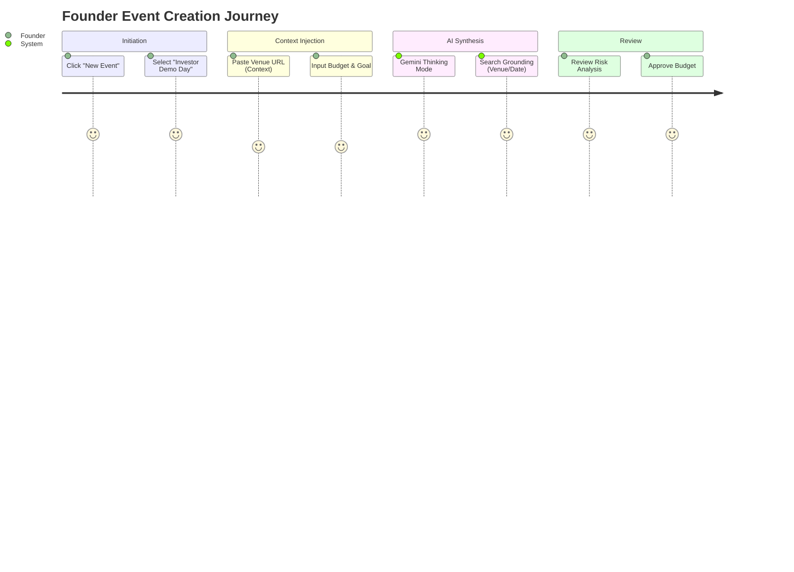
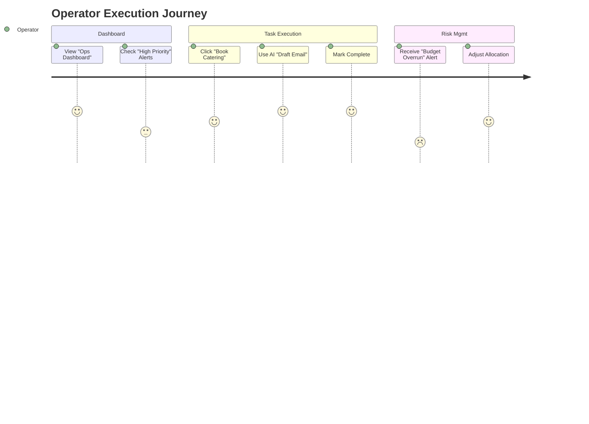
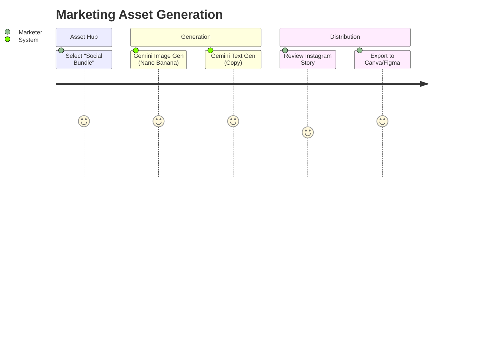
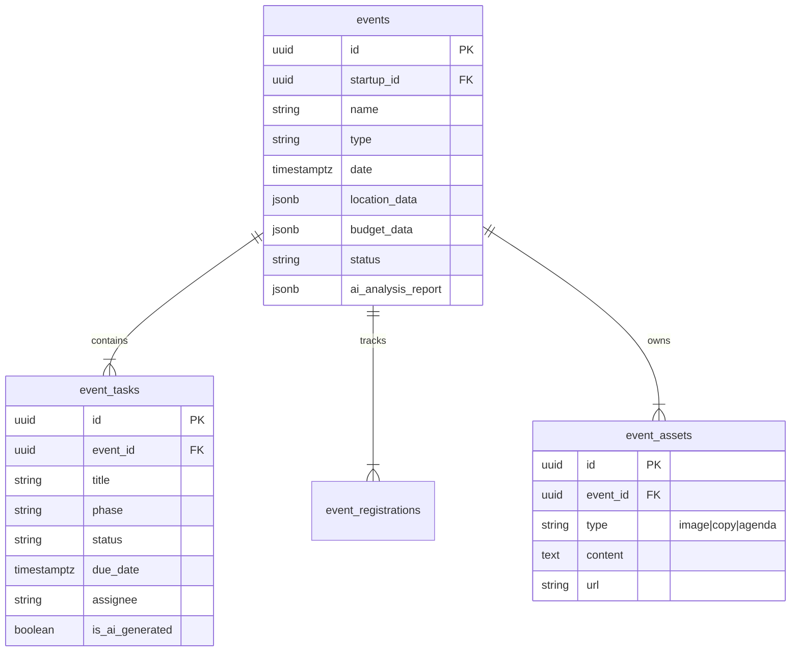
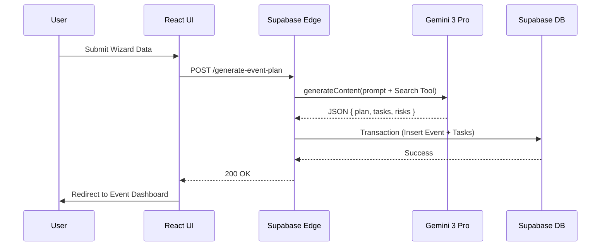

# 📅 StartupAI Events System — Architectural Blueprint

**Version:** 1.0  
**Status:** 🟡 Planned  
**Target Model:** Gemini 3 Pro (Thinking + Search Grounding)  
**Image Model:** Nano Banana Pro (`gemini-3-pro-image-preview`)

---

## 1. SYSTEM OVERVIEW

The **Events Management System** is a strategic module within StartupAI designed to automate the operational chaos of organizing startup events (Demo Days, Investor Mixers, Webinars, Product Launches). 

Unlike generic calendar tools, this system uses **Agentic AI** to act as an "Event Operations Manager." It doesn't just list tasks; it generates comprehensive execution strategies, marketing assets, and logistical roadmaps based on the startup's specific profile and constraints.

**Core User Value:**
1.  **Strategic Alignment:** Ensures events align with fundraising/growth goals (via Profile context).
2.  **Operational Automation:** Auto-generates 50+ step workback schedules.
3.  **Asset Synthesis:** Instantly creates landing pages and social collateral.

---

## 2. USER JOURNEYS

### Journey 1: The Founder (Strategy)
*Goal: Define the event vision and approve the budget.*



### Journey 2: The Operator (Execution)
*Goal: Execute tasks and manage logistics.*



### Journey 3: Marketing Lead (Promotion)
*Goal: Generate and distribute assets.*



---

## 3. EVENT WIZARD (MULTI-STEP)

A 4-step smart intake flow powered by Gemini 3 Pro.

| Step | Name | Inputs | AI Actions & Tools | Output |
|:---|:---|:---|:---|:---|
| **1** | **Context** | Event Name, Type (Virtual/Live), URL (Venue/Inspiration). | **Tool: URL Context.** Scrapes venue capacity, amenities, or competitor event structure. | `EventContext` JSON |
| **2** | **Strategy** | Goal (Lead Gen/Brand), Target Audience, Budget. | **Tool: Thinking.** AI reasons about budget feasibility vs. goals. | `StrategyAssessment` |
| **3** | **Logistics** | Date/Time, Location. | **Tool: Search Grounding.** Checks for holidays, major tech conferences (conflicts). | `LogisticsValidation` |
| **4** | **Review** | Confirmation. | **Tool: Structured Output.** Compiles final event blueprint. | `EventBlueprint` |

**Gemini Feature Usage:**
*   **URL Context:** User pastes a link to a "Dream Venue." Gemini extracts cost tier, location, and vibe to auto-set budget parameters.
*   **Search Grounding:** User picks a date. Gemini searches "Tech events San Francisco [Date]" to warn about conflicting events (e.g., "Warning: Dreamforce is this week, hotels will be expensive").

---

## 4. AI SUMMARY SCREEN (STEP 2)

**Title:** Event Intelligence Brief
**Purpose:** Establish trust by showing the AI's reasoning before generating tasks.

**Visual Components:**
1.  **Feasibility Score:** (0-100) based on Budget vs. Ambition.
2.  **Inferred Constraints:** "Based on the venue URL, capacity is capped at 150."
3.  **Conflict Radar:** "Caution: Date overlaps with YC Demo Day."
4.  **Budget Simulation:** High/Low/Median cost estimates based on industry benchmarks.

**Why this exists:** To prevent the "Garbage In, Garbage Out" problem. If the AI hallucinates a capability the venue doesn't have, the user catches it here.

---

## 5. WORKFLOWS & TASK SYSTEM

**Lifecycle Phases:**
1.  **Strategy (W-8):** Budget approval, Venue selection.
2.  **Planning (W-6):** Speaker outreach, Vendor booking.
3.  **Marketing (W-4):** Save the dates, Social campaign.
4.  **Ops (W-1):** Run of show, badges, catering finalization.
5.  **Post (W+1):** Thank you notes, Lead processing.

```flowchart
    Start([User Completes Wizard]) --> AI[Gemini 3 Pro: Generate Plan]
    AI --> Logic{Is Virtual?}
    
    Logic -- Yes --> VirtualFlow[Generate Zoom/Stream Tasks]
    Logic -- No --> LiveFlow[Generate Venue/Catering Tasks]
    
    VirtualFlow --> DB[(Insert Tasks)]
    LiveFlow --> DB
    
    DB --> Dashboard[Kanban Board]
    Dashboard --> Execution[User Completes Tasks]
    Execution --> Done([Event Complete])
```

---

## 6. DATA MODEL (ERD)



---

## 7. DATA FLOWS



---

## 8. GEMINI 3 PRO – TOOL USAGE MATRIX

| Capability | Application | Input | Output |
|:---|:---|:---|:---|
| **Thinking Mode** | Budgeting & Risk Analysis | "Budget $5k, 200 people, Downtown SF" | "High Risk: Catering alone exceeds budget." |
| **Search Grounding** | Date Conflict Detection | Event Date + City | List of conflicting major events. |
| **URL Context** | Venue/Vendor Analysis | URL of Venue | Capacity, Amenities, Restrictions. |
| **Structured Output** | Task Generation | Event Profile | Strict JSON array of tasks with due dates. |
| **Nano Banana Pro** | Marketing Assets | "Tech mixer, neon theme" | 16:9 Hero Image, 1:1 Social Tile. |
| **Function Calling** | CRM Sync | List of Attendees | Calls `sync_to_crm(attendees)`. |

---

## 9. FUNCTION CALLING DESIGN

**Function:** `generate_event_plan`
**Description:** Orchestrator for the entire event creation logic.

**Schema (Input):**
```json
{
  "name": "generate_event_plan",
  "parameters": {
    "type": "OBJECT",
    "properties": {
      "eventType": { "type": "STRING", "enum": ["Virtual", "Physical", "Hybrid"] },
      "attendeeCount": { "type": "INTEGER" },
      "budget": { "type": "NUMBER" },
      "vibe": { "type": "STRING" },
      "venueUrl": { "type": "STRING", "description": "Optional grounding URL" }
    },
    "required": ["eventType", "attendeeCount"]
  }
}
```

**Schema (Output - Strict JSON):**
```json
{
  "feasibility": { "score": 85, "reasoning": "..." },
  "suggested_venue_type": "...",
  "tasks": [
    { "phase": "Strategy", "title": "Secure Venue", "due_offset_days": -60 },
    { "phase": "Marketing", "title": "Launch Landing Page", "due_offset_days": -30 }
  ]
}
```

---

## 10. WEBSITE & DASHBOARD SCREENS

### 1. Events List (Dashboard)
*   **Cards:** Upcoming events with countdowns.
*   **KPIs:** Total Registrations, Budget Spent.

### 2. Event Wizard (Modal)
*   **Step 1:** Intake (Inputs + URL).
*   **Step 2:** AI Analysis (The "Reality Check").
*   **Step 3:** Confirmation.

### 3. Event Command Center (Detail View)
*   **Tabs:** Overview, Tasks (Kanban), Marketing, Registrations, Budget.
*   **Header:** Days to go, Status (On Track/At Risk).

### 4. Marketing Hub
*   **Generator:** "Create Social Assets" button.
*   **Gallery:** View generated images/copy.

---

## 11. IMAGE GENERATION STRATEGY

**Model:** `gemini-3-pro-image-preview` (Nano Banana Pro)

**Prompt Strategy:**
*   **Subject:** "Professional technology conference banner"
*   **Style:** "Abstract 3D geometric shapes, corporate memphis, matte finish."
*   **Color:** Dynamic injection of Startup Profile brand colors.
*   **Composition:** "Wide 16:9, plenty of negative space for text overlay."

**Use Cases:**
1.  Registration Page Hero.
2.  Email Header.
3.  LinkedIn "I'm Speaking" cards.

---

## 12. PRODUCTION-READY CHECKLIST

### Data Integrity
- [ ] **Schema Validation:** Edge Functions must validate Gemini JSON against Zod schemas before DB insert.
- [ ] **Transaction Safety:** Event + Tasks creation must be atomic.

### AI Reliability
- [ ] **Grounding Check:** Ensure `googleSearch` tool is actually triggered for date checks.
- [ ] **Fallback:** If `gemini-3-pro` times out, fallback to `gemini-2.5-flash` for simple task generation.
- [ ] **Thinking Budget:** Set `thinkingBudget: 2048` for the Strategy phase to ensure deep reasoning.

### UX/UI
- [ ] **Optimistic UI:** Show "Drafting plan..." skeleton screens while AI thinks.
- [ ] **Editability:** AI outputs must be editable by humans immediately.

---

## 13. BEST PRACTICES & FAIL-SAFES

1.  **Human Approval:** AI never spends money. It creates a "Purchase Order" task that a human must mark as done.
2.  **Date Anchoring:** All AI tasks use relative dates (e.g., `event_date - 30 days`). The backend calculates absolute dates.
3.  **URL Validation:** If a user pastes a broken URL, the AI should degrade gracefully to "Generic Venue" logic rather than crashing.

---

## 14. SUPABASE SCHEMA (SQL)

```sql
-- Events Table
create table public.events (
  id uuid default gen_random_uuid() primary key,
  startup_id uuid references public.startups(id) not null,
  name text not null,
  type text not null check (type in ('Virtual', 'Physical', 'Hybrid')),
  start_date timestamptz not null,
  end_date timestamptz,
  status text default 'planning',
  budget_total numeric,
  budget_spent numeric default 0,
  location_data jsonb,
  ai_analysis jsonb,
  created_at timestamptz default now()
);

-- Event Tasks (Extension of Task system or dedicated)
create table public.event_tasks (
  id uuid default gen_random_uuid() primary key,
  event_id uuid references public.events(id) on delete cascade,
  title text not null,
  description text,
  status text default 'todo',
  priority text default 'medium',
  due_date timestamptz,
  phase text, -- Strategy, Marketing, Ops
  is_ai_generated boolean default false
);

-- Event Assets
create table public.event_assets (
  id uuid default gen_random_uuid() primary key,
  event_id uuid references public.events(id) on delete cascade,
  type text not null, -- image, copy, email
  content text, -- text content or storage path
  url text, -- public url if applicable
  created_at timestamptz default now()
);
```

---

## 15. PROGRESS TRACKER

| Feature | Status | Priority |
|:---|:---|:---|
| **Database Schema** | 🔴 Pending | P0 |
| **Edge Function: `generate-event`** | 🔴 Pending | P0 |
| **Wizard UI** | 🔴 Pending | P1 |
| **Dashboard UI** | 🔴 Pending | P1 |
| **Image Generation Integration** | 🔴 Pending | P2 |

---

## 16. FINAL VALIDATION

**Definition of Done:**
1.  A user can create an event via Wizard.
2.  Gemini generates a logical, date-aware task list.
3.  The "AI Reality Check" screen correctly identifies a fake conflict (test case).
4.  Tasks persist to Supabase.
5.  An image asset can be generated and displayed.
