# 🔌 Frontend-Backend Integration Plan & Wiring Checklist

**Version:** 1.0  
**Status:** 🟡 Pending Final Verification  
**Architecture:** React (Vite) ↔ Supabase (Edge Functions) ↔ Gemini 3 Pro

---

## 📊 Integration Progress Tracker

| Phase | Component | Status | Description |
|:---|:---|:---|:---|
| **Phase 1** | **Auth & Session** | 🟢 Done | Login, Signup, Persistent Session, RLS Context. |
| **Phase 2** | **Data Layer** | 🟢 Done | `useSupabaseData` hook, Optimistic Updates, CRUD Services. |
| **Phase 3** | **AI Pipeline** | 🟡 In Progress | Migrating client-side `GoogleGenAI` calls to `ai-helper` Edge Function. |
| **Phase 4** | **Payment Sync** | 🟢 Done | Stripe Webhook ↔ `subscriptions` table sync verified. |
| **Phase 5** | **Hardening** | 🔴 Pending | Final RLS Audit, API Key rotation, Error Boundary checks. |

---

## 1. High-Level Architecture

We utilize a **Thin Client, Fat Edge** architecture. The frontend is primarily a view layer that triggers transactional logic on the backend.

### The "Restaurant" Analogy
1.  **Menu (Frontend):** The UI (Wizard, Editor) displays options and captures user intent.
2.  **Waiter (Service Layer):** `services/supabase/*.ts` takes the order and sends it securely to the kitchen.
3.  **Kitchen (Edge Functions):** `supabase/functions/` sanitizes inputs, orchestrates the workflow, and calls the Chef.
4.  **Chef (Gemini AI):** Cook the raw ingredients (prompts) into a finished meal (JSON/Content).
5.  **Pantry (Database):** Ingredients and finished meals are stored in Postgres tables (`startups`, `decks`).

**Why this way?**
*   **Security:** API Keys never leave the server.
*   **Consistency:** Data validation happens before the DB.
*   **Performance:** Heavy AI processing doesn't block the UI thread.

---

## 2. Frontend Wiring Checklist

### Authentication & State
- [x] **Auth Context:** `AuthProvider` wraps the app. `user` object is available globally.
- [x] **Token Injection:** All API calls automatically inject `Authorization: Bearer <token>`.
- [x] **Guest Mode:** App functions gracefully without a session (using `localStorage`), then syncs on signup.

### Service Layer (`src/services/`)
- [x] **Abstraction:** Components NEVER call `fetch()` directly. They call `ProfileService.update()`.
- [x] **Error Handling:** Services return standardized objects or throw typed errors caught by UI Toasts.
- [x] **Loading States:** Every async action triggers a local `isSaving` or `isGenerating` state.

### AI Consumption
- [ ] **Edge Migration:** Refactor `WizardService.ts` to call `supabase.functions.invoke('ai-helper')` instead of local `GoogleGenAI` (Hybrid fallback allowed for Dev).
- [x] **Streaming:** (Future) Implement stream handling for long-form content generation.

### UI Feedback
- [x] **Optimistic Updates:** UI updates immediately (e.g., Kanban drag), then reverts if backend fails.
- [x] **Toasts:** Success/Error messages for every transaction.

---

## 3. Backend Wiring Checklist (Supabase)

### Database (`public` schema)
- [x] **RLS Enforcement:** ALL tables have `alter table enable row level security`.
- [x] **Policies:**
    - `select`: `auth.uid() = user_id` (or `org_id` via membership).
    - `insert`: `auth.uid() = user_id`.
    - `update`: `auth.uid() = user_id`.
- [x] **Foreign Keys:** `on delete cascade` configured for `events -> event_tasks` to prevent orphans.

### Edge Functions (`supabase/functions/`)
- [x] **Environment Variables:** `GOOGLE_API_KEY`, `STRIPE_SECRET` set via `supabase secrets set`.
- [x] **CORS Headers:** Standard `Access-Control-Allow-Origin` handling for browser requests.
- [x] **Input Validation:** Check `req.json()` body existence before processing.
- [x] **Timeouts:** Long-running AI tasks (Deep Research) configured for 60s+ execution.

---

## 4. AI Integration Wiring

### Model Strategy
| Feature | Model | Config | Why? |
|:---|:---|:---|:---|
| **Startup Strategy** | `gemini-3-pro-preview` | `thinkingBudget: 2048` | Needs deep reasoning for business logic. |
| **Search Grounding** | `gemini-3-pro-preview` | `tools: [{googleSearch: {}}]` | Real-time market data is required. |
| **Asset Gen** | `gemini-2.5-flash-image` | `aspectRatio: '16:9'` | Fast, high-quality visuals. |
| **Chat/Copy** | `gemini-2.5-flash` | `temperature: 0.7` | Low latency, conversational. |

### Wiring Logic
1.  **Prompt Construction:** Happens in Edge Function (keeps prompt IP secure).
2.  **Structured Output:** `responseSchema` used for ALL JSON tasks (Tasks, Budget, Risks).
3.  **Parsing:** `cleanJson()` utility strips Markdown fences before `JSON.parse()`.
4.  **Fallback:** If Search Grounding fails, retry without search (graceful degradation).

---

## 5. Data Flow Diagrams

### **Scenario: Generating an Event Strategy**

```mermaid
sequenceDiagram
    actor User
    participant UI as EventWizard (React)
    participant Edge as Function (ai-helper)
    participant AI as Gemini 3 Pro
    participant DB as Supabase DB

    User->>UI: Clicks "Generate Strategy"
    UI->>UI: Set isProcessing = true
    UI->>Edge: POST /ai-helper { action: 'analyze_strategy', payload: inputs }
    
    rect rgb(20, 20, 20)
    Note right of Edge: Server Side Execution
    Edge->>AI: generateContent(Prompt + Schema)
    AI->>AI: Thinking Mode...
    AI-->>Edge: Returns JSON { feasibility, risks, budget }
    end

    Edge-->>UI: 200 OK (JSON Data)
    UI->>UI: Set isProcessing = false
    UI->>UI: Update Local State (Preview)
    
    User->>UI: Clicks "Save & Continue"
    UI->>DB: INSERT into events (strategy_json)
    DB-->>UI: Success
```



---

## 6. Acceptance & Verification Checklist

### ✅ Critical User Flows
- [ ] **Onboarding:** User can enter URL -> AI autofills -> User saves. Data persists in `startups` table.
- [ ] **Deck Generation:** User selects template -> AI generates structure -> Editor loads slides.
- [ ] **Events:** User creates event -> AI scans logistics -> Tasks appear in Kanban.
- [ ] **Billing:** User upgrades -> Stripe Checkout -> Success URL -> Profile shows "Pro".

### 🛡️ Security Checks
- [ ] **RLS Audit:** Can User A read User B's deal? (Should fail).
- [ ] **Key Audit:** Is `GOOGLE_API_KEY` visible in Network Tab? (Should fail/be hidden).
- [ ] **Input Sanitization:** Does injecting HTML/SQL in "Startup Name" break the UI?

### 🤖 AI Reliability
- [ ] **JSON Resilience:** Does the app crash if AI returns malformed JSON? (Should handle gracefully).
- [ ] **Empty States:** Does the UI handle "No competitors found"?
- [ ] **Latency:** do "Loading..." skeletons appear immediately?

---

## 7. Common Wiring Mistakes & Fixes

| Symptom | Probable Cause | Fix |
|:---|:---|:---|
| **"API Key Missing" in Prod** | Env vars not set in Supabase. | Run `supabase secrets set`. |
| **403 Forbidden on Save** | RLS Policy blocking write. | Check `auth.uid()` vs row owner. |
| **JSON Parse Error** | AI added ` ```json ` fences. | Use `cleanJson()` utility wrapper. |
| **Stale Data** | React state not updating after DB write. | Invalidate cache or use `setProfile(prev => ...)` locally. |
| **CORS Error** | Edge Function missing OPTIONS handler. | Add `corsHeaders` to all responses. |

---

## 8. Final "Production Ready" Gate

> **Can we ship this?**

1.  **Data Persistence:** ✅ All wizards save to DB.
2.  **Monetization:** ✅ Stripe is live and gating features.
3.  **Security:** ✅ RLS enabled, Keys hidden.
4.  **UX:** ✅ Empty states and Loading states exist.
5.  **AI:** ✅ Gemini 3 Pro correctly grounded.

**Verdict:** Ready for Deployment 🚀
