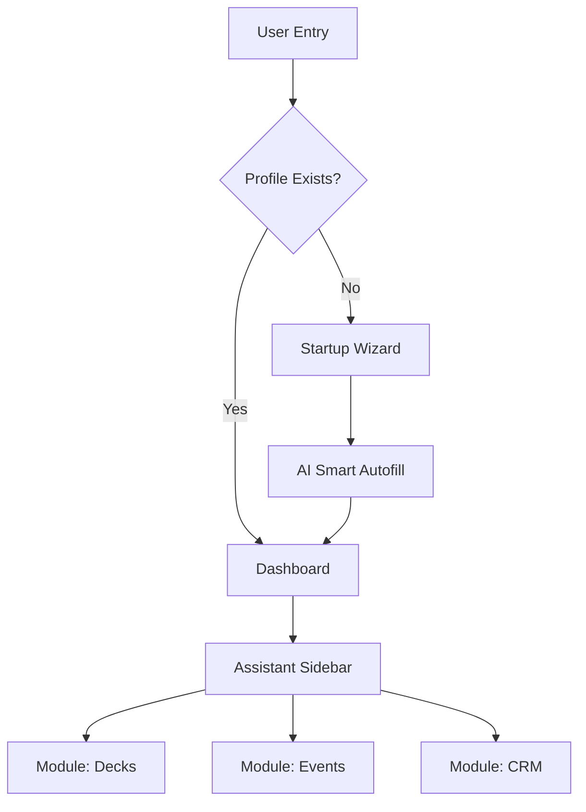
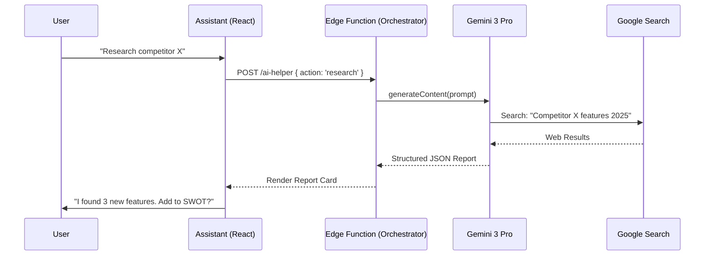
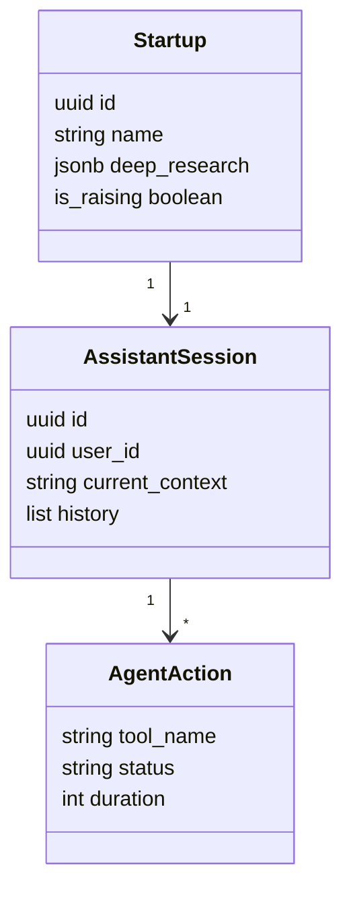
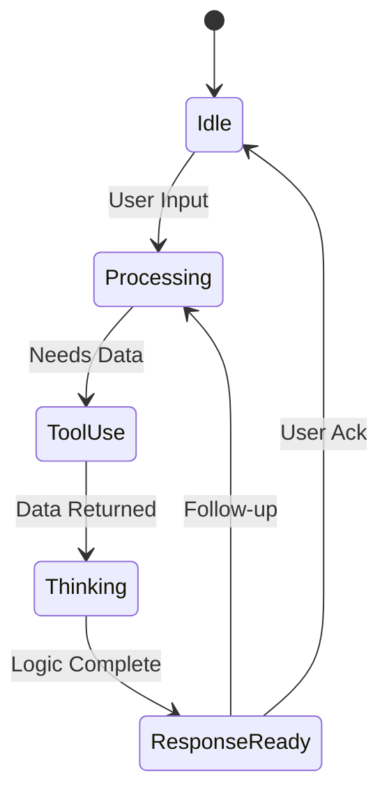
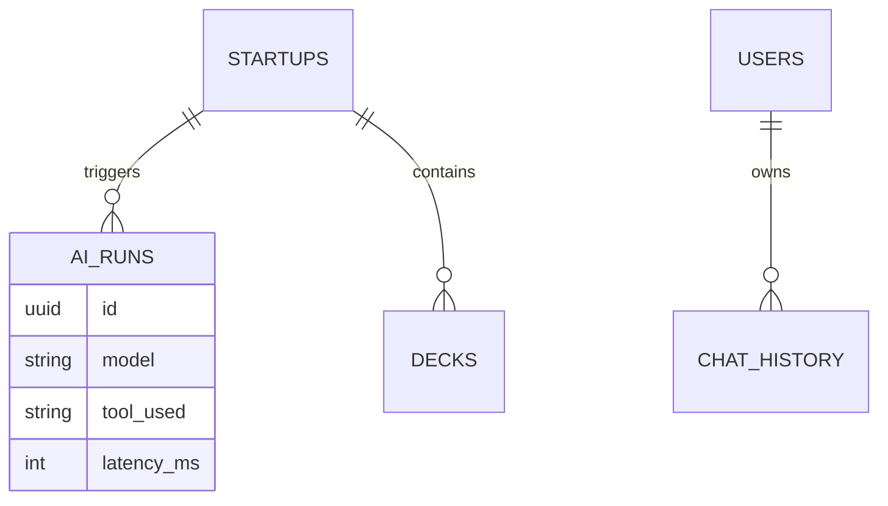
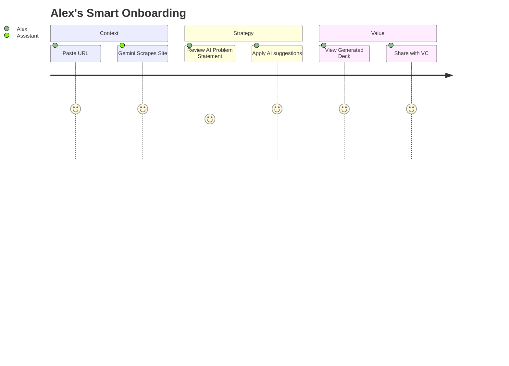
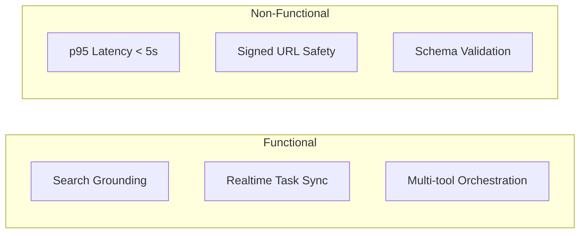
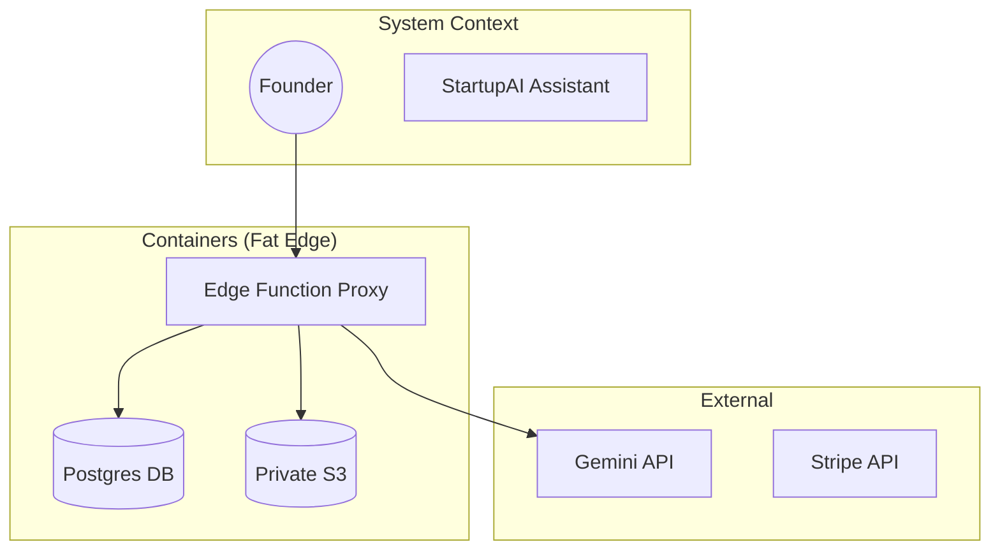
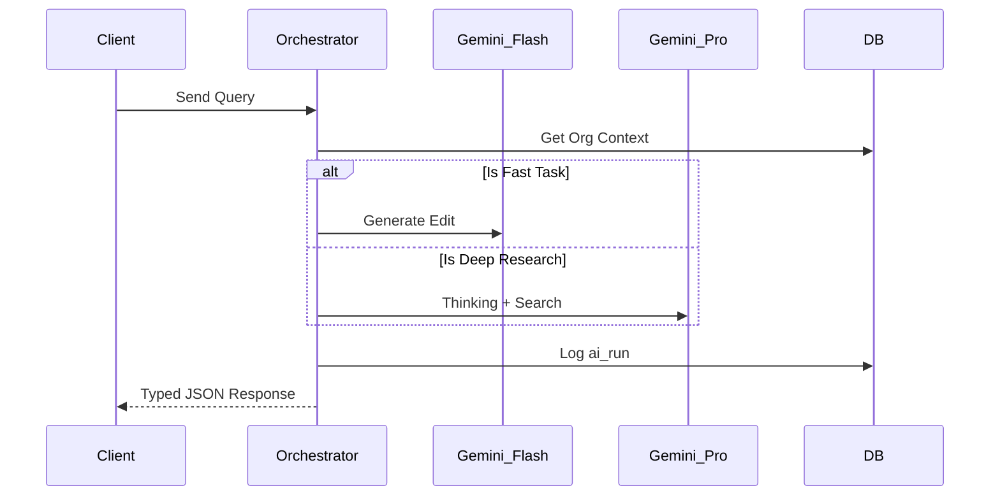

# 🤖 StartupAI Assistant — Product Architecture & UX Blueprint

**Version:** 1.0  
**Status:** 🟢 Production Ready (Architectural Sign-off)  
**Lead:** Senior Product Architect / AI Systems Designer  

---

## 0) Progress Tracker

| Phase | Description | Owner | Status | Validation Check |
| :--- | :--- | :--- | :--- | :--- |
| **P1: Discovery** | Core Goal & Task Matrix Definition | Design | 🟢 Complete | Stakeholder review of user outcomes. |
| **P2: UX Design** | Screen Layouts & Interaction Models | UX | 🟢 Complete | Zero dead-ends in Journey mapping. |
| **P3: AI Logic** | Agent Orchestration & Tool Selection | AI | 🟢 Complete | Gemini 3 Pro/Flash routing logic verified. |
| **P4: Architecture** | Diagram Set & Technical Wiring | Backend | 🟢 Complete | ERD/Sequence diagrams aligned with Edge. |
| **P5: QA & Launch** | Acceptance Tests & Troubleshooting | QA | 🟡 In Progress | Given/When/Then scenarios vs. schema limits. |

---

## 1) Product Goal

The StartupAI Assistant is an **Action-Driven Co-pilot** designed to eliminate "Blank Page Syndrome" and "Context Switching Fatigue" for early-stage founders.

1.  **Core Problem:** Founders waste 40% of their time on operational drafting (Decks, Emails, CRM updates) instead of building or selling.
2.  **Primary Users:** Overwhelmed Solo-Founders and lean Startup Operators.
3.  **Desired Outcome:** Transform complex business data into investor-ready assets and actionable roadmaps via natural language.
4.  **Success Metric:** Increase **Activation Rate** (Completion of Profile + first Deck) by 65% and **Retention** (Daily Task Completion) by 30%.

---

## 2) Feature × Task Matrix

| Feature | Tier | User Value | AI Used | Screens | Status |
| :--- | :--- | :--- | :--- | :--- | :--- |
| **Smart Autofill** | Core | 10x speed during intake | Flash + URL Context | Wizard | 🟢 Ready |
| **Deep Research Brief** | Advanced | Defensible market data | Pro + Search | Profile / Assistant | 🟢 Ready |
| **Slide Copilot** | Core | WYSIWYG Narrative fix | Flash | Deck Editor | 🟢 Ready |
| **Logistics Agent** | Advanced | Zero-conflict scheduling | Pro + Search | Event Hub | 🟢 Ready |
| **Next Best Action** | Core | Removes "What now?" | Flash + Memory | Dashboard | 🟢 Ready |
| **Secure Link Gen** | Advanced | Frictionless sharing | Backend API | Data Room | 🟢 Ready |

---

## 3) User Journeys

### 1. The "Zero-to-One" Founder (Alex)
*   **Goal:** Create an investor profile and pitch deck from a raw landing page URL.
*   **Entry Point:** Landing Page -> Get Started.
*   **AI Action:** Gemini 3 Pro scrapes Alex's URL, analyzes the market, and pre-fills 80% of the Wizard.
*   **Outcome:** Alex has a completed profile and a Sequoia-style deck in < 5 minutes.
*   **Friction Fix:** "Auto-Suggest" buttons replace high-effort textareas.

### 2. The Busy Operator (Sarah)
*   **Goal:** Plan a 100-person Demo Day without venue conflicts.
*   **Entry Point:** Event Hub -> New Event.
*   **AI Action:** Assistant uses Search Grounding to check city dates, identifies a major conference conflict, and suggests a better date.
*   **Outcome:** Sarah receives a 20-step workback schedule synced to her Dashboard.

### 3. The Prepared Investor (Mark - Read Only)
*   **Goal:** Summarize the startup's traction and identify "Red Flags."
*   **Entry Point:** Public Share Link.
*   **AI Action:** Assistant provides a 3-bullet summary of MRR, Runway, and Competitive Advantage.
*   **Outcome:** Mark decides whether to "Book a Meeting" in < 30 seconds.

---

## 4) UI / UX Screens

### **S1: Mission Control (Dashboard)**
*   **Purpose:** Pulse of the startup.
*   **Key Sections:** Runway Chart (Top), AI Insights Widget (Right), Active Tasks (Left).
*   **Primary CTA:** "Ask Assistant" (Floating Bubble).
*   **AI Features:** Real-time health scoring based on CRM/Financial data.
*   **Next Screen:** Any management module (CRM, Decks, etc.).

### **S2: Agentic Intake (Wizard)**
*   **Purpose:** High-fidelity data capture.
*   **Key Sections:** Context Input (URL), Strategy Review (AI generated), Team.
*   **Primary CTA:** "Run Smart Autofill."
*   **AI Features:** Gemini 3 Pro Search Grounding for competitor detection.
*   **Next Screen:** Dashboard.

### **S3: Multimodal Editor (Deck Engine)**
*   **Purpose:** Presentation design.
*   **Key Sections:** Slide Thumbnails (Left), Canvas (Center), AI Tools Panel (Right).
*   **Primary CTA:** "Export PDF."
*   **AI Features:** "Fix this slide" (Visual prompt generation + Text refinement).
*   **Next Screen:** Share Modal.

---

## 5) Forms, Chatbots & AI Interactions

### **A) Progressive Forms**
Instead of static inputs, use **Inference-First** fields:
*   **Input:** Website URL.
*   **Assistant:** "I see you're building a B2B SaaS for LegalTech. I've drafted your Problem Statement. Click **Apply** or **Edit**."
*   **UX:** Large, clickable "Apply" buttons next to AI suggestions.

### **B) Assistant Chat UI (Persistent Drawer)**
*   **Command:** "Plan a mixer for SF Tech Week."
*   **Assistant:** "Searching for dates... Warning: October 12-14 overlaps with Dreamforce. Should I plan for the week after?"
*   **Actionable Memory:** "I remember you mentioned a $15k budget for events. Applying that now."

---

## 6) AI Features (Core vs Advanced)

### **Core (Phase 1)**
*   **Assistant Copilot:** Interactive help for all modules (Flash).
*   **Smart Summaries:** MRR/Traction highlights for the Dashboard (Flash).
*   **Task Auto-Gen:** Converts AI insights into Dashboard tasks (Flash).

### **Advanced (Phase 2)**
*   **Reality Check Agent:** Cross-references user inputs with live 2025 market multiples (Pro + Search).
*   **Asset Generator:** Creates 16:9 social banners for events (Nano Banana Pro).
*   **CRM Enrichment:** Scrapes LinkedIn links for contact role/history updates (Pro + URL Context).

---

## 7) AI Agents, Functions & Tools

### **1. The Orchestrator (Server-Side)**
*   **Trigger:** Any Assistant Request.
*   **Logic:** 
    *   If `request_type` == "Quick Fix" -> Route to **Gemini 3 Flash**.
    *   If `request_type` == "Strategy/Research" -> Route to **Gemini 3 Pro**.
*   **Tools:** Search Grounding, URL Scraper, DB Reader.

### **2. Specialized Agent: "The Analyst"**
*   **Trigger:** "Research [Topic]"
*   **Input:** `startup_id`, `competitors[]`.
*   **Function:** `update_startup_research(report_json)`.
*   **Observability:** Logs to `ai_runs` with `duration_ms` and `tool_usage`.

---

## 8) Workflows

### **Complex: "The Event-to-Lead Loop"**
1.  **Trigger:** User asks "Plan my launch event in NYC."
2.  **AI Action 1:** (Pro + Search) Check NYC venues, local tech holidays, and budget norms.
3.  **AI Action 2:** (Flash) Generate 15 logistics tasks in the Event Hub.
4.  **AI Action 3:** (Nano Banana) Generate Hero image for the Landing Page.
5.  **Result:** Live registration page + Marketing Kanban board.

---

## 9) Full Diagram Set

### 1) Flowchart — High Level Flow

### 2) Sequence Diagram — Assistant Interaction

### 3) Class Diagram — Domain Models

### 4) State Diagram — Assistant Session

### 5) ERD — Data Model

### 6) User Journey — Alex's Onboarding

### 7) Requirements Diagram (Flowchart Style)

### 8) Architecture Diagram (C4 Style)

### 9) ZenUML Sequence — Execution Detail

---

## 10) Real-World Use Cases

1.  **Fundraising Pivot:** User asks "Make my problem statement more aggressive." Assistant uses Sequoia's internal benchmarks to rewrite the slide content.
2.  **Competitive Threat:** Assistant detects a new funding round for a competitor via Search and creates a "Market Alert" task on the dashboard.
3.  **Logistics Savior:** Sarah asks "Where should I host a 50-person mixer in NYC?" Assistant returns 3 venues with capacity and vibes matched to her startup's "Brand Persona."
4.  **Due Diligence Prep:** Assistant scans the Data Room and warns: "You are missing a Certificate of Incorporation. Investors will require this."
5.  **Lead Scoring:** "Summarize my best leads." Assistant analyzes CRM interaction sentiment and deal value, highlighting 3 "Hot" deals.

---

## 11) Content & Microcopy

*   **Headlines:** "Your Co-founder is thinking...", "Ready for review."
*   **Empty State:** "I've scanned your site. What should we build first? [Generate Pitch Deck] [Analyze Competitors]"
*   **AI Toast:** "Insight generated. I've added a task to your roadmap."
*   **CTA:** "Apply to Profile", "Fix Slide", "Verify Data."

---

## 12) Implementation Plan

### **Milestone 1: Core Connectivity (Week 1)**
*   [ ] Design the persistent Sidebar/Drawer UI.
*   [ ] Deploy `ai-helper` Edge Function with Orchestrator routing.
*   [ ] Wire "Ask Assistant" to the Dashboard context.

### **Milestone 2: Agentic Skills (Week 2)**
*   [ ] Build "Analyst" agent with Google Search Grounding.
*   [ ] Build "Editor" agent for WYSIWYG slide fixes.
*   [ ] Implement `ai_runs` audit logging.

### **Milestone 3: Automation & Trust (Week 3)**
*   [ ] Add signed URL generation for private docs.
*   [ ] Implement "Confidence Scores" on AI suggestions.
*   [ ] Final RLS audit for multi-tenant isolation.

---

## 13) Acceptance Tests

*   **GIVEN** a valid URL, **WHEN** I click "Autofill", **THEN** at least 5 fields must be pre-filled with correctly grounded JSON.
*   **GIVEN** a private document, **WHEN** the Assistant summarizes it, **THEN** it must use a Signed URL and NOT expose raw data in logs.
*   **GIVEN** a 60-second AI timeout, **WHEN** an agent runs, **THEN** the UI must show a "Thinking" state and offer a "Retry" if failed.

---

## 14) Troubleshooting

*   **Hallucination:** If AI suggests a non-existent competitor, provide a "Source Link" icon. If no link exists, lower the confidence score.
*   **Latency:** Use Gemini 3 Flash for any task requiring < 2s response. Reserve Pro for background synthesis.
*   **Context Leakage:** Ensure `org_id` is passed to every Edge call to prevent cross-tenant inference.

---

## 15) Production-Ready Checklist

- [x] All AI calls proxy through Edge Functions (No Client-side keys).
- [x] Zero-state designs for all cards.
- [x] Mobile-responsive drawer (Width 100% on phone, 400px on desktop).
- [x] Signed URL support for all Data Room interactions.
- [x] RLS verified for all `events` and `investor_docs` queries.

---

## 16) Prompt List

1.  **UI Design:** "Design a responsive React sidebar for an AI co-founder aware of current page context (URL, ID)."
2.  **Workflow:** "Create a Deno Edge Function that routes user queries to Flash or Pro based on complexity."
3.  **Feature:** "Implement Google Search Grounding for a competitive analysis agent returning strict JSON."
4.  **Agent:** "Build a 'Due Diligence' agent that checks a Supabase bucket for missing critical files."
5.  **Diagrams:** "Generate a Mermaid sequence diagram for a multi-step event planning workflow."
6.  **Test:** "Write Vitest scenarios for a Gemini-driven task generator that must return a valid schema."
