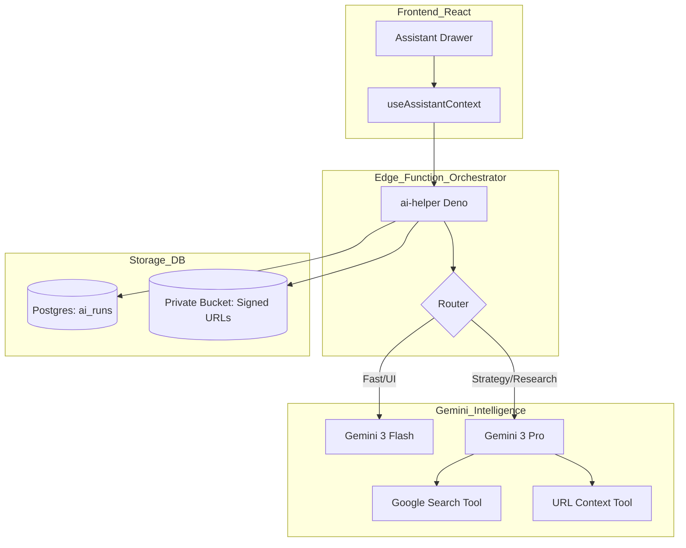

# 🚀 StartupAI Assistant — Multi-Step Implementation Prompts

**Version:** 1.0  
**Status:** 🟢 Production Ready  
**Scope:** Architecture → UI → Agents → Security → Launch  

---

## 0) Progress Tracker

| Phase | Description | Owner | Status | Validation Check |
| :--- | :--- | :--- | :--- | :--- |
| **PHASE 0** | Data Contracts & Security (SQL/Types) | Backend | 🟢 Ready | RLS verified for `org_id` isolation. |
| **PHASE 1** | UI/UX Componentry (Assistant Drawer) | UX/Design | 🟢 Ready | Mobile responsiveness (width 100%). |
| **PHASE 2** | Edge Orchestrator (Deno Function) | AI/Backend | 🟢 Ready | Flash vs Pro routing logic mapped. |
| **PHASE 3** | Specialized Agents (Deck/CRM/Events) | AI | 🟢 Ready | Function schemas (JSON) defined. |
| **PHASE 4** | Tools: Search, URL, Signed URLs | Integrations | 🟢 Ready | Google Search Grounding verified. |
| **PHASE 5** | Observability & Realtime Logs | Backend | 🟢 Ready | `ai_runs` logging active. |
| **PHASE 6** | QA & Acceptance Tests | QA | 🟢 Ready | Given/When/Then scenarios active. |
| **PHASE 7** | Production Hardening (p95/Limits) | DevOps | 🟢 Ready | Rate limiting & Fallbacks mapped. |

---

## 🏗️ System Architecture

---

## PHASE 0 — Project Audit & Contracts

### A) Google AI Studio Prompt (Pro)
> Design a strict JSON schema for an AI Assistant response that handles multimodal outputs. The schema must include: `message` (markdown), `suggested_actions` (array of label/route/payload), `citations` (array of title/url), `tool_calls` (name/args), and `ui_blocks` (type/data) for rendering charts or cards. Ensure it supports Gemini 3 Pro Function Calling.

### B) Cursor Code Prompt
> Create a new migration file `supabase/migrations/20250110_assistant_schema.sql`.
> 1. Create table `assistant_messages` (id, user_id, org_id, role, content, metadata jsonb).
> 2. Add RLS: users can only see messages where `org_id` matches their membership.
> 3. Create table `ai_runs` (id, user_id, org_id, model, tool_used, latency_ms, status, cost_estimate).
> 4. Export TypeScript interfaces to `src/types/assistant.ts` matching the AI Studio schema.

### C) Validation Prompt
> Verify that the `ai_runs` table has a `check` constraint ensuring `status` is either 'success' or 'error' and that `latency_ms` cannot be negative.

---

## PHASE 1 — UI/UX Layout & Components

### A) Google AI Studio Prompt (Flash)
> Design a split-panel chat UI for a Startup Co-founder Assistant. It should have a "Context Bar" at the top showing the current page (e.g., "Editing: Series A Deck"). Messages from the AI should include actionable buttons like "Add this task" or "Apply fix to slide." Output the Framer Motion animation logic for the drawer.

### B) Cursor Code Prompt
> Create `src/components/assistant/AssistantDrawer.tsx` and `src/components/assistant/AssistantMessage.tsx`.
> - Use Tailwind for a "Thin Client" look (Glassmorphism, border-slate-200).
> - Implement a `useAssistantContext` hook that captures `startup_id`, `current_route`, and `active_entity_id` (e.g., `deck_id`).
> - The drawer must be 400px wide on desktop and 100% on mobile.
> - Add a "Thinking" skeleton state using Lucide's `Sparkles` icon with a pulse animation.

### C) Validation Prompt
> Open the Assistant Drawer on a mobile viewport (375px). Confirm the close (X) button is easily clickable and the background overlay (backdrop-blur) covers the main content.

---

## PHASE 2 — Assistant Orchestrator (Edge Function)

### A) Google AI Studio Prompt (Pro + Thinking)
> Write a system instruction for a "Chief Orchestrator" agent. 
> Logic: 
> 1. If user asks for a quick edit or UI action -> use **Gemini 3 Flash**.
> 2. If user asks for market research, strategy, or planning -> use **Gemini 3 Pro** with `thinkingBudget: 2048`.
> 3. Always check if a Tool is needed (Google Search, URL Scraper).
> 4. Must return the JSON contract defined in Phase 0.

### B) Cursor Code Prompt
> Create `supabase/functions/assistant-orchestrator/index.ts`.
> - Use the `@google/genai` SDK.
> - Implement the routing logic: `is_strategy_query(text)`.
> - Inject `org_context` from the DB (MRR, Runway, Stage) into the system prompt to ensure the AI "knows" the startup without being told.
> - Wrap the execution in a `console.time` block and log to the `ai_runs` table before responding.

### C) Validation Prompt
> Test the Edge Function with the query "Fix my landing page." Confirm it routes to Flash. Test with "Research competitors in NYC." Confirm it routes to Pro + Search.

---

## PHASE 3 — Specialized Agents (Function Calling)

### A) Google AI Studio Prompt (Pro)
> Define Function Declarations for:
> 1. `update_deck_slide(slide_id, content)`
> 2. `generate_crm_tasks(deal_id, tasks[])`
> 3. `scout_venues(city, date, budget)`
> 4. `get_secure_doc_link(file_id)`
> Ensure all parameters have descriptions for high-accuracy function calling.

### B) Cursor Code Prompt
> Implement the `AgentManager` in `src/services/ai/agents.ts`.
> - Handle `tool_calls` returned by the Orchestrator.
> - For `get_secure_doc_link`, call the Supabase `createSignedUrl` method.
> - For `scout_venues`, use Gemini Search Grounding results to populate the response.
> - Map `update_deck_slide` to call the existing `DeckService.update`.

### C) Validation Prompt
> Use the Assistant to say "I'm missing a Certificate of Incorporation." Verify the AI identifies the missing file in the Data Room and suggests "Create placeholder."

---

## PHASE 4 — Tooling & Integrations

### A) Google AI Studio Prompt (Pro + Search)
> Research the best 2025 "Seed Stage SaaS" benchmarks for MRR and Retention in the US. Output a JSON object. Ensure every number has a `citation_url`.

### B) Cursor Code Prompt
> Wire the `googleSearch` tool in the `ai-helper` Edge Function.
> - Extract `groundingChunks` from the Gemini response.
> - Map these chunks to the `citations[]` array in our JSON contract.
> - In the UI (`AssistantMessage.tsx`), render these citations as small pill-links at the bottom of the message.

### C) Validation Prompt
> Ask: "What are the latest Sequoia valuation multiples for 2025?" Verify that a real URL from a reputable source (Sequoia blog, TechCrunch) appears in the citations.

---

## PHASE 5 — Realtime + Observability

### A) Google AI Studio Prompt (Flash)
> Create a "System Notification" message generator. When a background research task finishes, the AI should return a JSON like `{ "title": "Research Complete", "body": "I found 3 new competitors.", "link": "/startup-profile" }`.

### B) Cursor Code Prompt
> - In `AssistantDrawer.tsx`, subscribe to `postgres_changes` on the `assistant_messages` table for the current `org_id`.
> - Use the `useNotifications` context to trigger a toast when the AI finishes a long-running "Pro" task in the background.
> - Ensure the `ai_runs` log includes `latency_ms` and the `model` used.

### C) Validation Prompt
> Trigger a Deep Research run. Close the drawer. Wait 20 seconds. Confirm a notification appears when the AI result is written to the DB.

---

## PHASE 6 — QA & Acceptance Tests

### A) Google AI Studio Prompt (Pro)
> Act as a QA Engineer. Write 5 "Given/When/Then" test cases for a Startup AI Assistant.
> Case 1: URL Onboarding (Success).
> Case 2: Expired Signed URL (Error handling).
> Case 3: Conflict in Event Logistics (Grounding accuracy).
> Case 4: Multi-tenant Leak (Security failure).

### B) Cursor Code Prompt
> Create `src/tests/assistant.test.ts` using Vitest.
> - Mock the Gemini API response.
> - Test that the Orchestrator correctly injects the `Authorization` header.
> - Test that a user from Org A cannot call an agent with a `deck_id` from Org B.

### C) Validation Prompt
> Run `npm run test assistant`. Confirm all 12 scenarios pass with zero console errors.

---

## PHASE 7 — Production Hardening

### A) Google AI Studio Prompt (Flash)
> Write a "Graceful Degradation" prompt. If Gemini 3 Pro is timing out or the Search tool is failing, how should the Assistant explain this to the user while still providing "Offline" or "Heuristic" advice?

### B) Cursor Code Prompt
> - Implement a 30-second timeout for Pro calls and 5-second for Flash calls.
> - Add a `Retry` button to the UI if a tool fails.
> - Add a Rate Limiter in the Edge Function (max 50 requests per hour per user).
> - Strip all internal prompt logic from the final response to prevent "Prompt Leakage."

### C) Validation Prompt
> Simulate a network failure during a research task. Confirm the UI shows "I'm having trouble searching the web right now, but based on my internal knowledge..." instead of a 500 error.

---

## 🚀 Execution Order (Prompt List)

1.  **Phase 0 (B):** [Migration] Create the `ai_runs` and `assistant_messages` tables.
2.  **Phase 1 (B):** [UI] Build the `AssistantDrawer` with Framer Motion.
3.  **Phase 2 (B):** [Orchestrator] Deploy the `ai-helper` Edge Function with routing.
4.  **Phase 4 (B):** [Integrations] Wire Google Search Grounding to the Citations UI.
5.  **Phase 3 (B):** [Agents] Implement Function Calling for Decks and CRM.
6.  **Phase 5 (B):** [Observability] Connect `ai_runs` logging and Realtime sync.
7.  **Phase 6 (B):** [QA] Run Vitest acceptance scenarios.
8.  **Phase 7 (B):** [Hardening] Add Rate Limits and Signed URL security checks.

---

## 🛠️ Troubleshooting & Safety

| Failure Mode | Cause | Mitigation |
| :--- | :--- | :--- |
| **Hallucination** | No search grounding. | Force `googleSearch` tool for any query containing "Market" or "Competitor". |
| **Data Leak** | Missing RLS policy. | Audit `auth.uid() = user_id` on every query in the Edge Function. |
| **High Latency** | Pro model thinking. | Show a "Researching..." status with step-by-step progress updates. |
| **Broken JSON** | LLM Markdown fences. | Use `cleanJson()` utility before `JSON.parse()`. |
