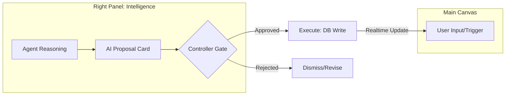

# 🤖 StartupAI Agentic OS — Master Plan (v4.2)

This document defines the specialized AI workers (Agents) that power the StartupAI ecosystem. Every agent operates under the **"Propose-Approve-Execute"** governance model, ensuring human control over all autonomous actions.

---

## 📊 Agent Implementation Tracker

| Agent Category | Status | Model | Key Tooling | Priority |
| :--- | :--- | :--- | :--- | :--- |
| **Orchestrator** | 🟢 Ready | Gemini 3 Pro | Thinking + Function Calling | P0 |
| **Market Scout** | 🟢 Ready | Gemini 3 Pro | Google Search + URL Context | P0 |
| **Deck Architect** | 🟢 Ready | Gemini 3 Pro | Structured Outputs | P0 |
| **Ops Planner** | 🟡 Testing | Gemini 3 Flash | Function Calling | P1 |
| **Financial Analyst**| 🟡 Testing | Gemini 3 Pro | Code Execution (Python) | P1 |
| **CRM Scorer** | 🔴 Backlog | Gemini 3 Flash | Reasoning | P2 |
| **Data Retriever** | 🔴 Backlog | Gemini 2.5 | RAG + Signed URLs | P2 |

---

## 🧙‍♂️ Core Agent Registry

| Agent Type | Role in StartupAI | Gemini 3 Model | Approved Tools Used |
| :--- | :--- | :--- | :--- |
| **Orchestrator** | Routes user intent to specialized agents. | Pro | Thinking, Function Calling |
| **Planner** | Generates pitch structures and event roadmaps. | Pro | Text Gen, Structured Outputs |
| **Analyst** | Performs financial forensics and risk audits. | Pro | Code Execution, Thinking |
| **Scorer** | Calculates Health, ROI, and Fit scores (0-100). | Flash | Structured Outputs |
| **Controller** | Enforces the human approval gate in the Right Panel. | N/A (Logic) | Human-in-the-loop Gate |
| **Extractor** | Hydrates profiles from URLs and LinkedIn. | Pro | URL Context, Search Grounding |
| **Content/Comms** | Drafts investor emails and marketing copy. | Flash | Text Gen, Nano Banana |

---

## 🧜‍♂️ System Workflows

### The Governance Lifecycle (Mandatory)
AI agents in StartupAI are **never** permitted to write directly to the database without a human intermediary.

### End-to-End Flow: The "Seed Round" Agent Chain
1.  **Scout (Intake):** Scrapes URL and searches for 2025 market benchmarks.
2.  **Analyst (Math):** Uses Code Execution to verify runway based on cash/burn inputs.
3.  **Planner (Drafting):** Architect generates a 12-slide Sequoia deck structure.
4.  **Controller (Approval):** User reviews the full "Fundraising Kit" in the Right Panel and clicks **Apply All**.

---

## 🛠️ Feature → AI Mapping (Audit v4.2)

| Item | Screen | Model | Gemini Tools | Agents | Inputs | Output | Approval |
| :--- | :--- | :--- | :--- | :--- | :--- | :--- | :--- |
| **Smart Onboarding** | Wizard | Pro | URL Context, Search | Scout, Extractor | URL, Keywords | Hydrated Profile | Controller |
| **Pitch Engine** | Deck Editor | Pro | Structured Output | Architect | Startup Profile | JSON Slides | Controller |
| **Financial Audit** | Dashboard | Pro | Code Execution | Analyst | CSV Export | Burn/Runway Data | Controller |
| **Event Roadmap** | Event Hub | Flash | Function Calling | Planner, Operator | Event Goal/Date | Kanban Tasks | Controller |
| **Outreach Draft** | CRM | Flash | Text Gen | Content/Comms | Investor Thesis | Email Hook | Controller |

---

## 📐 UX Design Rules for Agents

1.  **The "Right Panel" Rule:** All AI thinking, logs, and proposal cards MUST live in the Right Panel (Intelligence Hub).
2.  **The "Thinking" State:** During high-depth reasoning (Pro models), the UI must show a "Thinking Trace" or skeleton loader.
3.  **Source Transparency:** Any data found via **Search Grounding** must display a citation link icon.
4.  **Deterministic Math:** Never use LLM text generation for financials; always route through the **Analyst Agent** using Python **Code Execution**.

---

## ⚡ Sequential Multi-Step Prompts for Implementation

### Prompt 1: The Orchestrator Setup
> "Build the `ai-helper` Edge Function using Gemini 3 Pro. Implement a router that detects if a query is 'Quick' (Flash) or 'Complex' (Pro). Pro calls must include `thinkingBudget: 2048`. All responses must be wrapped in a `ProposedAction` JSON schema."

### Prompt 2: The Forensic Analyst
> "Implement the Analyst Agent in `forensics.ts`. Use Gemini 3 Pro **Code Execution** to parse raw transaction strings. The agent must write a Python script using Pandas to calculate MRR and Burn, returning a structured JSON of metrics and anomalies."

### Prompt 3: The Right Panel UI
> "Design a React component `ProposedActionCard` for the Right Panel. It should show the AI's reasoning, a diff of the proposed change, and a large 'Approve' button that triggers the `execute-action` Edge Function."