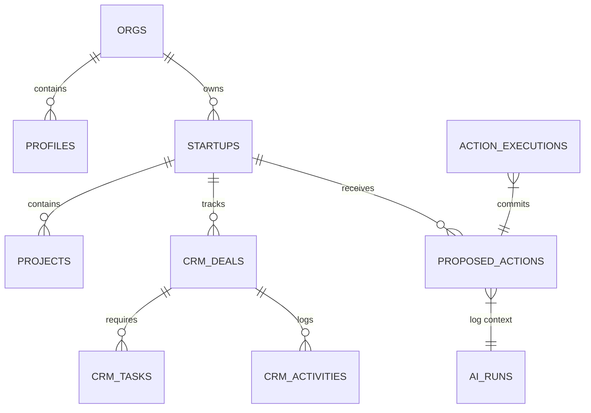
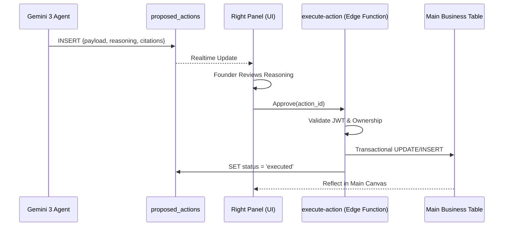

# 🗄️ StartupAI Supabase Schema Specification (v4.3)

This document defines the production-grade PostgreSQL schema for the StartupAI Agentic OS. The architecture is built on a **Security-First, Multi-Tenant** foundation where AI agents are restricted to a "Proposal" buffer.

---

## 1. High-Level Overview

The schema is divided into four main domains:
1.  **Identity & Access**: Multi-tenant isolation using `orgs` and `profiles`.
2.  **Startup Intelligence**: Core business entities and the "Startup Graph."
3.  **CRM & Operations**: The active execution workspace (Main Canvas).
4.  **Agentic Governance**: The mandatory buffer for AI-driven modifications.

---

## 2. Entity Relationship Diagram (ERD)



---

## 3. Table Definitions (Core OS)

### 3.1 Identity & Multitenancy

| Table | Purpose | Core Columns |
| :--- | :--- | :--- |
| `orgs` | Root tenant entity. | `id`, `name`, `billing_plan`, `owner_id` |
| `profiles` | User metadata linked to Auth. | `id` (FK auth.users), `org_id`, `full_name`, `role` |

### 3.2 Startup Graph

| Table | Purpose | Core Columns |
| :--- | :--- | :--- |
| `startups` | Master company record. | `id`, `org_id`, `name`, `industry`, `stage`, `deep_research_report` |
| `projects` | Operational buckets (e.g., "Series A Prep"). | `id`, `startup_id`, `title`, `status` |

### 3.3 CRM & Execution Workspace

| Table | Purpose | Core Columns |
| :--- | :--- | :--- |
| `crm_accounts` | Target investment firms/entities. | `id`, `org_id`, `name`, `domain`, `ai_score` |
| `crm_deals` | Specific fundraising/sales opportunities. | `id`, `startup_id`, `account_id`, `amount`, `stage`, `probability` |
| `crm_tasks` | Daily roadmap execution items. | `id`, `org_id`, `title`, `status`, `priority`, `source` (ai/manual) |

---

## 4. AI Governance (The "Safe-Write" Layer)

### 4.1 `proposed_actions`
**Purpose:** This is the ONLY table where AI Agents are permitted to `INSERT`. It acts as the staging area for the **Intelligence Hub**.

```sql
CREATE TABLE proposed_actions (
  id UUID PRIMARY KEY DEFAULT gen_random_uuid(),
  org_id UUID NOT NULL REFERENCES orgs(id),
  startup_id UUID NOT NULL REFERENCES startups(id),

  -- Routing Info
  entity_type TEXT NOT NULL, -- e.g., 'crm_deals', 'startups'
  entity_id UUID,            -- Target record to update
  action_type TEXT NOT NULL, -- 'update', 'insert', 'delete'

  -- AI Content
  payload JSONB NOT NULL,    -- The change to be applied
  reasoning TEXT,            -- Human-readable "Why" from Thinking Mode
  citations JSONB DEFAULT '[]', -- Source URLs from Search Grounding

  -- Lifecycle
  status TEXT DEFAULT 'proposed' 
    CHECK (status IN ('proposed', 'approved', 'rejected', 'executed')),
  
  -- Metadata
  ai_run_id UUID REFERENCES ai_runs(id),
  confidence FLOAT DEFAULT 1.0,
  
  created_at TIMESTAMPTZ DEFAULT now(),
  updated_at TIMESTAMPTZ DEFAULT now()
);
```

### 4.2 `ai_runs`
**Purpose:** Observability and cost tracking for every Gemini 3 interaction.

```sql
CREATE TABLE ai_runs (
  id UUID PRIMARY KEY DEFAULT gen_random_uuid(),
  org_id UUID NOT NULL REFERENCES orgs(id),
  user_id UUID REFERENCES auth.users(id),
  
  agent_name TEXT NOT NULL,  -- 'The Scout', 'The Analyst'
  model TEXT NOT NULL,       -- 'gemini-3-pro-preview'
  tools_used TEXT[],         -- ['googleSearch', 'codeExecution']
  
  input_tokens INTEGER,
  output_tokens INTEGER,
  latency_ms INTEGER,
  
  created_at TIMESTAMPTZ DEFAULT now()
);
```

---

## 5. RLS Policies (Multitenant Security)

Every table must enforce strict isolation based on the user's `org_id`.

```sql
-- Enable RLS
ALTER TABLE startups ENABLE ROW LEVEL SECURITY;
ALTER TABLE proposed_actions ENABLE ROW LEVEL SECURITY;

-- Typical Policy Pattern
CREATE POLICY "Users can only access their own org data"
  ON startups
  FOR ALL
  TO authenticated
  USING (org_id = (SELECT org_id FROM profiles WHERE id = auth.uid()));

-- AI Governance Policy: Restricted Write
CREATE POLICY "AI Agents can only stage proposals"
  ON proposed_actions
  FOR INSERT
  WITH CHECK (org_id = (SELECT org_id FROM profiles WHERE id = auth.uid()));
```

---

## 6. Execution Flow (The Human Gate)



---

## 7. Why This Schema Is Safe for AI

1.  **Immutability of Core Tables**: AI agents have no `UPDATE` or `DELETE` permissions on core business tables (`crm_deals`, `startups`, etc.).
2.  **Proposal Traceability**: Every proposed change is linked to an `ai_run_id`, allowing developers to trace hallucinations back to specific prompts and search chunks.
3.  **Transactional Integrity**: The `execute-action` Edge Function acts as a secure proxy, performing data validation and type checking before committing AI-generated payloads to the primary database.
4.  **Multi-tenant Airgap**: RLS ensures that even if an agent hallucinates a `startup_id`, the Postgres engine will block the write if that ID belongs to another organization.
