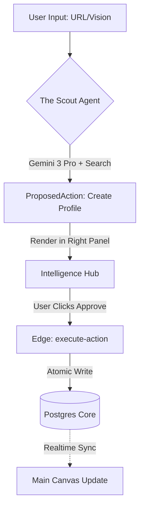
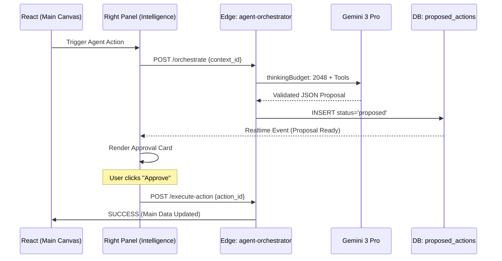
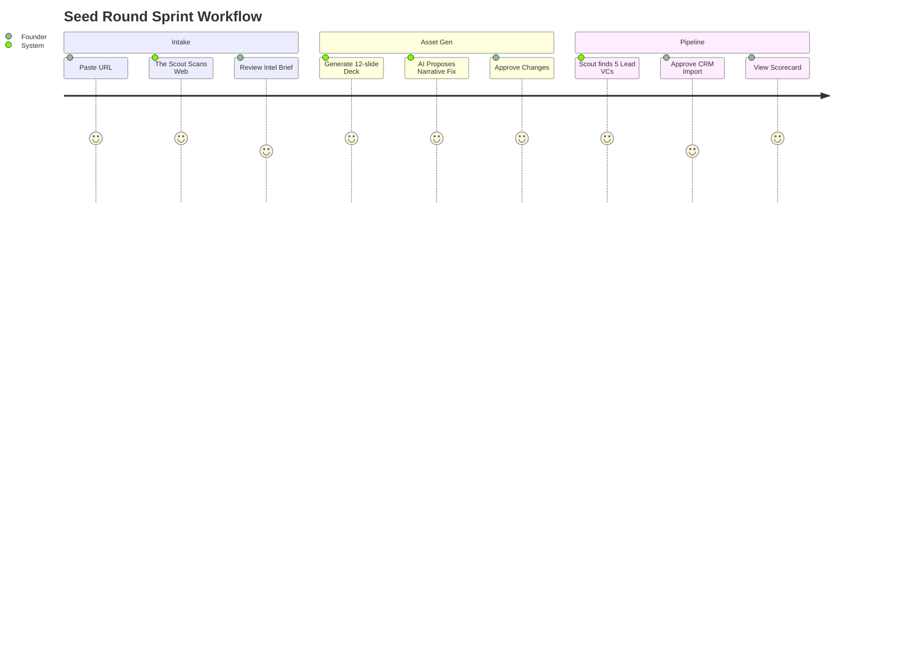

# 📑 StartupAI — Screen Registry & Workflow Specification (v4.3)

This document provides the high-fidelity specification for all application surfaces within the StartupAI Agentic OS. It defines the interaction model between the 3-panel UI and the "Propose → Approve → Execute" governance layer.

---

## 1) SYSTEM MAP

StartupAI is an AI-native Operating System that automates the lifecycle of a venture-backed company.

**Primary Entities:** `org`, `startup`, `project`, `deal`, `task`, `doc`, `proposed_action`, `ai_run`.

**The 3-Panel Rule:**
*   **Left (Navigator):** Global scope control. Sets the context for the workspace.
*   **Main (Canvas):** Active workspace for human/AI collaboration. Source of truth.
*   **Right (Intelligence Hub):** Mandatory safe-zone for AI reasoning, status, and approval gates.

**The Governance Rule:** AI agents are restricted to **READ** permissions for business data. They are permitted to **INSERT** only into the `proposed_actions` table. A human signature (Approve) is required to commit any change to core tables.

---

## 2) SCREEN REGISTRY

| Route | Screen Name | Type | Primary Entity | Advanced AI Feature | Key Agents | Outputs |
| :--- | :--- | :--- | :--- | :--- | :--- | :--- |
| `/dashboard` | Command Center | Dashboard | Startup | KPI Anomaly Detection | Analyst | tasks |
| `/onboarding` | Startup Wizard | Wizard | Org | Smart URL Autofill | Scout | startups |
| `/startups` | Startups List | Dashboard | Org | Multi-Portfolio Summary | Orchestrator | N/A |
| `/startups/:id` | Startup Profile | Editor | Startup | Deep Market Forensics | Scout, Analyst | startup_details |
| `/pitch-decks` | Deck Library | Dashboard | Deck | Narrative Scoring | Architect | N/A |
| `/pitch-decks/:id` | Deck Editor | Editor | Slide | Structured Slide Gen | Architect | slides |
| `/documents` | Document Hub | Dashboard | Doc | RAG-based search | Orchestrator | N/A |
| `/documents/:id` | Document Editor | Editor | DocSection | Contextual Rewriting | Content | doc_content |
| `/crm/contacts` | Contacts | Dashboard | Contact | LinkedIn Enrichment | Scout | contacts |
| `/crm/deals` | Deals Pipeline | Dashboard | Deal | Fit Scoring (0-100) | Scout | deals |
| `/crm/deals/:id` | Deal Detail | Editor | Deal | Strategic Outreach Hook | Scout | emails |
| `/tasks` | Task Manager | Dashboard | Task | 5-Step Roadmap Gen | Operator | tasks |
| `/automations` | Logic Builder | Editor | AutoRule | Natural Language Logic | Orchestrator | automation_rules |
| `/settings` | Settings | Settings | Org | Usage & Cost Audit | N/A | org_config |

---

## 3) SCREEN SPECS

### Screen: Startup Wizard
**Route:** `/onboarding`  
**Purpose:** High-speed entity creation from digital footprints.  
**Primary Users:** Founder  

**Panels:**
*   **Left:** Progress Stepper (Context, Brief, Team, Biz, Traction, Review).
*   **Main:** Contextual intake forms (URL -> Market -> Review).
*   **Right:** Terminal-style "Research Log" showing real-time Scout progress.

**Core UI Components:**
*   `SmartURLInput`: with auto-fill trigger.
*   `IntelBriefCard`: Synthetic summary of detected market data.
*   `ResearchTerminal`: Real-time grounding log.

**Forms / Fields:**
*   `website_url` — URL — Optional — Valid URL pattern.
*   `startup_name` — Text — Required — Length > 2.
*   `industry` — Select — Required — ENUM match.

**Sample Content/Data:**
```json
{
  "temp_id": "wiz_99",
  "url": "https://example.com",
  "detected": {
    "name": "Acme AI",
    "industry": "Fintech",
    "mrr_estimate": "$10k",
    "founders": ["Jane Doe", "John Smith"]
  }
}
```

**Agents on this screen:**
*   **The Scout:**
    *   Trigger: `onBlur` of URL input.
    *   Model: Gemini 3 Pro.
    *   Tools: `googleSearch`, `urlContext`.
    *   Output: `ProposedAction(type: 'startup_init')`.

**Automations:**
*   URL Entered → `is_startup_url` → Trigger Scout.
*   Scout Returns → Populates `ProposedAction` → Render Brief in Right Panel.

**Workflow Logic:**
AI proposes a full startup profile based on the URL. The user clicks "Apply Brief" in the Right Panel to pre-fill all subsequent steps.

**Acceptance Checks:**
*   Entering a URL triggers the Research Log in the Right Panel.
*   AI-suggested values appear with a distinct "Agent Highlight" UI.

---

### Screen: Deck Editor
**Route:** `/pitch-decks/:id`  
**Purpose:** Narrative architecting for fundraising.  
**Primary Users:** Founder  

**Panels:**
*   **Left:** Slide Navigator (Thumbnails + Reorder).
*   **Main:** WYSIWYG Slide Canvas (Editable Text/Charts).
*   **Right:** Architect Copilot (Reasoning + Image Gen).

**Core UI Components:**
*   `SlideCanvas`: Interactive artifact editor.
*   `AI_CopilotSidebar`: Context-aware refinement tools.
*   `ProposedWriteCard`: Visual diff for slide updates.

**Agents on this screen:**
*   **The Architect:**
    *   Trigger: Manual "Optimize Slide" click.
    *   Model: Gemini 3 Pro.
    *   Tools: `structuredOutput`, `thinkingConfig`.
    *   Output: `ProposedAction(type: 'slide_update')`.

**Workflow Logic:**
User selects a slide. Clicks "Refine Narrative". The Architect proposes a rewrite based on the Sequoia template. User reviews the diff in the Right Panel and clicks "Apply".

**Acceptance Checks:**
*   Text edits in Main Panel sync to DB in < 1s.
*   Right Panel shows "Thinking" state with `thinkingBudget` status.

---

## 4) USER JOURNEYS

### A) “Seed Round Sprint”
**Persona:** Alex (Solo Founder)  
**Goal:** Build a grounded fundraising suite in 15 minutes.  
1.  **Wizard:** Alex pastes her URL. The Scout finds 3 competitors and a $10M TAM.
2.  **Approval:** Alex clicks "Apply Intelligence Brief." Profile hydrated.
3.  **Synthesis:** Alex navigates to Deck Library. The Architect proposes a 12-slide narrative.
4.  **Execute:** Alex approves the Deck structure. CRM populates with "High Fit" VCs found during research.
**Outcome:** Alex has a verified deck and a warm pipeline ready for outreach.

### C) “Investor Outreach”
**Persona:** Sarah (Ops Lead)  
**Goal:** Execute high-conversion intro emails.  
1.  **CRM:** Sarah opens the Deals Pipeline. The Scout flags a "92% Fit" lead.
2.  **Intelligence:** Sarah clicks "Review Hook." The AI explains: "Investor just exited an AI Law firm; alignment is high."
3.  **Draft:** Sarah approves the "Proposed Outreach" action.
4.  **Execute:** Transactional Edge Function sends the email via the workspace mail server.
**Outcome:** Sarah secures a meeting using data Alex didn't have to manually research.

---

## 5) MERMAID DIAGRAMS

### 5.1 System Flow (Flowchart)


### 5.2 API + Approval (Sequence Diagram)


### 5.3 User Journey (Journey Diagram)


---

## 6) CORE VS ADVANCED (VALUE LAYERING)

| Screen | Core (Manual) | Advanced (AI) | ROI | Risk | Phase |
| :--- | :--- | :--- | :--- | :--- | :--- |
| **Wizard** | Form Entry | URL Context Intake | 10 | 2 | P0 |
| **Profile** | Text Editing | Forensic CSV Audit | 9 | 4 | P1 |
| **Decks** | Slide Editing | Narrative Flow Gen | 10 | 3 | P0 |
| **CRM** | List Leads | Search Grounded Scoring | 8 | 5 | P1 |
| **Tasks** | Create Todo | Strategic Roadmap Gen | 7 | 2 | P1 |

---

## 7) RISKS & MITIGATIONS

*   **RLS/Tenancy Leaks:** 
    *   *Mitigation:* Edge Functions strictly validate `user.id` against `org_id` before executing any `ProposedAction`.
*   **Cost Runaway:** 
    *   *Mitigation:* `ai_runs` table tracks token counts; daily dollar limits enforced per `org_id`.
*   **Hallucination:** 
    *   *Mitigation:* Any data sourced externally requires a `citations` array with clickable URLs in the UI.
*   **Approval Bypass:** 
    *   *Mitigation:* Frontend code stripped of `.update()` permissions on core tables; DB restricted to Service Role via Edge only.

---

## 8) NEXT IMPLEMENTATION ORDER

1.  **Shell:** Build `AppLayout.tsx` with the responsive 3-panel grid.
2.  **Governance Hub:** Implement the `proposed_actions` table and `execute-action` Edge Function.
3.  **Intelligent Intake:** Build Step 1 & 2 of the Wizard powered by The Scout.
4.  **Presentation Architect:** Connect the Architect Agent to the Deck Editor.
5.  **Relationship Intel:** Wire The Scout to CRM lead enrichment.
6.  **Forensic Traction:** Implement the Analyst Agent's CSV parsing logic.
7.  **Daily Roadmap:** Connect The Operator to the Task Manager.
8.  **Automation Builder:** Deploy natural language logic triggers.