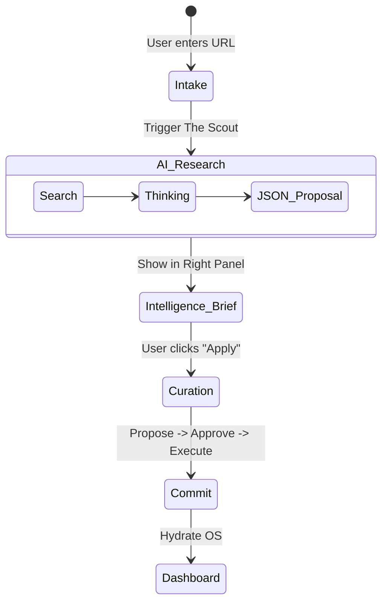

# 🧙‍♂️ StartupAI — Wizard System & Agentic Intake (v4.3)

This document specifies the **Wizard System**, the primary engine for data ingestion and asset synthesis in StartupAI. In an agentic OS, Wizards are not static forms; they are **collaborative intelligence sessions** where AI research precedes human data entry.

---

## 1) WIZARD SYSTEM OVERVIEW

Wizards in StartupAI act as the **Activation Layer**. 
*   **Contextual Entry:** Instead of a "Blank Page," wizards start with a URL or a high-level vision.
*   **Agentic Intake:** While the user fills the "Main Canvas," the "Right Panel" runs background research (**The Scout**) to validate and suggest values.
*   **Inference-Led UX:** AI "hallucinates" a structured draft using **Search Grounding**, and the user moves from *creating* to *curating*.
*   **Downstream Hydration:** Successful completion of a wizard triggers **Edge Automations** that populate the CRM, Task Roadmap, and Document Vault.

---

## 2) WIZARD REGISTRY (MASTER TABLE)

| Wizard Name | Route | Primary Goal | User | Output | AI Depth | Key Tools |
| :--- | :--- | :--- | :--- | :--- | :--- | :--- |
| **Startup Onboarding** | `/onboarding` | Entity Initialization | Founder | `startup`, `founders` | High | Search, URL Context |
| **Financial Forensic** | `/finance/setup` | Burn & Runway Audit | CFO | `metrics`, `runway` | High | Code Execution |
| **Pitch Deck Engine** | `/decks/new` | Narrative Arch | Founder | `deck`, `slides` | High | Thinking, Schema |
| **Event Ops Scout** | `/events/new` | Logistics Planning | Operator | `event`, `tasks` | Medium | Maps, Search |
| **Market Intelligence** | `/research/new` | Competitor Deep Dive | Analyst | `research_report` | High | Deep Research |
| **Outreach Wizard** | `/crm/outreach` | Warm Intro Gen | Founder | `emails`, `deals` | Medium | Search Grounding |
| **Launch Roadmap** | `/tasks/roadmap` | GTM Strategy | Ops Lead | `tasks`, `milestones` | Medium | Logic Thinking |

---

## 3) WIZARD SPECS (CORE SESSIONS)

### Wizard: Startup Onboarding
**Route:** `/onboarding`  
**Focus:** Rapid company initialization.

**Steps:**
1.  **Intake (Canvas):** Paste Website URL + LinkedIn URL + 3 Search Keywords.
2.  **Intelligence Brief (AI):** **The Scout** performs Search Grounding. Displays "Mission Control" brief in Right Panel with inferred TAM, competitors, and founder bios.
3.  **Team (Canvas):** Review/Edit auto-filled founder cards.
4.  **Business (Canvas):** Review/Edit inferred Problem/Solution/Model.
5.  **Traction (Canvas):** Input MRR/Users. AI benchmarks against industry in Right Panel.
6.  **Review (Canvas):** Final Approval of the "Startup Graph."

**Agents Involved:**
*   **The Scout (Gemini 3 Pro):**
    *   **Tool:** `googleSearch`, `urlContext`.
    *   **Action:** Returns `ProposedAction(type: 'startup_init')`.

---

### Wizard: Financial Forensic
**Route:** `/finance/setup`  
**Focus:** Turning raw data into defensible metrics.

**Steps:**
1.  **Ingestion:** Upload Stripe Export or Bank CSV.
2.  **Audit (AI):** **The Analyst** runs Python scripts to detect anomalies, churn spikes, and true burn.
3.  **Scenario:** User adjusts "Growth Levers" (Growth % vs. Churn %).
4.  **Execute:** Write metrics to `startup_metrics_snapshots`.

**Agents Involved:**
*   **The Analyst (Gemini 3 Pro):**
    *   **Tool:** `codeExecution` (Python/Pandas).
    *   **Config:** `thinkingBudget: 4096`.

---

## 4) USER JOURNEYS

### Journey A: The "Zero-to-Hero" Founder
1.  **Alex** enters `https://startup.ai` in the **Onboarding Wizard**.
2.  **The Scout** identifies Alex's previous exit and 3 active competitors in the Right Panel.
3.  Alex clicks **"Apply Intel Brief"** — 80% of his profile is instantly populated.
4.  Alex is routed to the **Pitch Deck Wizard**; AI proposes a narrative arc based on the research.
5.  **Outcome:** Alex has a verified deck and a warm investor pipeline in 12 minutes.

---

## 5) MERMAID DIAGRAMS

### 5.1 Wizard State Machine

---

## 6) IMPLEMENTATION PROMPTS (SEQUENTIAL)

### Prompt 1: The Multi-Step Wizard Shell
> **Role:** Senior UI Engineer
> **Task:** Build a reusable `WizardLayout` within the 3-Panel OS.
> **Requirements:**
> 1. Left Panel shows a "Progress Stepper."
> 2. Main Panel handles the `ActiveStep` component.
> 3. Right Panel remains reserved for `AgentIntelligenceCards`.
> 4. State must be persistent in LocalStorage until "Final Commit" to Supabase.

### Prompt 2: The Agentic Intake Controller (Step 2)
> **Role:** AI Systems Designer
> **Task:** Implement the `IntelligenceBrief` Edge Function.
> **Logic:**
> 1. Call **Gemini 3 Pro** with `thinkingBudget: 2048` and `googleSearch`.
> 2. Search for the startup name and industry provided in Step 1.
> 3. Return a JSON schema including: `executive_summary`, `competitors[]`, `valuation_benchmarks{}`, and `founder_fit_score`.
> 4. Store this as a `ProposedAction` for the user to review.

### Prompt 3: The Forensic Math Agent (Financials)
> **Role:** Principal AI Engineer
> **Task:** Build **The Analyst** agent prompt.
> **Prompt:** "Act as a Forensic CFO. You are given a CSV string of transactions. Use the Python `codeExecution` tool to calculate MRR, Net Churn, and Burn Rate. Return a JSON object for the `ProposedAction` table. If the data is messy, add a `reasoning` field explaining your normalization logic."

---

## 7) CORE VS ADVANCED VALUE LAYERING

| Wizard | Core (Manual) | Advanced (Agentic) | ROI |
| :--- | :--- | :--- | :--- |
| **Onboarding** | Input fields | URL Context Autofill | 10x Speed |
| **Finance** | Manual entry | Python Forensic Audit | 100% Accuracy |
| **Deck** | Template edit | Narrative Flow Architecting | Investor Fit |
| **Outreach** | Template emails | Grounded "Warm Path" hooks | High Conversion |

---

## 8) RISKS & MITIGATIONS

*   **Hallucination in Financials:** *Mitigation:* The Analyst Agent **MUST** use `codeExecution` for math. Raw LLM arithmetic is forbidden.
*   **Token Clipping:** *Mitigation:* Do not set `maxOutputTokens` for Deck generation to ensure full JSON closure.
*   **Stale Search:** *Mitigation:* Ensure `googleSearch` tool is used for any wizard step involving "Competitors" or "Market."

---

## 9) BUILD ORDER
1.  **AppShell (3-Panel Layout)** — Mandatory for all wizards.
2.  **Startup Onboarding Wizard** — Entry point for data.
3.  **The Scout Agent** — Search Grounding logic for Onboarding.
4.  **Pitch Deck Wizard** — High-value asset generator.
5.  **Financial Model Wizard** — Data trust builder.