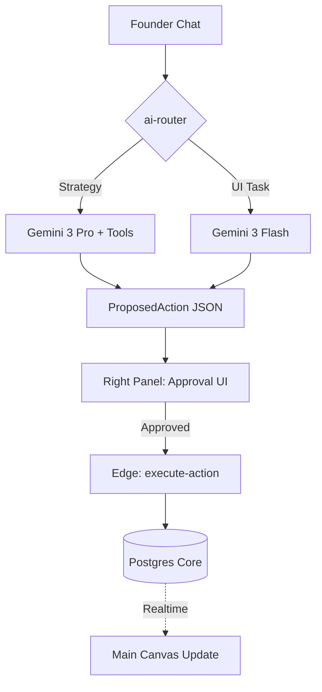
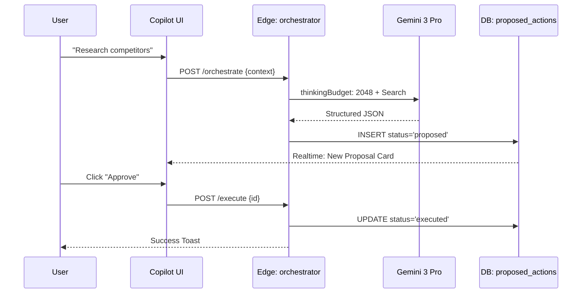

# 🤖 StartupAI Copilot — Chatbot System Specification (v4.3)

# 1) SHORT SUMMARY
The StartupAI Copilot is a context-aware agentic interface that acts as an operational co-founder, transforming natural language intent into structured business actions through a strict **Propose → Approve → Execute** governance model.

# 2) PURPOSE + SUCCESS OUTCOMES
*   **Purpose:** To eliminate operational friction for founders by providing stage-specific guidance, automating document/task creation, and grounding business decisions in real-time market data.
*   **Success Metrics:**
    *   **Time-to-Asset:** Reduction in time to generate a first-draft pitch deck or GTM plan (< 5 mins).
    *   **Approval Rate:** % of AI-proposed actions accepted by the human user (> 80%).
    *   **Actionability:** Number of daily founder tasks generated by the Copilot and subsequently completed.

# 3) CORE UX CONCEPT (3-PANEL)
The Copilot is anchored in the **Right Panel (Intelligence Hub)**. 
*   **Left Panel (Navigator):** Informs the Copilot of the "Current Scope" (e.g., Which startup or deal is being discussed).
*   **Main Panel (Canvas):** Informs the Copilot of the "Current Work" (e.g., What form is open, what slide is being edited).
*   **Right Panel (Copilot):** The persistent chat interface where reasoning happens and **Proposal Cards** are rendered for human sign-off.

# 4) CAPABILITIES (CORE vs ADVANCED)

| Capability | Core (MVP) | Advanced | Why it Matters | Example |
| :--- | :--- | :--- | :--- | :--- |
| **Context Awareness** | Knows current route. | Knows full entity history. | Reduces repetitive input. | "Rewrite the problem on this slide." |
| **Form Filling** | Basic text input. | Multi-select + UI Toggles. | Accelerates onboarding. | "Set my target raise to $2M." |
| **Stage Coaching** | Static stage tips. | Dynamic roadmap pivots. | Prevents "wrong-stage" work. | "You're in MVP stage; focus on churn." |
| **Market Data** | Internal knowledge. | Real-time Search Grounding. | Ensures defensible numbers. | "Find 3 SaaS competitors in Berlin." |
| **Risk Detection** | Basic runway alerts. | Sentiment analysis on deals. | Pre-empts business failure. | "This investor seems hesitant; redo deck?" |
| **Citations** | None. | Verifiable URL links. | Builds founder/investor trust. | "Sources: TechCrunch, Pitchbook." |

# 5) AGENT TYPES (REGISTRY)

| Agent | Purpose | Model | Gemini Tools | UI Location |
| :--- | :--- | :--- | :--- | :--- |
| **Orchestrator** | Routes queries to specialized agents. | Pro | Function Calling | Right Panel |
| **Advisor** | Provides stage-specific strategic advice. | Pro | Thinking Mode | Right Panel |
| **Market Scout** | Conducts competitor/TAM research. | Pro | Search Grounding | Right Panel |
| **Analyst** | Performs financial math/forensics. | Pro | Code Execution | Right Panel |
| **Planner** | Generates tasks and workback schedules. | Flash | Structured Output | Tasks View |
| **UX Filler** | Proposes UI state changes/form fills. | Flash | Structured Output | Active Form |
| **Validator** | Checks proposals for schema/RLS safety. | Flash | responseSchema | Internal (Edge) |

# 6) DATA + CONTEXT MODEL
Every request to the `ai-router` Edge Function includes the following **Context Packet**:

```json
{
  "user_context": {
    "user_id": "uuid",
    "org_id": "uuid",
    "role": "admin"
  },
  "navigation_context": {
    "active_route": "/pitch-decks/:id",
    "active_entity": { "type": "deck", "id": "uuid" },
    "selected_tab": "editor"
  },
  "entity_context": {
    "startup_profile": { "stage": "Seed", "industry": "Fintech" },
    "current_metrics": { "mrr": 5000, "runway": 4.5 }
  },
  "ui_state": {
    "form_values": { "title": "Series A", "target": "" },
    "is_dirty": true
  },
  "history": [ "last_20_activity_log_events" ]
}
```

# 7) PROPOSE → APPROVE → EXECUTE (GOVERNANCE)

### ProposedAction Schema
```json
{
  "action_id": "uuid",
  "type": "update_entity | create_task | send_email | ui_action",
  "label": "Update Fundraising Goal",
  "reasoning": "Based on current burn rate, $2M is required for 18mo runway.",
  "payload": {
    "table": "startups",
    "column": "funding_goal",
    "value": 2000000
  },
  "citations": [ { "title": "SaaS Benchmarks 2025", "url": "https://..." } ],
  "confidence": 0.98
}
```

### Execution Log Schema
```json
{
  "execution_id": "uuid",
  "action_id": "uuid",
  "executed_by": "user_uuid",
  "timestamp": "iso_string",
  "result": "success | error",
  "audit_diff": { "old": 1000000, "new": 2000000 }
}
```

# 8) GEMINI 3 TOOLING PLAN

| Tool | Usage Rule | Priority Model |
| :--- | :--- | :--- |
| **Thinking Mode** | Use for "Strategy" or "Refine Narrative" queries. | Gemini 3 Pro |
| **Search Grounding** | Use for "Market", "Competitors", or "VC Thesis" queries. | Gemini 3 Pro |
| **URL Context** | Use for Step 1 Onboarding and CRM lead enrichment. | Gemini 3 Pro |
| **Code Execution** | Use ONLY for calculating burn, runway, or valuation. | Gemini 3 Pro |
| **Structured Output** | Used for ALL `ProposedAction` generation. | Gemini 3 Flash |
| **Function Calling** | Used by Orchestrator to trigger Edge Function tools. | Gemini 3 Pro |

# 9) SCREEN INTEGRATIONS

| Screen | User Asks... | Bot Action | Approval? |
| :--- | :--- | :--- | :--- |
| `/onboarding` | "Help me fill this." | Scrapes URL + proposes profile fields. | Yes |
| `/dashboard` | "How's my health?" | Analyst Agent audits MRR/Runway. | No (Read only) |
| `/pitch-decks/:id` | "Fix this slide." | Architect proposes narrative rewrite. | Yes |
| `/crm/deals/:id` | "Draft intro." | Scout finds firm history + drafts email. | Yes |
| `/tasks` | "What's next?" | Planner generates 10-step roadmap. | Yes |
| `/automations` | "If deal is closed..." | Generates natural language logic rule. | Yes |

# 10) WORKFLOWS

1.  **Smart Intake:** URL provided → Scout Agent researches → Proposes full profile → User approves → DB updated.
2.  **Deck Sprint:** Slide selected → Architect Agent thinks → Proposes text/charts → User approves → Realtime sync to canvas.
3.  **Lead Scoring:** LinkedIn URL added → Scout searches history → Proposes "Fit Score" → User approves → CRM updated.
4.  **Runway Rescue:** Low cash detected → Analyst runs Python → Proposes cost-cut tasks → User approves → Tasks added.
5.  **Logic Builder:** User describes rule → Automation Agent structures JSON → Proposes rule → User approves → Engine active.

# 11) USER JOURNEYS

### Journey: The Fundraising Sprint (Alex, CEO)
1.  Alex asks Copilot: "I need to raise $1M. Prepare my suite."
2.  Copilot: "I'll start by auditing your financials and drafting a deck." (Thinking: Pro)
3.  Copilot proposes: A 12-slide Sequoia structure in the Right Panel.
4.  Alex clicks **"Approve Deck Structure"**.
5.  Alex asks: "Who should I talk to?"
6.  Copilot uses Search to find 5 VCs in Alex's sector and proposes them as CRM leads.
7.  **Outcome:** Alex has a verified deck and a warm pipeline in 15 minutes.

# 12) MERMAID DIAGRAMS

### 12.1 System Flow


### 12.2 Sequence Diagram


# 13) REAL-WORLD USE CASES

1.  **Seed Fundraising:** User provides a vision; bot generates deck, identifies VCs, and drafts the teaser email.
2.  **MVP Launch:** Bot identifies "Missing Landing Page" and generates a launch task list and GTM doc.
3.  **Runway Risk:** Analyst detects 3-month runway; bot proposes a "Freeze Hiring" task and "Bridge Round" deck.

# 14) EDGE FUNCTIONS

| Name | Purpose | Tooling |
| :--- | :--- | :--- |
| `ai-router` | Main Copilot endpoint. | Gemini 3 Pro |
| `execute-action` | Secure DB writer for approved items. | Node/Postgres |
| `market-research` | Search-grounded deep dive. | Search Tool |
| `financial-analysis` | Math and runway audit. | Code Execution |
| `generate-tasks` | Roadmap decomposition. | Structured Output |

# 15) ACCEPTANCE CHECKS
*   Verify chat history persists in `assistant_messages`.
*   Verify no AI-generated data enters the `startups` table without an `approved` status in `proposed_actions`.
*   Confirm "Citations" are clickable and lead to external sources.
*   Confirm Gemini 3 Flash is used for simple text edits to minimize latency.

# 16) RISKS & MITIGATIONS
*   **Prompt Injection:** System instructions are hidden in Edge Functions, never client-side.
*   **Latency:** Use "Thinking..." skeletons in the UI to manage Pro model wait times.
*   **Cost:** Rate limit Pro calls per user; default to Flash for conversational chit-chat.

# 17) IMPLEMENTATION ROADMAP
*   **P0:** Basic Chat Drawer + Proposal Cards + Execute Edge Function.
*   **P1:** Form-filling UI actions + Slide narrative fixes + Lead scoring.
*   **P2:** Python-driven financial forensics + Deep Research reports + Cross-org benchmarking.