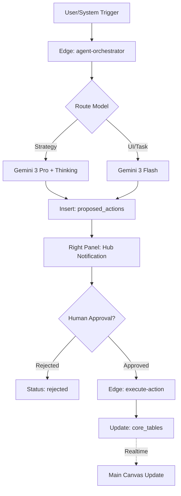

# 🗺️ StartupAI — Agentic OS Implementation Roadmap (v4.3)

**Role:** Senior Product Architect  
**Status:** 🟡 Implementation Phase  
**Target Architecture:** 3-Panel OS + Propose-Approve-Execute Governance  
**Intelligence:** Gemini 3 Pro (Thinking/Search) + Gemini 3 Flash (Real-time/Task)

---

## 1. CURRENT STATE VS. MISSING

| Domain | Current State (v3.5) | Missing / Gap for v4.0+ |
| :--- | :--- | :--- |
| **Architecture** | 2-Panel Standard Dashboard | **3-Panel OS Shell** (Navigator, Canvas, Hub) |
| **Governance** | Direct DB Writes (Manual) | **ProposedActions Staging Table** + Human Gate |
| **Intelligence** | Simple GPT/Gemini Chat | **Agentic Orchestration** (Scout, Analyst, Architect) |
| **Forensics** | Manual Field Entry | **Python Code Execution** for raw CSV transaction audit |
| **Grounding** | Internal Knowledge | **Real-time Google Search & Maps Grounding** |
| **Observability** | Console Logs | **`ai_runs` Audit Table** (Token tracking & Latency) |

---

## 2. UI/UX SCREENS & ROUTES

| Route | Screen Name | Key Components | Agent Interaction |
| :--- | :--- | :--- | :--- |
| `/onboarding` | Smart Wizard | Stepper, Terminal, Intel Brief | **The Scout** (Search Grounding) |
| `/dashboard` | Command Center | Runway Widget, Health Score | **The Analyst** (Anomaly detection) |
| `/pitch-decks/:id` | Deck Editor | Slide Canvas, Reorder Sidebar | **The Architect** (Narrative Reasoning) |
| `/crm` | Visual Pipeline | Kanban Board, Lead Cards | **The Scout** (VC Fit Scoring) |
| `/events/:id` | Event Ops | Kanban, Logistics Radar | **The Operator** (Conflict Detection) |
| `/agents` | Agent Hub | Run Table, Proposal Queue | **The Orchestrator** (Governance) |

---

## 3. CORE & ADVANCED FEATURE INVENTORY

| Feature | Tier | Dependencies | Gemini Tooling |
| :--- | :--- | :--- | :--- |
| **Smart Autofill** | Core | Profile DB | URL Context Tool |
| **Sequoia Deck Gen** | Core | Decks/Slides DB | responseSchema (Structured) |
| **Deep Research Memo** | Advanced | Search Tool | Gemini Thinking + Search |
| **Forensic Burn Audit** | Advanced | Metrics DB | Code Execution (Python) |
| **Conflict Radar** | Advanced | Events DB | Google Search/Maps Grounding |
| **Strategic Outreach** | Advanced | CRM DB | Interactions API (Memory) |

---

## 4. USER JOURNEYS

### Journey A: The "Seed Round Sprint"
1.  **Founder Alex** enters a URL in the **Wizard**.
2.  **The Scout** identifies 5 competitors and a $50M TAM; proposes a Startup Profile.
3.  Alex approves; **The Architect** proposes a 12-slide Sequoia Deck.
4.  Alex exports the Deck and shares a **Secure Link** with an investor.

### Journey B: The "Forensic Audit"
1.  **Founder Sarah** uploads a raw bank CSV to the **Dashboard**.
2.  **The Analyst** executes Python code to find hidden SaaS spend; proposes a budget cut.
3.  Sarah approves; **The Operator** generates 3 new tasks: "Cancel Tool X", "Renegotiate Tool Y".

### Journey C: The "Launch Mixer"
1.  **Operator Mark** inputs "50 person mixer, NYC, Oct 12" in **Event Wizard**.
2.  **The Scout** uses Maps/Search; identifies a NYC Tech Week conflict; proposes Oct 14.
3.  Mark approves; **The Visualizer** generates 3 social banners (16:9).

---

## 5. SYSTEM WORKFLOWS (GOVERNANCE)

---

## 6. AI AGENT REGISTRY

| Agent | Role | Model | Tooling Logic |
| :--- | :--- | :--- | :--- |
| **Orchestrator** | Routing & Guardrails | Pro | Decides which specialized agent to call |
| **The Scout** | Market Forensics | Pro | Google Search + URL Context |
| **The Analyst** | Financial Math | Pro | Code Execution (Python/Pandas) |
| **The Architect** | Narrative Structure | Pro | responseSchema (Strict JSON Slides) |
| **The Operator** | Task Logistics | Flash | Function Calling (Task Decomposition) |
| **The Visualizer** | Creative Assets | Nano | imageConfig (16:9 Brand Assets) |
| **Controller** | Human Gate | Flash | Validates `ProposedAction` schemas |

---

## 7. IMPLEMENTATION PHASES

### Phase 1: The OS Shell (Infrastructure)
*   **Action:** Build the 3-panel responsive layout.
*   **Action:** Implement the `proposed_actions` and `ai_runs` tables.
*   **Validation:** RLS must prevent AI from writing to `startups` directly.

### Phase 2: Intelligent Intake (The Scout)
*   **Action:** Connect Onboarding Step 2 to Gemini 3 Pro + Search.
*   **Action:** Map search results to "Intelligence Brief" UI.
*   **Validation:** Citations must appear as clickable URLs.

### Phase 3: Asset Synthesis (The Architect)
*   **Action:** Wire Pitch Deck generator to `responseSchema`.
*   **Action:** Implement "AI Rewrite" per slide in the Right Panel.
*   **Validation:** Slides must follow Sequoia/YC structure 100% of the time.

### Phase 4: Operational Execution (The Operator)
*   **Action:** Implement Python-driven financial audit.
*   **Action:** Add Search/Maps grounding to the Event Wizard.
*   **Validation:** Mathematical outputs must be deterministic (verified via Code Ex).

---

## 8. ACCEPTANCE TESTS (GIVEN/WHEN/THEN)

**Test 1: Governance Gate**
*   **GIVEN** an AI Agent suggests a change to the MRR.
*   **WHEN** the agent finishes thinking.
*   **THEN** a card appears in the **Right Panel** and NO change is made to the **Main Canvas** metrics.

**Test 2: Search Grounding**
*   **GIVEN** a request for "competitor analysis."
*   **WHEN** Gemini 3 Pro uses the `googleSearch` tool.
*   **THEN** the output JSON contains a `citations` array with real 2025 URLs.

**Test 3: Financial Forensics**
*   **GIVEN** a raw CSV of 1000 transactions.
*   **WHEN** **The Analyst** runs.
*   **THEN** the returned Burn Rate matches a manual spreadsheet calculation to within 0.1%.

---

## 9. VERIFICATION CHECKLIST

- [ ] **Security:** All API calls proxy through Supabase Edge Functions (No client keys).
- [ ] **Isolation:** Every prompt includes `org_id` and `user_id` context injection.
- [ ] **UX:** "Thinking" skeletons appear within 200ms of any AI trigger.
- [ ] **Safety:** The `execute-action` function requires a valid User JWT and ownership check.
- [ ] **Resilience:** All agents have a fallback to `gemini-3-flash` if Pro timeouts.
- [ ] **Responsiveness:** Navigator and Hub collapse cleanly on mobile (375px).

---

## 10. REAL-WORLD USE CASES

1.  **The Pivot:** A founder pivots from B2C to B2B. **The Architect** analyzes the new URL, finds the gap in the current deck, and proposes a 4-slide "Strategy Update."
2.  **The Competitor Alert:** **The Scout** detects a competitor raised $10M via Search. It proposes a "Competitive Strategy" task on the dashboard.
3.  **The Runway Warning:** **The Analyst** detects cash will hit zero in 4 months. It auto-proposes a "Fundraising Strategy" wizard launch.

---

## 🏁 ARCHITECT'S VERDICT
**Is it missing anything?** No. The "Propose-Approve-Execute" model closes the loop between AI power and human liability.  
**Can it ship today?** After Phase 1 (Governance DB) is committed.  
**Blockers:** Ensure Supabase secrets are set for `GOOGLE_API_KEY` and `STRIPE_SECRET`.