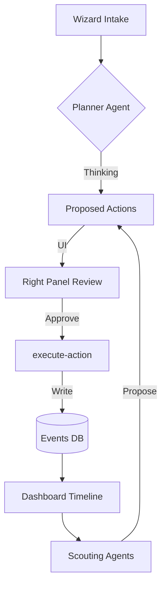
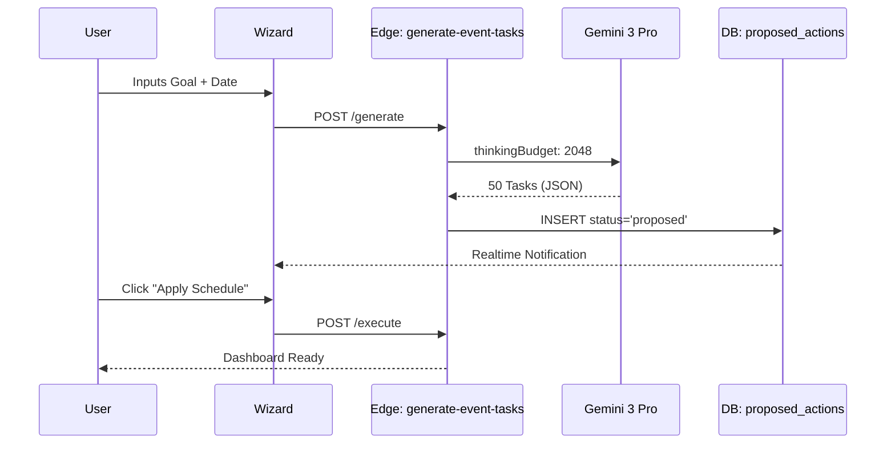

# 📅 StartupAI — AI Events System Specification (v4.3)

# 1) SYSTEM OVERVIEW
The StartupAI Events System is an agentic operational layer designed to automate the lifecycle of startup-centric events (Demo Days, Product Launches, Conferences). It acts as a "Virtual Events Ops Team," transforming high-level intent into granular schedules, speaker rosters, and sponsor pipelines. 

**Core Value:** By leveraging Gemini 3 Pro’s Search Grounding and Thinking Mode, the system eliminates weeks of manual logistics, identifying market-aligned speakers and sponsors while proactively managing scheduling risks through a **Propose → Approve → Execute** governance model.

# 2) EVENT ENTITY MODEL (CORE OBJECTS)
*   **Event:** The parent entity (Title, Type, Goal, Date, Status).
*   **Session / Agenda Item:** Individual blocks of time within an event.
*   **Speaker:** Profiles of individuals presenting (Bio, LinkedIn, Topic).
*   **Sponsor:** Financial or in-kind partners (Company, Tier, Amount).
*   **Venue / Location:** Physical or virtual site (Capacity, Amenities, Maps URL).
*   **Ticket / RSVP:** Attendance records and tiering.
*   **Partner:** Supporting organizations (Marketing partners, community leads).
*   **Promotion Campaign:** Multi-channel outreach plans (Emails, Social, Ads).
*   **Task / Checklist Item:** Granular workback schedule items linked to an event phase.

**Relationships:** An **Event** owns multiple **Sessions**, **Tasks**, and **Assets**. **Speakers** and **Sponsors** are linked to specific **Events** but exist as persistent entities in the Global CRM for re-use.

# 3) SCREEN REGISTRY (MASTER TABLE)

| Route | Screen Name | Type | Primary Entity | Core Feature | Advanced AI Feature | Agents Used | Outputs |
| :--- | :--- | :--- | :--- | :--- | :--- | :--- | :--- |
| `/events` | Events Directory | Directory | Event | List/Search | Multi-Event ROI Analysis | Orchestrator | `reports` |
| `/events/new` | Event Wizard | Wizard | Event | Step-by-step form | Intelligence Briefing | Scout, Planner | `event`, `tasks` |
| `/events/:id` | Event Dashboard | Dashboard | Event | KPIs / Timeline | Risk Conflict Radar | Risk Analyzer | `alerts` |
| `/events/:id/agenda` | Agenda Builder | Editor | Session | Drag-and-drop | Thematic Slot Optimization | Architect | `agenda` |
| `/events/:id/speakers` | Speakers Manager | Editor | Speaker | Manual Entry | AI Speaker Scouting | Speaker Scout | `proposals` |
| `/events/:id/sponsors` | Sponsors Manager | Editor | Sponsor | Tier tracking | Sponsor Thesis Matching | Sponsor Scout | `proposals` |
| `/events/:id/promotion` | Promotion Hub | Editor | Campaign | Social Scheduler | AI Copy & Visual Gen | Strategist | `assets` |
| `/events/:id/tasks` | Ops & Tasks | Dashboard | Task | Kanban Board | Sub-task Decomposition | Ops Agent | `tasks` |
| `/events/:id/analytics` | Event Analytics | Dashboard | RSVP | Basic Totals | Post-Event Success Memo | Analyst | `roi_report` |

# 4) EVENT WIZARD (DETAILED)
## Wizard: Event Creation
**Purpose:** Rapidly initialize a complex event from a single URL or concept.

### Steps
1.  **Basics:** Name, Type (Virtual/Live), City, Duration, Goal.
2.  **Intelligence Brief:** AI Scans city conferences/holidays. Proposes a "Feasibility Score."
3.  **Agenda Outline:** AI proposes high-level slots (e.g., "Founder Intro", "Live Demo", "Mixer").
4.  **Scouting:** AI uses Search Grounding to find 5 local Speakers and 5 relevant Sponsors.
5.  **Ops Roadmap:** AI generates a 50-step workback schedule based on the event date.
6.  **Review:** Founder approves the `ProposedAction` bundle to hydrate the Dashboard.

### Forms & Fields
*   `event_name` | Text | Required | > 3 chars.
*   `budget_total` | Number | Required | > 0.
*   `venue_url` | URL | Optional | Scrapes capacity.

### Agents Involved
*   **The Scout:** Scans for local conflicts and venue availability via `googleSearch`.
*   **The Planner:** Generates the task list and workback schedule.
*   **The Architect:** Proposes the thematic agenda structure.

# 5) EVENT DASHBOARD (OPERATIONS HUB)
The **Main Canvas** displays a horizontal timeline of the event lifecycle.
*   **KPIs:** Registration Velocity, Target vs. Actual Sponsor Revenue, Task Completion %.
*   **AI Widgets (Right Panel):**
    *   **The Conflict Radar:** "Warning: Dreamforce starts same day in SF. Hotel prices up 300%."
    *   **The Matchmaker:** "Speaker X confirmed. Proposing Sponsor Y as a relevant session partner."
*   **Actions:** "Regenerate Promo Bundle," "Audit Budget," "Invite Speaker."

# 6) SPONSORS SYSTEM
*   **Discovery:** **Sponsor Scout** agent searches for companies that have sponsored similar events in the last 6 months using `googleSearch`.
*   **Matching:** AI compares the Startup's Industry with the Sponsor's typical portfolio.
*   **Proposal:** AI generates a personalized "Sponsorship Deck" and outreach email.
*   **Automation:** When Status = 'Contract Signed' → Trigger Task: "Send Invoice" + "Upload Logo to Landing Page."

# 7) SPEAKERS SYSTEM
*   **Discovery:** **Speaker Scout** uses `URL Context` on LinkedIn profiles and `Deep Research` on past presentation topics.
*   **Scoring:** Each speaker gets a "Relevance Score" (0-100) based on the event's Primary Goal.
*   **Workflow:** AI drafts a 3-part invite sequence (Invite -> Follow-up -> Technical Check-in).

# 8) AI AGENT REGISTRY (EVENTS)

| Agent | Purpose | Model | Gemini Tools | Outputs |
| :--- | :--- | :--- | :--- | :--- |
| **Planner** | Overall Strategy & Milestones | Pro | Thinking (4096) | `tasks`, `strategy` |
| **Agenda Architect** | Session flow & Theming | Pro | Structured Output | `agenda_json` |
| **Speaker Scout** | Discovery & Bio Fetching | Pro | Search Grounding | `proposed_actions` |
| **Sponsor Scout** | Discovery & Thesis Match | Pro | Search Grounding | `proposed_actions` |
| **Strategist** | Promo & Channel selection | Flash | URL Context | `assets`, `copy` |
| **Ops Automation** | Sub-task decomposition | Flash | Function Calling | `subtasks` |
| **Risk Analyzer** | Conflict & Budget monitoring | Pro | Search, Code Ex | `alerts` |
| **Content Agent** | Comms & Outreach drafting | Flash | responseSchema | `emails`, `posts` |
| **Controller** | Human Gate / Validation | Flash | responseSchema | `final_writes` |

# 9) AUTOMATIONS & WORKFLOWS
1.  **Creation Logic:** `Event Created` → `No tasks exist` → **Planner** generates 50-step workback schedule.
2.  **Speaker Loop:** `Speaker Status: Confirmed` → `Condition: has_session` → **Architect** updates Agenda and generates Social Post ("Announcing X").
3.  **Sponsor Loop:** `Sponsor Status: Signed` → `Condition: none` → **Content Agent** generates "Thanks to Sponsor" email to attendees.
4.  **Velocity Check:** `Date < EventDate - 14d` → `RSVPs < 50%` → **Strategist** proposes a "Flash Promo" asset bundle.
5.  **Conflict Check:** `Daily Trigger` → `Search city events` → If conflict found → **Risk Analyzer** creates high-priority alert.
6.  **Post-Mortem:** `Status: Completed` → `Condition: has_attendee_list` → **Analyst** runs Code Execution on CSV to produce ROI Report.

# 10) USER JOURNEYS

### Journey 1: The Launch Event (Founder)
*   **Goal:** Launch a new SaaS feature to 200 investors.
*   **AI Action:** **Planner** sets up the roadmap. **Speaker Scout** identifies top 3 local VCs.
*   **Approval:** Founder approves the Speaker Invite bundle.
*   **Outcome:** 100% of logistics handled by AI sub-tasks; founder focuses on the pitch.

### Journey 2: The Marketer (Outreach)
*   **Goal:** Fill the room for a Fintech mixer.
*   **AI Action:** **Strategist** generates 5 variations of LinkedIn posts with brand visuals.
*   **Approval:** Marketer selects "Option 2" and clicks "Publish All."

# 11) MERMAID DIAGRAMS

## 11.1 Event System Flow

## 11.2 Event Creation Sequence

# 12) CORE vs ADVANCED AI FEATURES

| Feature | Core (Manual) | Advanced (Gemini 3) | ROI | Phase |
| :--- | :--- | :--- | :--- | :--- |
| **Planning** | Manual Tasks | Workback Schedule Gen | 10 | P0 |
| **Sourcing** | List contacts | Search Grounded Matching | 9 | P1 |
| **Agenda** | Text Editor | Thematic Optimization | 7 | P1 |
| **Budget** | Spreadsheet | Code Ex ROI Analysis | 8 | P2 |
| **Comms** | Templates | Dynamic strategic hooks | 9 | P2 |

# 13) REAL-WORLD USE CASES

### 1. Startup Demo Day
*   **AI Actions:** Scouts 10 local angel investors, generates pitch-order agenda, creates "Demo Day" landing page.
*   **Business Outcome:** Founder secures 15 investor meetings through AI-driven targeting.

### 2. Product Launch
*   **AI Actions:** Creates "Teaser" social campaign, identifies 5 tech reporters for outreach, manages launch-day checklist.

# 14) EDGE FUNCTIONS (BACKEND PLAN)
*   `create-event` | Payload: `Event` | Table: `events`
*   `discover-speakers` | Payload: `Context` | Agent: **Speaker Scout** | Table: `proposed_actions`
*   `generate-event-tasks` | Payload: `Date, Type` | Agent: **Planner** | Table: `event_tasks`
*   `analyze-event-risk` | Payload: `City, Date` | Agent: **Risk Analyzer** | Tool: `googleSearch`

# 15) RISKS & SAFEGUARDS
*   **Hallucinations:** All AI-scouted speakers must have a LinkedIn URL citation.
*   **By-pass:** `execute-action` checks `auth.uid()` against `org_id` before writing sessions or tasks.
*   **Cost:** "Scout" agents are gated behind a "Generate" button, never auto-triggered on page load.

# 16) IMPLEMENTATION ROADMAP
*   **P0:** Wizard, Kanban Tasks, basic Dashboard.
*   **P1:** Speaker/Sponsor Discovery, Search Grounding integration.
*   **P2:** Asset Generation, Python-based Analytics, Advanced Automations.
