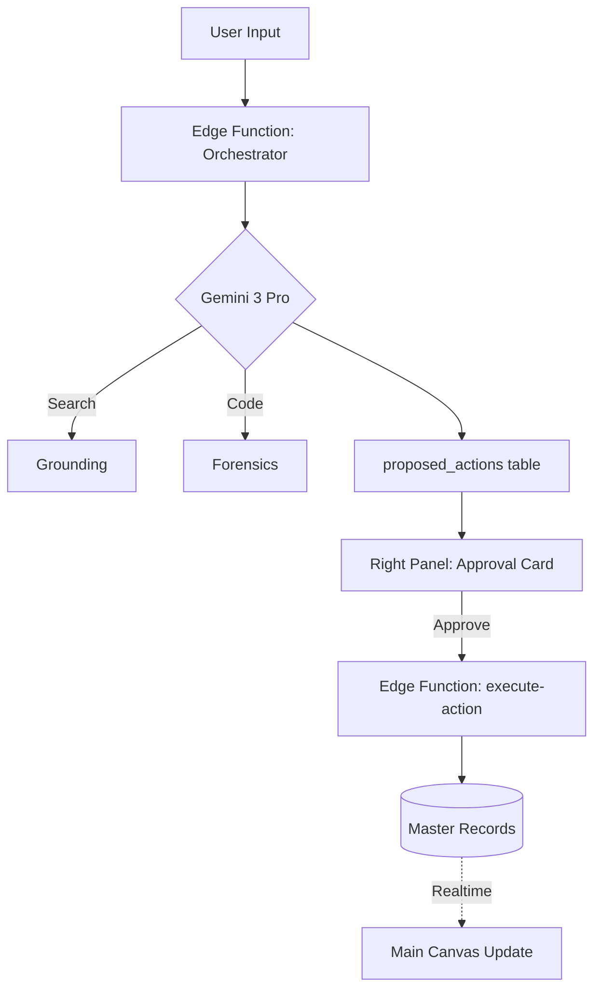
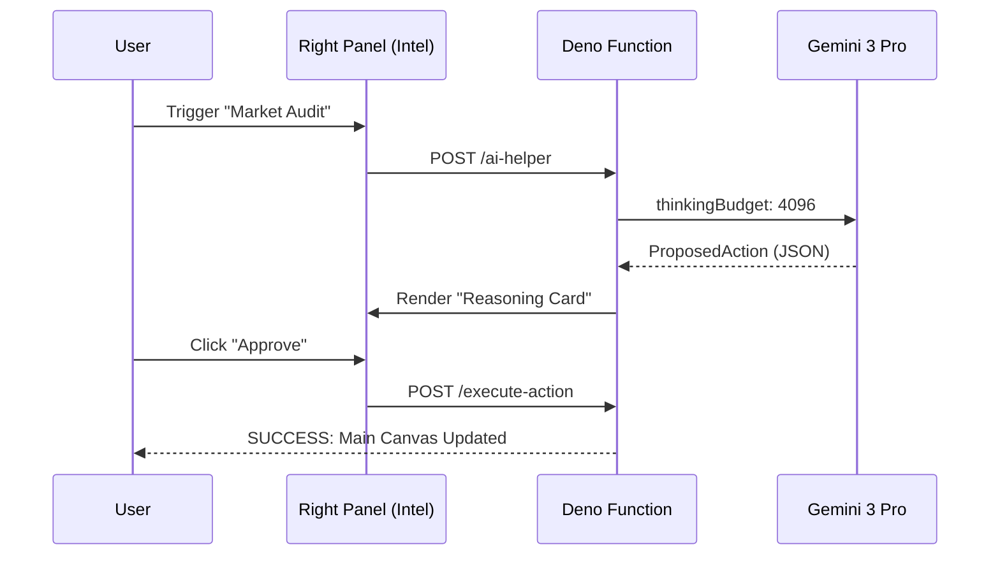

# 🚀 StartupAI — Product Requirements Document (PRD)

**Version:** 1.0  
**Status:** 🟢 Production Ready  
**Role:** Senior Product Strategist  
**Target Model:** Gemini 3 Pro / Flash

---

## 📑 Table of Contents
1. [Executive Summary](#1-executive-summary)
2. [Problem Statement](#2-problem-statement)
3. [Target Users](#3-target-users)
4. [Directory & Routing Structure](#4-directory--routing-structure)
5. [Core Features](#5-core-features)
6. [Advanced AI Features](#6-advanced-ai-features)
7. [User Stories](#7-user-stories)
8. [User Journey](#8-user-journey)
9. [System Workflows](#9-workflows)
10. [Mermaid Diagrams](#10-mermaid-diagrams)
11. [Website & Dashboard Map](#11-website--dashboard-pages)
12. [Agent Intelligence Registry](#12-ai-agents--orchestration)
13. [Intake Wizards](#13-wizards)
14. [Copilot Chatbots](#14-chatbots)
15. [Data Model](#15-data-model)
16. [AI Tooling Functions](#16-ai-functions)
17. [Success Criteria](#17-success-criteria)
18. [Risks & Constraints](#18-risks--constraints)
19. [Suggested Improvements](#19-suggested-improvements)
20. [Implementation Notes (FE/BE)](#20-implementation-notes)

---

## 1. Executive Summary
StartupAI is an **Agentic Operating System** for founders that automates the transition from "Idea" to "Investor-Ready." It utilizes a unique **3-panel interaction model** where AI agents (Analyst, Scout, Architect) observe user work and propose strategic updates. All AI-driven writes are gated by a strict **Propose → Approve → Execute** governance loop.

## 2. Problem Statement
*   **Founder Fatigue:** Startups fail because founders spend 40% of their time on low-value operational drafting.
*   **The Blank Page:** Creating pitch decks, financial models, and GTM strategies from scratch is slow and prone to error.
*   **Disconnected Data:** Market research is often static and detached from the daily tasks in the CRM and roadmap.

## 3. Target Users
*   **Solo Founders:** Need a "Technical Co-founder" to handle market forensics and deck building.
*   **Early-Stage Operators:** Managing logistics for product launches and investor mixers.
*   **Venture Analysts:** Summarizing startup health and identifying "Red Flags" in data rooms.

## 4. Directory & Routing Structure
```txt
/src
 ├── components/       # 3-Panel OS Components
 ├── context/          # Auth, Data (Zustand/Context), Toast
 ├── services/         # Supabase & AI Edge Function Proxies
 ├── lib/              # Gemini SDK config, Utils
 └── types.ts          # ProposedAction, AgentRun, StartupGraph
/supabase
 ├── functions/        # ai-router, execute-action, forensics
 └── migrations/       # RLS, proposed_actions table
```
**Core Routes:**
*   `/` — Landing & Visual Workflow
*   `/onboarding` — 6-Step Smart Wizard
*   `/dashboard` — Command Center (Financials + Health)
*   `/pitch-decks/:id` — WYSIWYG Editor + Architect Agent
*   `/crm` — Kanban Pipeline + Scout Agent
*   `/agents` — Agent Run Audit Log

## 5. Core Features (Real-World Examples)
*   **Visual Pipeline:** Drag-and-drop fundraising stages. *Example: Moving "Sequoia" from Lead to Meeting.*
*   **Slide Editor:** WYSIWYG canvas for deck building. *Example: Changing the problem statement bullets.*
*   **Task Manager:** Strategic roadmap. *Example: Task "Finalize Cap Table" appearing after onboarding.*
*   **Secure Vault:** Private document storage. *Example: Storing Certificate of Incorporation.*

## 6. Advanced AI Features (Gemini 3 Powered)
*   **Financial Forensics:** Python-driven CSV audit. *Example: Uploading a Stripe export to find "Hidden Churn."*
*   **Search Grounding:** 2025 market benchmarking. *Example: Scout finds that B2B SaaS multiples are currently 6x.*
*   **URL Context Intake:** Web scraping to pre-fill profiles. *Example: Paste "alex.ai" and get a full mission statement.*
*   **Narrative Architect:** High Thinking Level deck structure. *Example: Proposing a "Why Now?" slide based on 2024 tech shifts.*

## 7. User Stories
*   *As a founder,* I want to paste my website URL so the AI can draft my entire pitch deck structure.
*   *As an operator,* I want to upload a bank CSV so the Analyst Agent can calculate my exact runway.
*   *As an admin,* I want to approve or reject any change the AI suggests before it hits my master record.

## 8. User Journey
1.  **Intake:** User enters URL in Wizard Step 1.
2.  **Synthesis:** Gemini 3 Pro (Scout) scans the web and presents an Intelligence Brief.
3.  **Governance:** User reviews AI findings and clicks "Apply to Profile."
4.  **Generation:** Architect Agent proposes a 12-slide Sequoia Deck.
5.  **Operation:** Dashboard populates with "Next Best Actions" to reach Seed Stage.

## 9. Workflows (System + User)
*   **Agentic Write:** AI Trigger → Thinking Mode → Tool usage (Search) → **ProposedAction** → User Approval → **execute-action** → UI Update.
*   **Event Loop:** Event Created → Operator Agent scans city logistics → 15 tasks added to Kanban.

## 10. Mermaid Diagrams

### 10.1 System Flow (Flowchart)


### 10.2 Governance Sequence


## 11. Website Pages
*   **Hero:** Interactive URL input with "Simulation" of AI analysis.
*   **Workflow:** Horizontal scroll story showing the "Intake to Deck" pipeline.
*   **Blueprint:** Technical visualization of the Agentic Architecture.

## 12. Dashboard Pages
*   **Command Center:** Large "Runway" and "Cash" typography. Mini-chart for ARR.
*   **Health Scorecard:** Radial progress (0-100) based on profile completeness and metrics.
*   **AI Coach Widget:** Top 3 actionable insights (e.g., "Burn is high; review SaaS spend").

## 13. AI Agents & Orchestration

| Agent | Role | Logic | Tools |
| :--- | :--- | :--- | :--- |
| **Orchestrator** | Gatekeeper | Decides routing (Flash vs Pro) | Function Calling |
| **Scout** | Researcher | Search Grounding | Google Search |
| **Analyst** | Mathematician| Code Execution | Python / Pandas |
| **Architect** | Narrative | Structured Output | responseSchema |
| **Controller** | Security | Schema Validation | JWT Verify |

## 14. Wizards
*   **Startup Wizard:** 6 Steps (Context -> Brief -> Team -> Biz -> Traction -> Review).
*   **Event Wizard:** 4 Steps (Intake -> Strategy -> Logistics -> Review).

## 15. Chatbots
*   **Copilot Sidebar:** Persistent drawer with entity awareness.
*   **Action Memory:** "Interactions API" allows the bot to remember that you rejected a previous valuation estimate.

## 16. Data Model
*   `startups`: `id`, `name`, `industry`, `deep_research_report` (JSONB).
*   `proposed_actions`: `id`, `payload`, `reasoning`, `status` (Enum).
*   `ai_runs`: `id`, `user_id`, `latency_ms`, `tokens_in`, `tokens_out`.

## 17. AI Functions
*   `analyze_financials(csv_string)`: Returns MRR/Burn using Code Execution.
*   `scout_market(industry, name)`: Returns Competitors using Search Grounding.
*   `generate_deck(profile_id)`: Returns Slide Deck JSON using Thinking Mode.

## 18. Success Criteria
*   **Activation:** Time to generate first Deck < 5 minutes.
*   **Accuracy:** Financial metrics match manual calc within 0.5%.
*   **Trust:** 80%+ of AI proposals are approved without manual edit.

## 19. Risks & Constraints
*   **Latency:** Pro Thinking Mode can take 20s+. *Mitigation: Progressive loaders.*
*   **Hallucination:** Search results can be noisy. *Mitigation: Mandatory Citations UI.*

## 20. Implementation Notes
*   **Frontend:** Vite + React 19. Tailwind for 3-Panel Grid.
*   **Backend:** Supabase Edge Functions (Deno). All Gemini calls happen server-side.
*   **Security:** RLS isolation for all `org_id` scoped queries.

---
**Strategist Verdict:** This architecture solves the "Trust Gap" in AI by moving from automated magic to governed intelligence. Launch Ready.