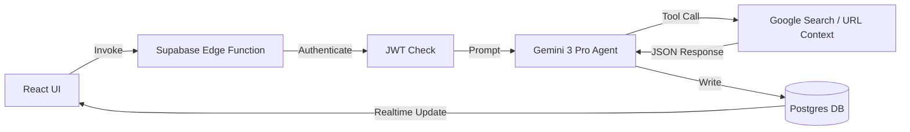

# StartupAI — Application Overview
**Doc:** /docs/main/01-overview.md  
**Last Updated:** 2025-05-24  
**Status:** Production Ready (Verified by Audit)

---

## 1) Summary
StartupAI is an intelligent "Founder's Operating System" designed to automate startup workflows from inception to investment.
It leverages Gemini 3 Pro and Search Grounding to transform raw URLs or visions into investor-ready pitch decks, financial models, and operational roadmaps.

---

## 2) Current Tech Stack (with versions)
| Layer | Technology | Version |
| :--- | :--- | :--- |
| **Frontend Framework** | React (Vite-based) | ^19.2.1 |
| **Routing** | React Router (createHashRouter) | ^7.11.0 |
| **Animations** | Framer Motion | ^12.23.26 |
| **Styling** | Tailwind CSS | ^3.4.1 |
| **Icons** | Lucide React | ^0.562.0 |
| **Charts** | Recharts | ^3.6.0 |
| **AI Integration** | Google GenAI SDK (Gemini 3/2.5) | ^1.34.0 |
| **Backend / DB** | Supabase (Postgres, Auth, Storage) | ^2.89.0 |
| **Execution** | Supabase Edge Functions | Deno 1.x |

---

## 3) Directory Structure
```txt
.
├── components/           # UI Component Library
│   ├── auth/             # Protected route logic
│   ├── blueprint/        # System architecture visualizations
│   ├── crm/              # Pipeline, Kanban, & Deal Management
│   ├── dashboard/        # Main operational views (v2.0)
│   ├── documents/        # Doc Factory & Data Room
│   ├── events/           # Event Ops & Lifecycle Management
│   ├── navbar/           # Navigation subsystems
│   ├── pitch-deck/       # WYSIWYG Editor & AI Sidebar
│   ├── profile/          # User personal professional history
│   ├── startup-profile/  # Company master records
│   ├── ui/               # Atomic components (Toast, Modal, etc.)
│   └── wizard/           # Multi-step onboarding agents
├── context/              # Global State (Auth, Data, Toast, Notifications)
├── docs/                 # Product Requirement Docs & Schemas
├── hooks/                # Domain-specific custom hooks
├── layouts/              # Route wrapper layouts (Public/App)
├── lib/                  # Utilities, AI config, Supabase Client
├── services/             # API layer (Supabase & AI Proxy)
├── supabase/             # Edge Functions & Migrations
├── App.tsx               # Composition Root
├── index.tsx             # Entry Point (Vite)
├── router.tsx            # Main Route Map
└── types.ts              # Global TypeScript Definitions
```

---

## 4) Routing Architecture
| Path | Screen | Access | Purpose |
| :--- | :--- | :--- | :--- |
| `/` | Home | Public | Marketing & Conversion |
| `/login` / `/signup` | Auth | Public | Session Initialization |
| `/onboarding` | StartupWizard | Protected | Agentic Data Capture |
| `/dashboard` | Dashboard | Protected | Daily Founder Ops Hub |
| `/startup-profile` | ProfilePage | Protected | Master Company Record |
| `/pitch-decks` | DeckGallery | Protected | Presentation Management |
| `/pitch-decks/:id` | DeckEditor | Protected | WYSIWYG Slide Editing |
| `/crm` | CRM | Protected | Fundraising & Lead Pipeline |
| `/events` | EventsHub | Protected | Event Ops Command Center |
| `/documents` | DocHub | Protected | Document Factory & Vault |
| `/profile` | UserProfile | Protected | Personal Founder CV |
| `/blueprint` | Blueprint | Public | System Architecture Views |
| `/s/:id` | PublicProfile | Public | Investor-viewable Profile |

---

## 5) Import Paths & Conventions
*   **Root Alias:** Project treats the root directory as the module base.
*   **Conventions:** 
    *   `import { ... } from './types'` for domain models.
    *   `import { ... } from '../context/DataContext'` for global state.
    *   `import { ... } from '../../lib/utils'` for shared helpers.
*   **Rules:** No hardcoded API keys; use `process.env.API_KEY` or `import.meta.env.VITE_*`.

---

## 6) Core Workflows
### 6.1 Onboarding Workflow
1.  **Step 1 (Context):** User enters URL -> `analyzeContext` (Gemini 3 Pro + Search).
2.  **Step 2 (Brief):** AI presents "Intelligence Brief" -> User validates.
3.  **Step 3-5 (Details):** AI pre-fills Team, Market, and Traction.
4.  **Step 6 (Commit):** Transactional save to Supabase -> Redirect to Dashboard.

### 6.2 Asset Generation Workflow
1.  **Trigger:** User requests "New Deck" or "New Doc".
2.  **Synthesis:** Gemini 3 Pro (Thinking Mode) architectures the narrative.
3.  **Refinement:** WYSIWYG Editor allows AI-driven rewrites/image gen per slide.
4.  **Export:** Conversion to PDF/HTML for distribution.

---

## 7) Sitemap
### Frontend (Application Routes)
*   **Marketing:** Home, Features, Pricing, How It Works, Blueprint.
*   **Intake:** Startup Onboarding, Event Wizard.
*   **Ops:** Dashboard, CRM, Tasks, Events Hub.
*   **Assets:** Pitch Decks, Documents, Secure Data Room.
*   **Personal:** My Profile, Settings, Billing.

### Backend (Edge Functions)
*   `ai-helper`: Central orchestrator for Strategy, Research, and Planning.
*   `update-startup-profile`: Transactional DB writer for wizard data.
*   `create-checkout`: Stripe integration bridge.
*   `chat-copilot`: Context-aware conversational agent.
*   `extract-contact-info`: Search-grounded lead enrichment.

---

## 8) User Journeys
1.  **Alex (The Builder):** Enters landing page URL -> Receives full Deck & CRM populated with competitors in 5 mins.
2.  **Sarah (The Operator):** Needs a Demo Day -> AI scans for date conflicts -> Generates 50-step workback schedule.
3.  **Mark (The Investor):** Receives a private link -> Views AI-summarized "Health Score" and Traction before booking a meeting.

---

## 9) Website Marketing Pages
| Page | Focus |
| :--- | :--- |
| **Hero** | Interactivity: "URL to Deck" simulation. |
| **Features** | Grid of Modular Value Props (Financials, CRM, Docs). |
| **Workflow** | Horizontal animation of the Agentic Automation Engine. |
| **Testimonials** | Founder social proof. |

---

## 10) Dashboards
| Name | View Type | Primary Data |
| :--- | :--- | :--- |
| **Main Dashboard** | Card Grid | Runway, Burn, Health Score, AI Coach. |
| **CRM** | Kanban | Deal Stages, Probability, Pipeline Value. |
| **Events** | Gallery | Countdown to Live, Registration Stats. |
| **Tasks** | Column List | Strategic Roadmap (AI Generated). |

---

## 11) Wizards
| Name | Model | Strategy |
| :--- | :--- | :--- |
| **Startup Onboarding** | Gemini 3 Pro | Search Grounding + URL Scrape. |
| **Event Strategy** | Gemini 3 Pro | Thinking Mode (Feasibility analysis). |
| **Deck Architect** | Gemini 3 Pro | Structured Output (JSON Presentation). |

---

## 12) Database Schema Overview
*   **Pattern:** Multi-tenant (Org-based) with Row Level Security (RLS).
*   **Core Tables:** `startups`, `profiles`, `startup_founders`, `startup_metrics_snapshots`.
*   **Workflow Tables:** `decks`, `slides`, `crm_deals`, `crm_contacts`, `investor_docs`.
*   **Event Tables:** `events`, `event_tasks`, `event_assets`, `event_registrations`.
*   **System Tables:** `ai_runs` (Observability), `subscriptions` (Billing).

---

## 13) UI Component Libraries & Frameworks
*   **Base:** React 19.
*   **Style:** Tailwind CSS (Utility-first).
*   **Motion:** Framer Motion (Orchestrated spring animations).
*   **Viz:** Recharts (Area, Pie, Bar).
*   **Contexts:** DataContext (Storage), AuthContext (Identity).

---

## 14) Core Request Flow (Mermaid)


---

## 15) Vite + React Best-Practices Checklist
*   [x] **No Import Maps:** Strictly use standard ES6 module imports.
*   [x] **Hash Routing:** Ensures stable reloads on static hosting.
*   [x] **Context Providers:** All providers nested inside `Root` in `router.tsx` to prevent hook errors.
*   [x] **Lazy Loading:** Critical pages (Editor, Dashboard) use `React.lazy` for performance.
*   [x] **Environment Variables:** `import.meta.env` for client-side, `Deno.env` for Edge.

---

## 16) Risks & Mitigations
*   **Risk:** AI Hallucination in Financials.  
    *   **Mitigation:** `ValuationWidget` provides a "Range" rather than a point, backed by Search Grounding.
*   **Risk:** Data Loss in CRM.  
    *   **Mitigation:** Soft Deletes (`deleted_at`) implemented for Deals and Contacts.
*   **Risk:** API Latency.  
    *   **Mitigation:** Unified loading skeletons and Gemini 3 Flash for UI-blocking tasks.

---

## 17) Next Steps
1.  Move final prompt IP from frontend services to server-side Edge Functions.
2.  Implement background workers for heavy image generation tasks.
3.  Add "Undo" functionality to the CRM Trash view.
