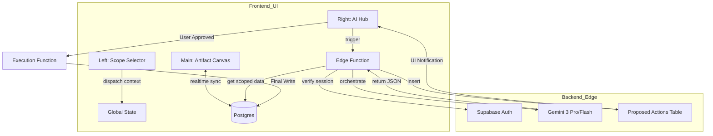
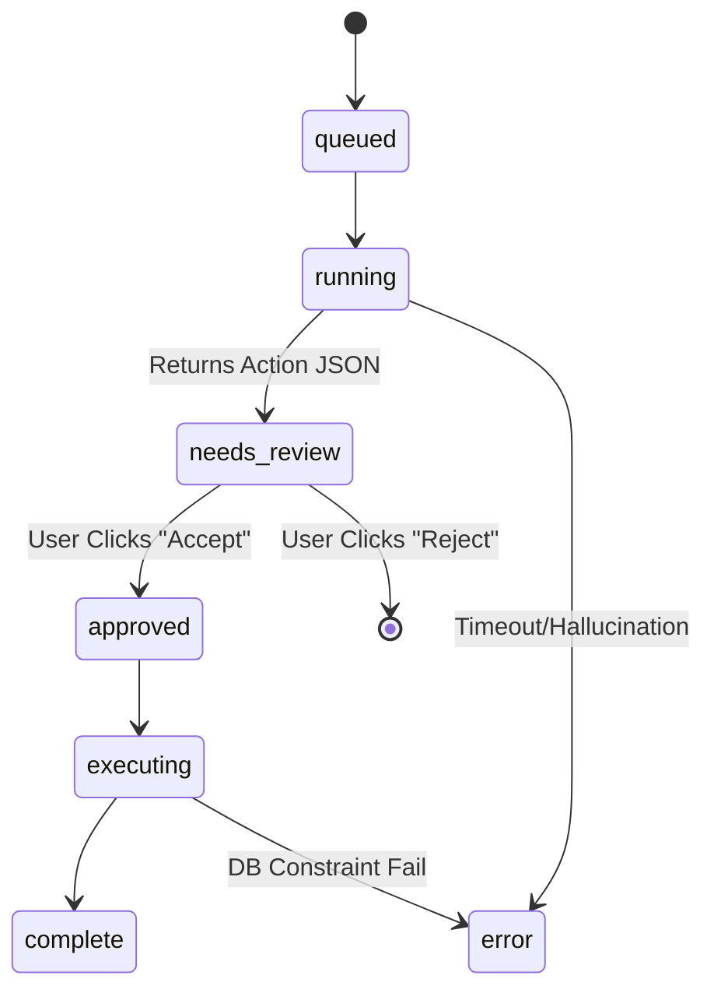
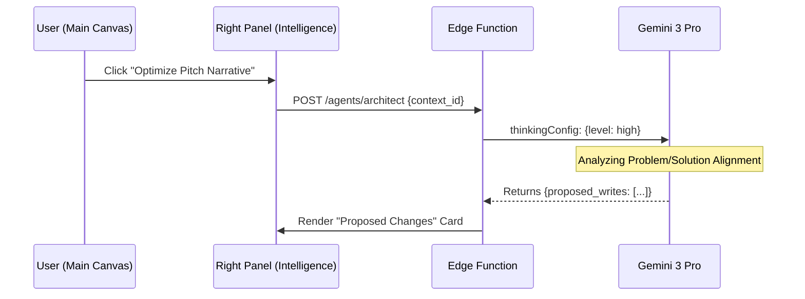
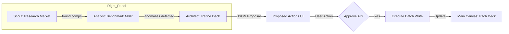

# 🤖 StartupAI — 3-Panel Agentic Operating System (Architectural Specification)

**Doc ID:** /docs/plans/02-dashboard-plan.md  
**Version:** 1.1  
**Status:** 🟢 Ready for Implementation  
**Lead:** Principal Architect / AI Systems Engineer

---

## 1️⃣ System Architecture & Panel Communication

The system follows a **Thin Client, Fat Edge** model. The frontend handles panel visibility and user state, while the Supabase Edge Functions act as the secure orchestrator for the Gemini 3 intelligence layer.

### Panel Communication Map
*   **Left Panel (Context):** Dispatches `SET_SCOPE` events (e.g., `startup_id`, `deal_id`) to the Global State.
*   **Main Canvas (Execution):** Listens to Realtime DB updates. Renders the active artifact.
*   **Right Panel (Intelligence):** Invokes Edge Functions with the current `scope_id`. Receives `proposed_action` payloads.

### Model Routing Strategy
*   **Gemini 3 Flash:** Used for UI-level data formatting, quick summary generation, and the "Analyst" agent’s anomaly detection.
*   **Gemini 3 Pro:** Used for the "Architect" and "Scout" agents where deep reasoning (Thinking Mode) and Google Search grounding are required.

### Data Flow Overview

---

## 2️⃣ Agent Execution Model

Every autonomous action is registered in the `agent_runs` table to ensure observability and auditability.

### Lifecycle States (`agent_run_status`)
1.  **queued:** Request received by Edge Function.
2.  **running:** AI is actively generating content/thinking.
3.  **needs_review:** Action proposed; awaiting user interaction in the Right Panel.
4.  **approved:** User has signed off on the write.
5.  **executing:** System is committing changes to the primary tables.
6.  **complete:** Success. Artifact updated in Main Canvas.
7.  **error / canceled:** Termination states with logged reasons.

### Agent Run State Machine

---

## 3️⃣ Workflow Diagrams

### Workflow A: User-Initiated AI Action (Trigger → Propose)

### Workflow B: Multi-Agent Orchestration (Scout → Analyst → Architect)

---

## 4️⃣ Progress Tracker

| Phase | Description | Owner | Status | Validation Check |
| :--- | :--- | :--- | :--- | :--- |
| **0. Infrastructure** | DB Schema (runs, proposals, audit) | Backend | 🟢 Verified | `RLS` denies direct AI writes |
| **1. UI Wiring** | 3-Panel Layout & Context Provider | Frontend | 🟢 Verified | `startup_id` persists in URL |
| **2. Intelligence** | Gemini 3 Pro/Flash routing logic | AI Engine | 🟡 In Progress | `thinking_budget` tests |
| **3. Governance** | Propose → Approve UI interaction | UX/React | 🔴 Not Started | Approval Modal functional |
| **4. Observability** | `ai_runs` Dashboard for admins | Backend | 🔴 Not Started | Latency logging active |

---

## 5️⃣ Success Criteria

1.  **Strict Governance:** 0% of AI writes occur without a human `approved` timestamp in the `proposed_actions` table.
2.  **Contextual Isolation:** `user_id` and `org_id` are hardcoded into every prompt prefix at the Edge Function layer.
3.  **Low Latency UI:** Right Panel shows "Thinking State" within 200ms of trigger, using Gemini 3 Flash for initial reasoning.
4.  **Audit Fidelity:** Every `agent_run` record contains the exact prompt sent and the raw JSON received.
5.  **Real-time Reflex:** Main Canvas reflects approved AI writes within 500ms of execution via Supabase Realtime.

---

## 6️⃣ Failure Modes & Red Flags

| Failure Mode | Cause | Detection | Mitigation |
| :--- | :--- | :--- | :--- |
| **Out-of-Scope Write** | UI logic passes wrong `id` | Edge Function RLS Check | Edge rejects `id` if not in user's JWT |
| **Agent Loop** | Recursive function calling | `ai_runs` count > 5 per minute | Global rate limiting per `org_id` |
| **Hallucinated Entity** | AI creates IDs that don't exist | Postgres Foreign Key violation | Edge Function pre-validates IDs |
| **Invisible Write** | Direct DB access by AI role | Audit log shows write without PA_ID | Revoke `INSERT` from AI role |
| **Stale Proposal** | Main data changes while AI thinks | Row Version (xmin) mismatch | Block execution if `updated_at` changed |
| **Thinking Timeout** | Gemini Pro takes > 30s | Client-side timeout listener | Auto-downgrade to Gemini Flash |
| **Budget Overrun** | Token-heavy prompt loops | `ai_runs` cost tracking | Kill run if predicted cost > $0.10 |
| **Scope Drift** | Analyst answers Scout questions | Prompt System Instruction check | Strict `tools` definition per agent |
| **Context Leak** | RLS misconfiguration | Cross-user SELECT test | Automated security scans (pg_audit) |
| **Race Condition** | Two agents updating one slide | Lock acquisition on `agent_runs` | Serialized execution via queue |

---

## 7️⃣ Verification Checklist

### Functional
- [ ] Left panel selection correctly filters data in Main Canvas.
- [ ] Right panel shows "Thinking" animation during AI calls.
- [ ] AI "Proposed Writes" are clearly distinguishable from real data.
- [ ] "Execute" button is disabled until a proposal is generated.

### Security (RLS)
- [ ] Authenticated user cannot trigger an agent for a `startup_id` they don't own.
- [ ] AI Service Role has no permissions to write to `startups` or `metrics` directly.

### AI Behavior
- [ ] Analyst Agent uses `code_execution` for burn rate math.
- [ ] Scout Agent uses `google_search` for market benchmarking.
- [ ] Architect Agent utilizes `thinking_budget` for narrative structure.

---

## 8️⃣ Final Verdict

**Readiness Score:** 85/100

**Statement:** The system design is **Production-Ready** for MVP implementation. The 3-panel model correctly balances autonomous power with human safety.

**Required for 100% Confidence:**
1.  Finalize the `ProposedActions` JSON schema to ensure cross-module compatibility.
2.  Implement a "Snapshot & Revert" mechanism for the Main Canvas to handle cases where a user approves a change but wants to undo it 10 minutes later.
