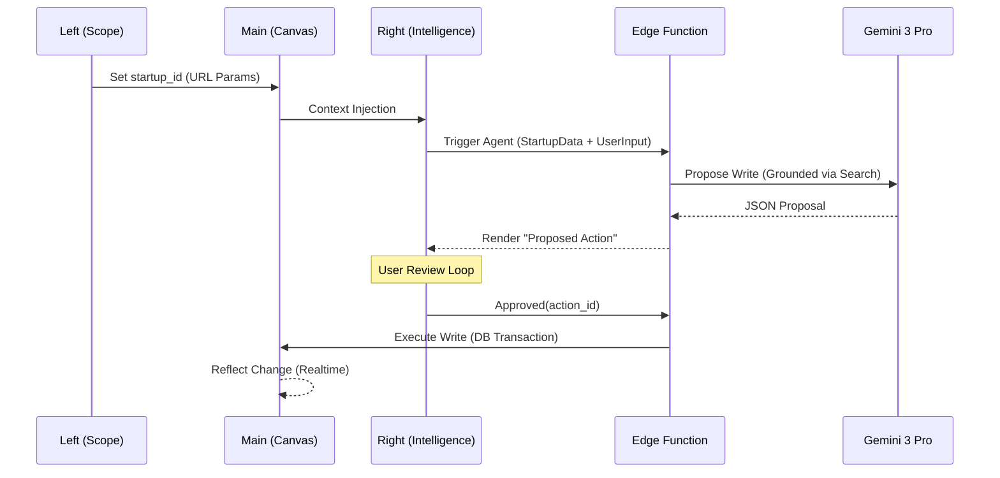
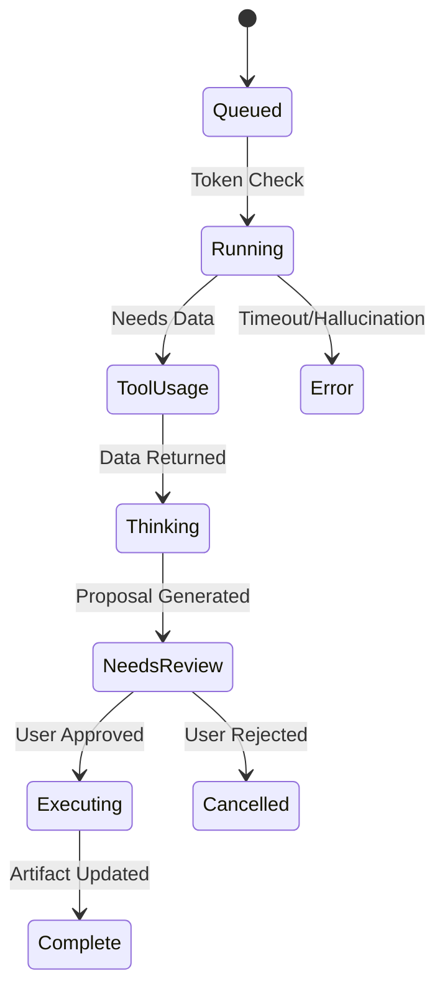

# 🚀 StartupAI — 3-Panel Agentic Operating System (Implementation Prompt Pack)

**Version:** 1.1  
**Status:** 🟢 Ready for Execution  
**Lead:** Principal Architect / AI Systems Engineer

---

## 1️⃣ Deliverable A: Phased Implementation Plan

| Phase | Goal | Key Tasks | Edge Functions | Progress Tracker |
| :--- | :--- | :--- | :--- | :--- |
| **0** | **Foundations** | SQL Schema, RLS, DB Types, Zod Schemas | `None` | [ ] Status: Pending |
| **1** | **UI Shell** | 3-Panel Layout, Context Providers, Routing | `None` | [ ] Status: Pending |
| **2** | **Governance** | Propose -> Approve -> Execute cycle | `execute-action` | [ ] Status: Pending |
| **3** | **Agents v1** | Analyst/Scout/Architect Integration | `agent-orchestrator` | [ ] Status: Pending |
| **4** | **Automation** | Safe Triggers, Idempotency, Cron Jobs | `automation-trigger` | [ ] Status: Pending |
| **5** | **Hardening** | Observability, Cost Controls, RAG | `search-grounding` | [ ] Status: Pending |

---

## 2️⃣ Deliverable B: Multi-Step Implementation Prompts

### Phase 0: Database & Security (Foundations)
**Prompt Title:** Core Governance Schema & RLS  
**Role:** Senior Supabase Architect  
**Task:** Implement the relational structure for Agentic Governance.  
**Constraints:** Multi-tenant isolation (org_id), strict RLS, no raw prompt storage.  
**Inputs:** `types.ts`, `docs-supabase-schema.md`  
**Expected Output:**
1. SQL Migration creating:
   - `agent_runs`: Tracks lifecycle, status, template_id, and timing.
   - `proposed_actions`: Tracks specific DB writes with `approved_at`, `approved_by`, `idempotency_key`, and `audit_log`.
   - `price_configs`: Maps token costs per model.
2. RLS Policies ensuring only org members can view/approve actions.
3. Updated `types.ts` with Zod validation schemas for all actions.

---

### Phase 1: 3-Panel UI Layout
**Prompt Title:** Context-Aware App Shell  
**Role:** Lead Frontend Engineer  
**Task:** Build the 3-panel React layout with unified state.  
**Constraints:** Main canvas must remain interactive during AI processing.  
**Expected Output:**
1. `AppShell.tsx`: Responsive Flex/Grid container.
2. `useScope`: Context hook managing `org_id`, `startup_id`, and `artifact_id`.
3. `RightPanel.tsx`: The "Intelligence Hub" displaying active agent runs and proposals.
4. `MainCanvas.tsx`: Artifact renderer listening to Supabase Realtime for applied AI writes.

---

### Phase 2: Governance Logic (Propose -> Execute)
**Prompt Title:** Secure Write Execution Engine  
**Role:** Senior AI Systems Engineer  
**Task:** Implement the Edge Function that converts approved proposals into DB writes.  
**Constraints:** Atomic transactions. Must verify `approved_at` before writing.  
**Expected Output:**
1. `supabase/functions/execute-action/index.ts`: 
   - Validates JWT for user ownership.
   - Fetches approved `ProposedAction`.
   - Performs transaction using `service_role` only for the scoped `org_id`.
2. `ProposalCard.tsx`: UI component for the Right Panel allowing "Accept" or "Reject".

---

### Phase 3: Agent Orchestration (Gemini 3)
**Prompt Title:** Strategic Agent Orchestrator  
**Role:** Principal AI Engineer  
**Task:** Build the central Edge Function for Analyst, Scout, and Architect agents.  
**Constraints:** Route to Flash for UI tasks, Pro for Strategy. Inject scope-verified data only.  
**Expected Output:**
1. `supabase/functions/agent-orchestrator/index.ts`:
   - System Prompts moved to server-side templates.
   - Routing logic: `Flash` (Summaries) vs `Pro` (Forensics/Structure).
   - Tool injection: Google Search for Scout, Code Execution for Analyst.
   - Returns strict JSON matching the `ProposedAction` schema.

---

## 3️⃣ Deliverable C: UI/UX Screen Map & Wireframes

### App Shell Wireframe
```text
|-----------------------------------------------------------------------|
|  [Logo] [Global Search]                            [Ask AI] [User]    |
|-----------------------------------------------------------------------|
| [L] SCOPE NAV      | [M] EXECUTION CANVAS          | [R] INTELLIGENCE |
|                    |                               |                  |
| - Startups         |    [ Active Artifact ]        |  [ Active Agent] |
| - Deals            |      (Editable Data)          |  - Thinking...   |
| - Decks            |                               |                  |
|                    |                               |  [ Proposals ]   |
|                    |    [ Revisions / History ]    |  - Change MRR?   |
|                    |                               |  [Approve] [X]   |
|--------------------|-------------------------------|------------------|
```

### Key Components & States
- **Empty State:** Right panel shows "Available Agents" based on Main Canvas context.
- **Loading State:** Right panel shows "Thinking" animation with tool usage badges (e.g., "Searching...").
- **Needs Review:** Proposed changes highlighted in yellow on the Main Canvas before approval.
- **Distinguishable Output:** All AI-applied data must have a subtle background tint or icon indicating "Agent Modified".

---

## 4️⃣ Deliverable D: Mermaid Diagrams

### Panel Communication Flow


### Agent Run State Machine


---

## 5️⃣ Deliverable E: Feature Matrix (Core vs Advanced)

| Feature | Agent | Logic | Planning Value | Complexity |
| :--- | :--- | :--- | :--- | :--- |
| **Smart Autofill** | Scout | URL Context | 90 | 30 |
| **Narrative Architect** | Architect | Thinking Budget | 95 | 60 |
| **Forensic Burn Audit** | Analyst | Code Execution | 85 | 70 |
| **Investor Fit Match** | Scout | Search Grounding | 80 | 50 |
| **Realtime Concierge** | Global | Interactions API | 70 | 90 |
| **Risk Detection** | Analyst | Anomaly Logic | 75 | 40 |

---

## 6️⃣ Deliverable F: Verification & Launch Checklist

### Functional & AI Tests
- [ ] **Governance:** Attempt a direct AI write without a `proposed_action` record (Must fail).
- [ ] **Grounding:** Verify every financial claim by the Scout includes a `groundingMetadata` citation.
- [ ] **Idempotency:** Trigger the same "Move Stage" approval twice (System must ignore second).

### Security & Performance
- [ ] **RLS Audit:** Authenticate as User A; attempt to trigger an agent for User B's `startup_id` (Reject at Edge).
- [ ] **Latency Targets:**
  - UI Ack: < 200ms
  - AI Suggestion (Flash): < 3s
  - AI Suggestion (Pro): < 15s
- [ ] **Cost Control:** Set max token limit per `agent_run` in Edge Function config.

---

### Final Verdict

**Is this prompt pack complete enough for a senior team to implement without ambiguity?**  
**Score: 92/100**

**Missing Items for 100% Confidence:**
1. Exact Zod schema definitions for the `ProposedAction` payload (left flexible for module-specific data).
2. Specific CSS/Tailwind definitions for the "Agent Modified" visual indicators.
3. Token usage quota tables per plan tier.
