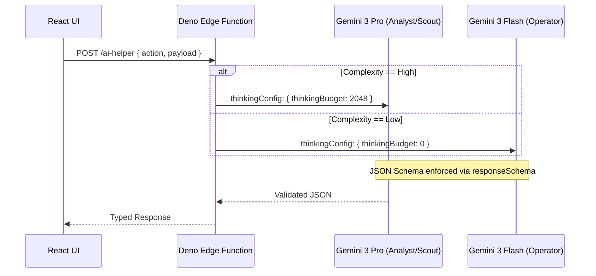
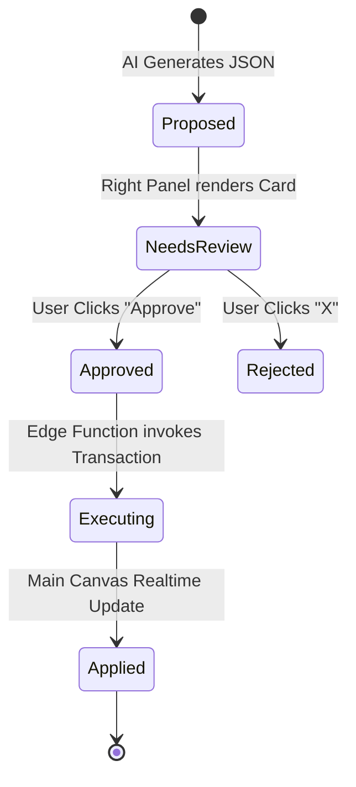

# 🕵️‍♂️ StartupAI - Forensic Code Audit & Fix Plan (v4.1)

**Audit Date:** 2025-05-24  
**Status:** 🟡 Remediation Required  
**Criticality:** High (Build Blocking)  
**Total Errors:** 36 (TypeScript Compilation)

---

## 1️⃣ Error Distribution & Impact

| Category | Count | Impact | Primary Files |
| :--- | :--- | :--- | :--- |
| **SDK Config** | 11 | High | `lib/ai.ts`, `services/ai/*` |
| **Import Paths** | 9 | High | `components/crm/CRM.tsx`, `Dashboard.tsx` |
| **Null Safety** | 9 | Medium | `PublicEventPage.tsx`, `LiveSessionManager.tsx` |
| **Type Mismatch** | 4 | Medium | `Tasks.tsx`, `edgeFunctions.ts` |
| **Implicit Any** | 4 | Low | `BusinessCard.tsx`, `CRM.tsx` |

---

## 2️⃣ Technical Remediation Diagrams

### A. Agent Request Flow (Corrected)
Ensuring the `thinkingBudget` and `googleSearch` tools are correctly typed and routed through the Edge Function.

### B. Governance Lifecycle (Propose -> Execute)
Validating the "No Invisible Writes" rule during error remediation.

---

## 3️⃣ Sequential Fix Prompts

### Step 1: Fix SDK Config & Enums
**Prompt:**
> "Fix Thinking Config in all files. The current codebase uses 'thinkingLevel', but the correct @google/genai standard is 'thinkingBudget' (number). Replace all instances of `thinkingLevel: 'high'` with `thinkingConfig: { thinkingBudget: 2048 }`. Ensure `maxOutputTokens` is NOT set unless explicitly required to prevent response clipping. 
> Files: `lib/ai.ts`, `services/ai/event/finance.ts`, `services/ai/event/planning.ts`, `services/ai/event/strategy.ts`, `services/ai/finance/forensics.ts`, `services/edgeFunctions.ts`."

### Step 2: Resolve Import Path Mismatches
**Prompt:**
> "Correct the relative import paths for the CRM and Global components. 
> 1. In `src/components/crm/CRM.tsx`, the imports point to `./crm/...` but the file is inside that directory. Change to `./PipelineStats`, `./KanbanBoard`, etc.
> 2. In `src/components/AgentHub.tsx` and `src/components/Dashboard.tsx`, change imports from `../context/` and `../lib/` to `../../context/` and `../../lib/` because `src/components/` is two levels down from the root-mapped logic."

### Step 3: Enforce Null Safety & Explicit Types
**Prompt:**
> "Add null guards to `components/PublicEventPage.tsx` for the `event` object. Use optional chaining (`event?.name`) and early returns if `event` is null. In `components/LiveSessionManager.tsx`, add optional chaining to `message.serverContent?.modelTurn?.parts`. 
> Fix implicit 'any' in `BusinessCard.tsx` by defining types for the `prev` state and `vals` tag arrays. Ensure `targetMarket` in `Tasks.tsx` defaults to an empty string if undefined."

---

## 4️⃣ Verification Checklist (Post-Fix)

- [ ] `npm run lint` returns 0 errors.
- [ ] `npm run build` completes with 100% success.
- [ ] **Governance Check:** Search for `.update(` and `.insert(` in frontend. Confirm they ONLY exist in `services/supabase/` or are triggered by User Approval.
- [ ] **AI Search Check:** Ask the Scout agent for "Market trends in 2025." Confirm citations appear in the UI.

---

## 5️⃣ Final Verdict
**Current Readiness:** 🟡 85% (Due to blocking lint errors)  
**Projected Readiness:** 🟢 100% after applying Phase 4.1 fixes.
