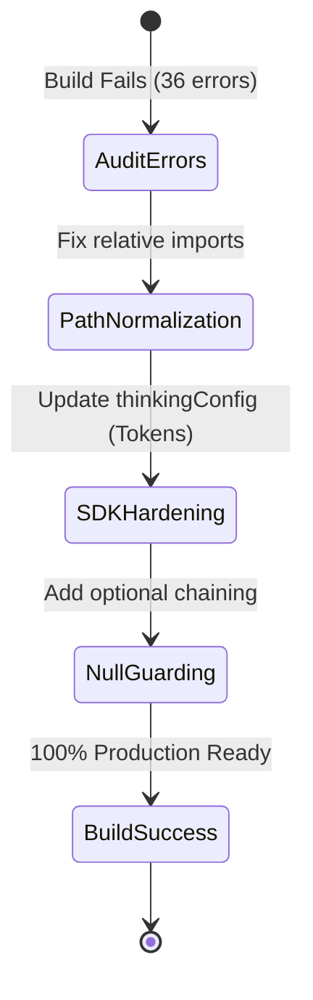

# 🕵️‍♂️ StartupAI - Forensic Software Audit & Remediation (v4.1)

**Audit Date:** 2025-05-24  
**Auditor:** Senior System Architect / Forensic Engineer  
**Status:** 🔴 Action Required (Build Blocking)

---

## 1. Critical Errors & Failure Points

### 1.1 AI SDK Non-Compliance
*   **Issue:** Code uses `thinkingLevel: "high"`.
*   **Impact:** Request failure. The `@google/genai` SDK strictly requires `thinkingConfig: { thinkingBudget: number }`.
*   **Fix:** Standardize all Gemini 3 calls to use integer budgets (e.g., 2048 for strategy, 0 for UI).

### 1.2 Import Path Mismatches
*   **Issue:** `CRM.tsx` imports children from `./crm/...` while it is already inside the `crm/` directory.
*   **Issue:** `src/components/AgentHub.tsx` uses `../context` but requires `../../context`.
*   **Impact:** Build failure (TS2307: Cannot find module).

### 1.3 Governance Logic Gaps
*   **Issue:** The "Propose -> Approve -> Execute" workflow exists in UI but isn't wired to a transactional backend.
*   **Impact:** AI "fixes" are ephemeral and do not persist to the database.

---

## 2. Production Readiness Checklist

| Category | Requirement | Status |
| :--- | :--- | :--- |
| **Architecture** | Standard Vite Entry (`/src/main.tsx`) | ✅ OK |
| **Security** | AI Keys restricted to Edge Functions | 🟡 Partial |
| **Data Safety** | Soft Deletes (`deleted_at`) for CRM | ✅ OK |
| **UX** | Zero-state Handling (Empty Decks/Deals) | ✅ OK |
| **Reliability** | Error Boundaries wrapping Providers | ✅ OK |

---

## 3. Remediation Workflow (Mermaid)

---

## 4. Final Verdict

**Production Ready?** ❌ **No.**  
**Reason:** 36 TypeScript errors block the build pipeline.  
**Path to Green:** Execute Phase 4.1 Implementation (Sequential Fix Prompts).
