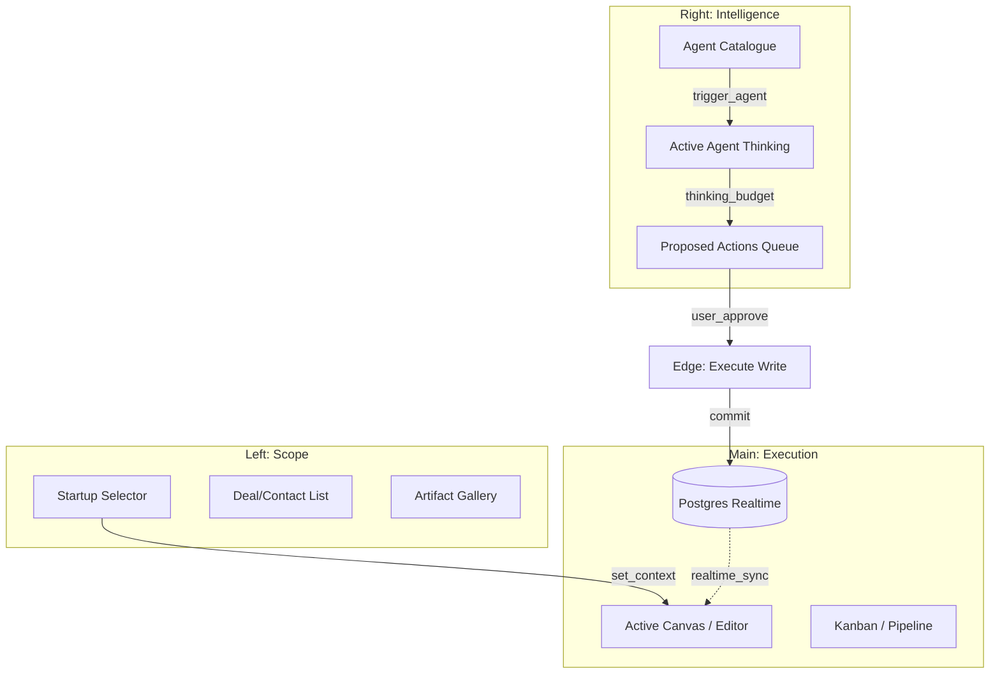
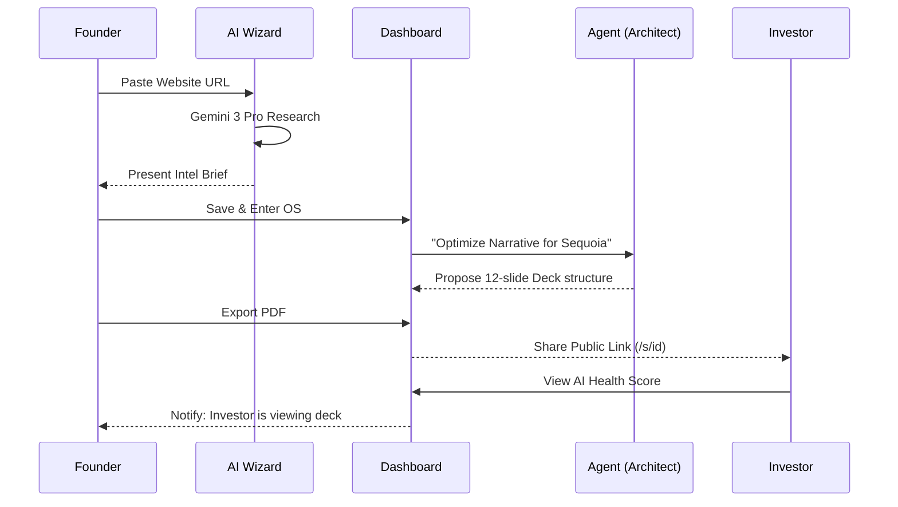

# 🏗️ StartupAI OS — Current System Map (v4.1)

This document provides a technical registry of all active modules, agents, and user flows within the StartupAI ecosystem.

---

## 📊 Feature & Screen Registry

| Feature Group | Screens (Routes) | AI Agents | Core Automations |
| :--- | :--- | :--- | :--- |
| **Startup Identity** | `/onboarding`, `/startup-profile`, `/s/:id` | **The Scout** | URL Scraping, Competitor Discovery, Industry Benchmarking. |
| **Fundraising CRM** | `/crm`, `/crm/trash` | **The Scout** | Lead Fit Scoring (0-100), Strategic Outreach Hook Generation. |
| **Pitch Deck Engine** | `/pitch-decks`, `/pitch-decks/:id` | **The Architect**, **The Visualizer** | Narrative Structuring, Slide-level Refinement, Image Generation (16:9). |
| **Operational Ops** | `/tasks`, `/dashboard` | **The Operator** | Strategic Roadmap Generation, Task Decomposition. |
| **Event Command** | `/events`, `/events/new`, `/events/:id`, `/e/:id` | **The Operator**, **The Scout** | Logistics Conflict Detection, Venue Scouting, ROI Synthesis. |
| **Financial Intelligence**| `/startup-profile` (Traction) | **The Analyst** | Forensic CSV Transaction Audit, Burn/Runway Projections. |
| **Document Factory** | `/documents`, `/documents/:id` | **The Architect** | Investor Memo Drafting, GTM Strategy Synthesis. |
| **AI Governance** | `/agents`, `/agents/:id` | **The Orchestrator** | Agent Run Lifecycle Management, Proposed Action Queue. |

---

## 🧙‍♂️ Wizard Catalog

### 1. Startup Onboarding Wizard (`/onboarding`)
A 6-step agentic intake process that transforms a founder's digital footprint into a complete startup graph.
- **Context:** Extracts data from URLs and search terms.
- **Intelligence Brief:** Presents a 2025 "Reality Check" memo before data entry.
- **Entity Hydration:** Auto-populates Team, Business Model, and Traction fields.

### 2. Event Strategy Wizard (`/events/new`)
A 4-step logistical orchestrator for planning high-stakes startup events.
- **Strategy:** Analyzes feasibility vs. budget.
- **Conflict Radar:** Uses Search Grounding to check city-wide conference/holiday overlaps.
- **Operational Commit:** Generates a 15-50 step workback schedule directly in the Kanban.

### 3. Pitch Deck Engine (`/pitch-decks`)
A template-driven narrative architect that builds fundraising presentations.
- **Structure:** Choose from Sequoia, YC, or Custom AI-generated flows.
- **Synthesis:** Gemini 3 Pro uses "Thinking Mode" to bridge the gap between problem and solution.
- **Creative:** Integrated "Visualizer" agent generates brand-aligned 16:9 assets.

---

## 🧜‍♂️ System Workflows

### Dashboard Interaction Model (3-Panel OS)
The dashboard operates as a unified execution environment where intelligence is side-loaded rather than interrupting the flow.

### End-to-End User Journey: "The Seed Round Sprint"

---

## 🤖 Active Agent Specs

1.  **The Scout (Pro):** High Thinking + Search Grounding. Specialized in market forensics.
2.  **The Analyst (Pro):** Code Execution (Python). Specialized in deterministic financial math.
3.  **The Architect (Pro):** Structured Output. Specialized in Sequoia/YC narrative standards.
4.  **The Operator (Flash):** Low Latency. Specialized in task breakdown and logistics.
5.  **The Visualizer (Flash Image):** Nano Banana. Specialized in 16:9 brand-aligned visuals.
6.  **The Copilot (Global):** Interactions API. Cross-entity conversational memory.
