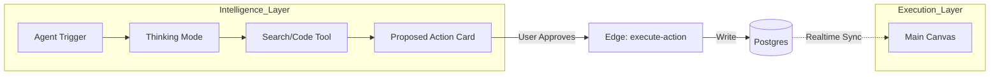

# 🚀 StartupAI v4.2 — 3-Panel Agentic OS & Wizardry

**Status:** 🟢 Final Specification  
**Architecture:** Multi-Agent Orchestration (MAO)  
**Intelligence Layer:** Gemini 3 Pro (Forensics) + Gemini 3 Flash (Real-time)

---

## 📊 Feature & Intelligence Registry

| Feature Group | Screens (Routes) | AI Agents | Core ai agents and Automations | Advanced Capabilities |
| :--- | :--- | :--- | :--- | :--- |
| **Startup Identity** | `/onboarding`, `/startup-profile` | **The Scout** | URL Scraping, Entity Extraction, Competitor Discovery. | **Deep Market Forensics:** Real-time 2025 sector benchmarking via Search Grounding. |
| **Fundraising CRM** | `/crm`, `/crm/trash` | **The Scout** | Lead Scoring (0-100), Auto-Enrichment from LinkedIn URLs. | **Thesis Matching:** Cross-references investor history with startup stage using Thinking Mode. |
| **Pitch Deck Engine** | `/pitch-decks`, `/pitch-decks/:id` | **The Architect** | Narrative Structuring (YC/Sequoia), Slide-level Refinement. | **Nano Visualizer:** 16:9 brand-aligned asset generation via Gemini 2.5 Flash Image. |
| **Operational Ops** | `/tasks`, `/dashboard` | **The Operator** | Roadmap Generation, Task Decomposition, Priority Scoring. | **Conflict Detection:** Identifies overlaps in multi-agent schedules and roadmap blockers. |
| **Event Command** | `/events`, `/events/:id` | **The Operator** | Logistics Generation, Venue Mapping, Registration Sync. | **ROI Synthesis:** Gemini Code Execution (Python) calculates CAC and success metrics post-event. |
| **Financial Intel** | `/startup-profile` (Traction) | **The Analyst** | Burn Rate Calculation, Cash Projections, ARR Trends. | **Forensic Audit:** Direct CSV parsing via Python for anomaly detection and runway validation. |
| **Intelligence Hub** | `/agents`, `/agents/:id` | **The Orchestrator** | Agent Lifecycle Audit, Token Budgeting, Error Handling. | **Governance Engine:** "Propose-Approve-Execute" gate for all autonomous writes. |

---

## 🧜‍♂️ System Workflows: The 3-Panel Interaction Model

StartupAI OS v4.2 moves beyond standard CRUD. It treats the UI as an **Agentic Playground**.

### 1. The Interaction Flow
- **LEFT (Scope):** User selects context (e.g., *Startup A* or *Series A Deck*). No direct editing happens here.
- **MAIN (Execution):** The active canvas (Kanban, Editor, List). This is the source of truth synced to Postgres.
- **RIGHT (Intelligence):** The Agent Hub. Agents observe the Main panel, think, and propose updates.

### 2. The Governance Lifecycle (No Invisible Writes)

---

## ⚡ Active Agent Specs (Gemini 3 Implementation)

### 🕵️ The Scout (Gemini 3 Pro)
- **Tools:** `googleSearch`, `urlContext`.
- **Config:** `thinkingBudget: 2048`.
- **Best Practice:** Use for competitive threats and investor thesis matching. Must return URLs in `groundingMetadata`.

### 🧮 The Analyst (Gemini 3 Pro)
- **Tools:** `codeExecution` (Python/Pandas).
- **Config:** `thinkingBudget: 4096`.
- **Best Practice:** Ingest raw CSV data. Never rely on LLM math; always use Python to calculate MRR and Burn.

### 🏗️ The Architect (Gemini 3 Pro)
- **Tools:** `structuredOutput`.
- **Config:** `thinkingBudget: 4096`.
- **Best Practice:** Enforce YC/Sequoia JSON schemas via `responseSchema` to prevent narrative hallucinations.

### ⚡ The Operator (Gemini 3 Flash)
- **Tools:** `functionCalling`.
- **Config:** `thinkingBudget: 0` (Low Latency).
- **Best Practice:** Used for UI-level tasks: decomposition of high-level goals into 10-15 tactical tasks.

---

## 🗺️ End-to-End User Journey: "The Fundraising Sprint"

1.  **Smart Intake:** Founder Alex enters `https://alex.ai` in the **Onboarding Wizard**.
2.  **Scout Phase:** AI performs "Reality Check," finding 3 competitors Alex missed and a $12M TAM.
3.  **Synthesis Phase:** **Architect Agent** proposes a 12-slide Sequoia Deck based on the findings.
4.  **Governance Phase:** Alex reviews the Deck in the **Right Panel**, clicks "Approve All."
5.  **Execution Phase:** The **Main Canvas** populates with slides. Alex exports PDF.
6.  **CRM Phase:** **Scout** finds 5 VCs who just raised a fund for AI Law; populates the **CRM Kanban**.
7.  **Ops Phase:** **Operator** generates a task list: "Email Sequoia Partner," "Schedule Demo Day."

---

## 🛠️ Gemini 3 Best Practices & Tooling Plan

### 1. Thinking Budget Optimization
- **UI Actions:** Set `thinkingBudget: 0` (Flash) for instant feel.
- **Strategic Briefs:** Set `thinkingBudget: 2048` (Pro) for logical consistency.
- **Forensics/Math:** Set `thinkingBudget: 4096` (Pro) for edge-case detection.

### 2. Guardrails & Safety
- **Context Injection:** Every agent call MUST inject `startup_context` and `org_id` into the system instruction.
- **Tenant Isolation:** Use Supabase RLS at the database level; verify `user_id` matches JWT at the Edge Function level.
- **Token Control:** Never set `maxOutputTokens` unless clipping is desired; allow the model to finish the full JSON schema.

### 3. Error Handling (The 3-Step Fail)
1.  **Agent Failure:** Catch `4xx/5xx` from Edge. Show "Agent Encountered a Logical Block" + Retry button.
2.  **JSON Failure:** If `cleanJson()` fails to parse, route to a Flash "Repair Agent" to fix the braces.
3.  **Timeout:** If Pro takes > 30s, automatically offer a downgrade to Flash for a faster, heuristic response.
