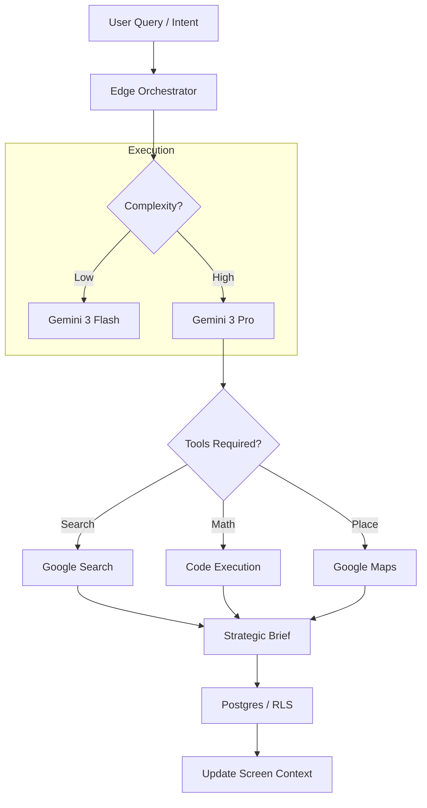

# 🤖 StartupAI — Advanced Agentic Roadmap (v4.0)

**Version:** 4.0 | **Status:** 🟢 Implementation Phase  
**Key Tech:** Gemini 3 Pro (Forensics), Gemini 3 Flash (Real-time), Gemini 2.5 (Geospatial/Live)

---

## 1. Top 10 AI Agents — Real-World Startup Value

This table ranks agents by their ability to change outcomes (Funding, Planning, Execution).

| Rank | AI Agent / Workflow | Type | Logic / Tooling | StartupAI Screen | Planning Value |
| :--- | :--- | :--- | :--- | :--- | :--- |
| **1** | **Founder Strategy Agent** | Advanced | Thinking + Search Grounding | `/startup-profile` | ⭐⭐⭐⭐⭐ |
| **2** | **Pitch Deck Architect** | Core | Structured Output (JSON) | `/pitch-decks` | ⭐⭐⭐⭐⭐ |
| **3** | **Financial Forensics** | Advanced | Code Execution (Python) | `/startup-profile` | ⭐⭐⭐⭐⭐ |
| **4** | **Investor CRM Copilot** | Core | Search Grounding + Memory | `/crm` | ⭐⭐⭐⭐ |
| **5** | **Market Research / TAM** | Advanced | Search Grounding + Citations | `/startup-profile` | ⭐⭐⭐⭐ |
| **6** | **Fundraising Automations** | Core | Trigger -> Function Calling | `/tasks` | ⭐⭐⭐⭐ |
| **7** | **GTM Strategy Planner** | Advanced | Reasoning + Memory Scope | `/documents` | ⭐⭐⭐⭐ |
| **8** | **Event & Logistics Scout** | Advanced | Maps Grounding + Search | `/events` | ⭐⭐⭐ |
| **9** | **Ops Assistant (Chat)** | Core | Interactions API + Context | Sidebar (Global) | ⭐⭐⭐ |
| **10** | **Contextual Memory (RAG)** | Advanced | pgvector + Metadata Scope | `/documents` | ⭐⭐⭐ |

---

## 2. Agent Execution Architecture

Every "Advanced" agent follows a strict **Orchestrator Pattern** to ensure determinism and safety.

---

## 3. Detailed Screen Mapping & Outcomes

### 1. Founder Strategy Agent
*   **Target Screen:** `/startup-profile` (Strategic Narrative Section)
*   **User Action:** Click "Refine Narrative with Gemini 3 Pro."
*   **AI Logic:** Performs a "Pre-mortem" using Thinking mode. It acts as a skeptical VC partner identifying holes in the problem statement.
*   **Outcome:** Converts a weak "Problem Statement" into a "Venture Scalable Thesis" with defensible numbers.

### 2. Financial Forensics (The "Truth" Agent)
*   **Target Screen:** `/startup-profile` (Traction / Metrics Card)
*   **User Action:** Upload a raw CSV export from Stripe/Bank.
*   **AI Logic:** Utilizes **Gemini 3 Code Execution (Python)** to parse the CSV, normalize categories, and calculate true MRR, Net Churn, and Runway.
*   **Outcome:** Automated dashboard metrics that investors can trust because they are derived from raw data, not manual entry.

### 3. Investor CRM Copilot
*   **Target Screen:** `/crm` (Deal Details Drawer)
*   **User Action:** Add an investor URL (e.g., Sequoia.com).
*   **AI Logic:** **Search Grounding** finds the specific partner's thesis, recent investments in the sector, and suggests a "Warm Path" hook for the intro email.
*   **Outcome:** Higher conversion rates for outreach emails.

### 4. Event & Logistics Scout
*   **Target Screen:** `/events` (Logistics Step in Wizard)
*   **User Action:** Enter "Loft-style mixer, 50 people, NYC, $5k budget."
*   **AI Logic:** **Google Maps Grounding** scans for venues matching the vibe and capacity. It cross-references the date against city holidays and conferences (Dreamforce, SXSW) via Search.
*   **Outcome:** Conflict-free, budget-optimized event plan in seconds.

---

## 4. Progress Tracker (Agentic Maturity)

| Milestone | Agentic Level | Status | Target Date |
| :--- | :--- | :--- | :--- |
| **Phase 1** | Level 1: Contextual Chat (Flash) | 🟢 Complete | Live |
| **Phase 2** | Level 2: Structured Output (Decks) | 🟢 Complete | Live |
| **Phase 3** | Level 3: Grounded (Search/Maps) | 🟡 In Progress | Q1 2025 |
| **Phase 4** | Level 4: Deterministic (Code Ex) | 🟡 In Progress | Q1 2025 |
| **Phase 5** | Level 5: Autonomous (Workflows) | 🔴 Backlog | Q2 2025 |

---

## 5. Implementation Workflow: Multi-Step Prompts

### **Step 1: The Brief (Intake)**
Capture raw variables and "Memory Scoping" (ensuring the agent knows which Startup/Project it is acting for).

### **Step 2: The Thought (Thinking Mode)**
Gemini 3 Pro performs reasoning. It outputs a hidden "Thought Trace" that identifies risks before generating the user-facing response.

### **Step 3: The Action (Function Calling)**
Agent returns a Tool Call. The system executes the DB write or API call (e.g., `update_valuation_multiple`).

### **Step 4: The Review (UI Update)**
Data is written to Postgres. Realtime subscriptions update the frontend. User receives a "Toast" notification: *"AI updated your competitive landscape."*

---

## 6. Security & Isolation (RLS)
To prevent cross-tenant data leakage in large context windows:
1.  **Strict Scoping:** Every Agent request includes a mandatory `org_id` in the prompt prefix.
2.  **Memory Clipping:** Long chat histories are summarized into "Context Chips" to keep the window focused and safe.
3.  **Audit Logs:** Every tool call is logged to `ai_runs` with duration and token count.
