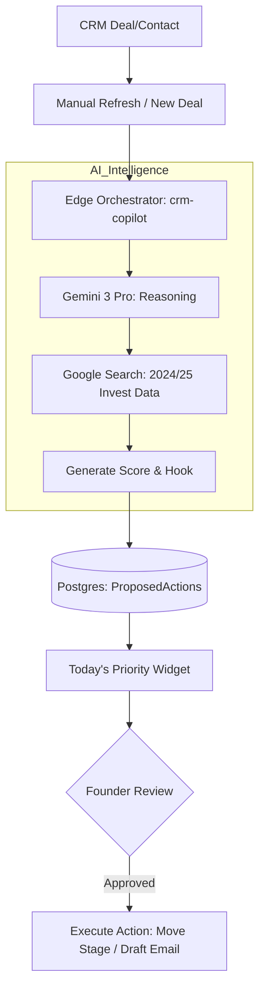

# 🕵️‍♂️ Investor CRM Copilot — Implementation Blueprint (v4.0)

**Doc:** /docs/roadmap/03-investor-crm-copilot.md  
**Status:** 🟡 Implementation Phase (Phase 1/4)  
**Priority:** P0 (Core Fundraising Value)

## 📊 Feature Status & Gaps

| Module | Purpose | Status | Logic |
| :--- | :--- | :--- | :--- |
| **Scoring Engine** | Priority ranking | 🟡 In Progress | Gemini 3 Pro + Search |
| **Enrichment Cache** | Prevent redundant API calls | 🟢 Ready | last_enriched_at logic |
| **Governance Hub** | Propose → Approve flow | 🔴 Pending | ProposedActions table |
| **Warm Hook Gen** | Contextual intro sentences | 🟡 In Progress | Interactions API + Search |

## 🏗️ Technical Architecture

## 🧙‍♂️ Sequential Multi-Step Prompts

### Step 1: Types & Governance Structure
"Update `src/types.ts` to support CRM intelligence. Add `ai_score`, `ai_reasoning`, `last_enriched_at` to `Deal`. Add `fit_score`, `warm_hook`, `sentiment_score` to `Contact`. Create a new `ProposedAction` interface with status tracking (proposed, approved, executed). Add `deleted_at` to all CRM entities for soft-delete safety."

### Step 2: The Agentic Orchestrator (Edge Function)
"Implement a new action `analyze_vc_fit` in the `ai-helper` Edge Function. It should take a `contact_id` and `startup_profile`. Use Gemini 3 Pro with Search Grounding to find the firm's latest 3 investments and generate a fit score + strategic hook. Return structured JSON. Handle timeouts with an AbortController (15s limit)."

### Step 3: Outreach Dashboard Component
"Build `src/components/crm/CopilotCommandCenter.tsx`. This is a high-utility widget that sits above the CRM pipeline. It should display the Top 3 scored leads that haven't been contacted in 7 days. Include a 'Review Hook' button that opens the Email Drafter modal."

## 🛡️ Production Readiness Checklist

- [ ] **Tenant Isolation:** RLS policies verified to prevent cross-startup scoring access.
- [ ] **Governance:** No automated DB writes to core Deal/Contact tables from AI (all via `ProposedAction`).
- [ ] **Idempotency:** Unique keys on enrichment logs to prevent duplicate search costs.
- [ ] **Explainability:** UI shows "Reasoning Bullets" from the AI to build trust.
- [ ] **Mobile Ready:** Outreach card stacks into a single list on mobile views.
