# StartupAI - Core Sitemap

**Version:** 1.1 | **Status:** Planning

---

## Site Structure

```mermaid
flowchart TB
    subgraph Public["🌐 PUBLIC"]
        HOME["/"]
        FEATURES["/features"]
        PRICING["/pricing"]
        LOGIN["/login"]
        SIGNUP["/signup"]
    end

    subgraph App["📱 APP"]
        WIZARD["/onboarding"]
        DASH["/dashboard"]
        DECKS["/pitch-decks"]
        CRM["/crm"]
        DOCS["/documents"]
        TASKS["/tasks"]
        SETTINGS["/settings"]
    end

    HOME --> LOGIN --> WIZARD
    SIGNUP --> WIZARD --> DASH
```



---

## Core Pages

### Public (5 pages)

| Route | Page | Purpose |
|-------|------|---------|
| `/` | Home | Landing page, hero, features, CTA |
| `/features` | Features | Feature list with descriptions |
| `/pricing` | Pricing | Plans: Free, Founder, Growth |
| `/login` | Login | Email/password + Google OAuth |
| `/signup` | Sign Up | Registration form |

### App (7 sections)

| Route | Page | Purpose |
|-------|------|---------|
| `/onboarding` | **Startup Wizard** | Initial data collection & AI setup |
| `/dashboard` | Dashboard | KPIs, recent activity, quick actions |
| `/pitch-decks` | Pitch Decks | Deck list, wizard, editor |
| `/crm` | CRM | Contacts, deals pipeline |
| `/documents` | Documents | Document hub, editor |
| `/tasks` | Tasks | Task manager, workflows |
| `/settings` | Settings | Profile, team, billing |

---

## Google Studio Prompts

### 🏠 Home Page

```
Create a SaaS landing page for "StartupAI" - AI startup operating system.

Sections:
1. Hero - headline, subheadline, 2 CTA buttons, stats bar
2. Features - 6 cards (Pitch Decks, CRM, Documents, Tasks, Financials, Data Room)
3. How It Works - 3 steps
4. Pricing - 3 plans preview
5. CTA - email signup
6. Footer

Style: Modern, clean, indigo/violet accents
```

### 💰 Pricing Page

```
Create a pricing page for "StartupAI".

3 tiers:
- Free: $0 - 1 deck, basic features
- Founder: $29/mo - unlimited decks, CRM, 5 docs
- Growth: $79/mo - everything + team, data room

Include: Feature comparison table, FAQ section
Style: Clean cards, highlight Founder tier
```

### 📊 Dashboard

```
Create a dashboard for "StartupAI".

Layout:
- Left sidebar: nav menu
- Top bar: search, notifications, user
- Main: KPIs (4 cards), recent activity, quick actions

KPIs: Decks, Deals, Tasks Due, Documents
Style: Clean, minimal, card-based
```

### 🎯 Pitch Deck Editor

```
Create a pitch deck editor.

3-panel layout:
- Left (250px): Slide list thumbnails
- Center: Slide canvas with edit controls
- Right (300px): AI tools panel

Top bar: Back, title, Present button, Export button
Style: Clean, focused, minimal distractions
```

### 👥 CRM Pipeline

```
Create a CRM deals page with Kanban board.

Columns: Lead → Qualified → Meeting → Proposal → Closed
Cards: Company, value, contact, next task
Top bar: Filters, search, + Add Deal

Style: Clean Kanban, drag-drop cards
```

### ✅ Task Manager

```
Create a task manager with 5-step workflow.

5 phases: Research → Strategy → Plan → Execute → Review
KPIs: High Priority, In Progress, Completed
Kanban: Backlog → In Progress → Review → Done

Style: Clean cards, progress indicators
```

### 🧙‍♂️ Startup Wizard (New)

```
Create a multi-step onboarding wizard.

Steps:
1. Company Basics
2. Problem/Solution
3. Market & Metrics
4. Team
5. AI Review

Style: Focused, single-column, progress steps on top.
```

---

## Navigation

### Sidebar Menu

```
📊 Dashboard
🎯 Pitch Decks
👥 CRM
📄 Documents
✅ Tasks
⚙️ Settings
```

### User Flow

```
Home → Sign Up → Onboarding Wizard → Dashboard → Create Deck
                                       ↓
                                 Populate CRM/Docs
```

---

## Page Priority

| Priority | Pages | Status |
|----------|-------|--------|
| **P0** | Home, Login, Dashboard, Pitch Decks, **Wizard** | 🟡 WIP |
| **P1** | Pricing, CRM, Documents | 🟢 Done |
| **P2** | Tasks, Settings, Features | 🟡 WIP |

---

**Total: 12 core pages**
