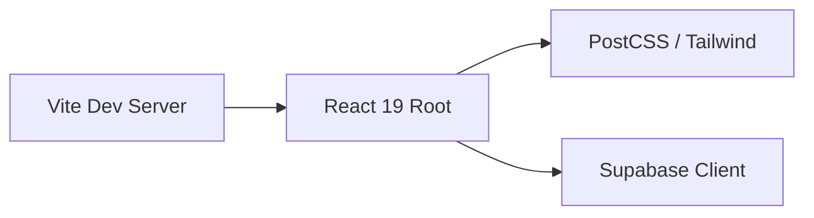

# 01 - Foundation & Core Setup

## 📊 Progress Tracker
- [ ] Initialize Vite + React + TS 0%
- [ ] Install Core Dependencies 0%
- [ ] Configure Tailwind + StartupAI Palette 0%
- [ ] Setup Supabase Client 0%

## 📋 Implementation Order
| Step | Task | Tools |
| :--- | :--- | :--- |
| 1 | Scaffolding | Vite |
| 2 | UI Framework | Tailwind, Lucide |
| 3 | Backend Client | @supabase/supabase-js |
| 4 | State/Types | context/types.ts |

## 🛠️ Multi-Step Prompts

### Prompt A: Scaffolding
> Initialize a Vite project with React and TypeScript. Standardize the `index.html` to remove all CDN scripts and import maps. Set up `tailwind.config.js` with the StartupAI neutral color palette (#1A1A1A, #F7F7F5, #FF6A3D) and Inter/Playfair Display font families.

### Prompt B: UI Utilities
> Configure the `cn` utility in `src/lib/utils.ts` using `clsx` and `tailwind-merge`. Ensure all `lucide-react` icons are available for standard UI primitives.

### Prompt C: Supabase Setup
> Create `src/lib/supabase.ts`. Initialize the client using `import.meta.env.VITE_SUPABASE_URL` and `VITE_SUPABASE_ANON_KEY`. Add a check function `isSupabaseConfigured()` to enable safe guest-mode fallbacks.

## 🏗️ Screens Involved
*   `Global Layout`: Root configuration for fonts and styles.

## 🧜‍♂️ Diagrams

## 🌟 Real-World Use Cases
1. **Developer Velocity**: Instant reloads and type safety across the repo.
2. **Connectivity**: Ready to fetch data room files from day one.
