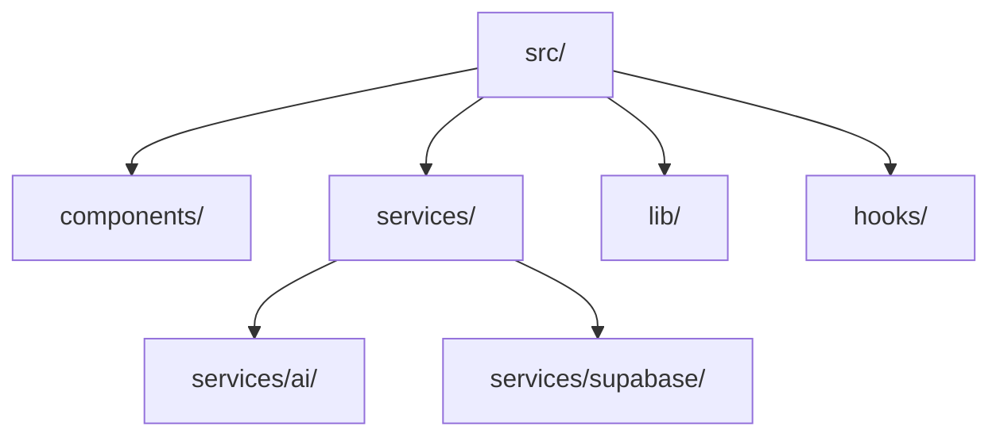

# 02 - Directory Structure & Conventions

## 📊 Progress Tracker
- [ ] Enforce Path Normalization 0%
- [ ] Define Domain Folders 0%
- [ ] Standardize File Naming 0%

## 📋 Implementation Order
| Step | Task | Target |
| :--- | :--- | :--- |
| 1 | Refactor imports | src/components |
| 2 | Domain Isolation | src/services |
| 3 | AI Logic Mapping | src/lib/ai |

## 🛠️ Multi-Step Prompts

### Prompt A: Path Normalization
> Audit all existing imports in `App.tsx` and `Dashboard.tsx`. Normalize relative paths to use absolute roots or clean `./` patterns. Remove any references to a nested `src/src` folder. Move all types to `src/types.ts`.

### Prompt B: Service Layer
> Create a modular service directory: `src/services/supabase/` for DB CRUD and `src/services/ai/` for Edge Function proxies. Every service must use a mapper pattern to convert DB JSON into UI Types defined in `src/types.ts`.

## 🏗️ Screens Involved
*   N/A (Structural Task)

## 🧜‍♂️ Diagrams

## 🌟 Real-World Use Cases
1. **Onboarding**: A new engineer knows exactly where "The Scout" logic lives by looking at the `services/ai` folder.
2. **Security**: Prompt logic is air-gapped in services/edge-functions, not leaked in UI components.
