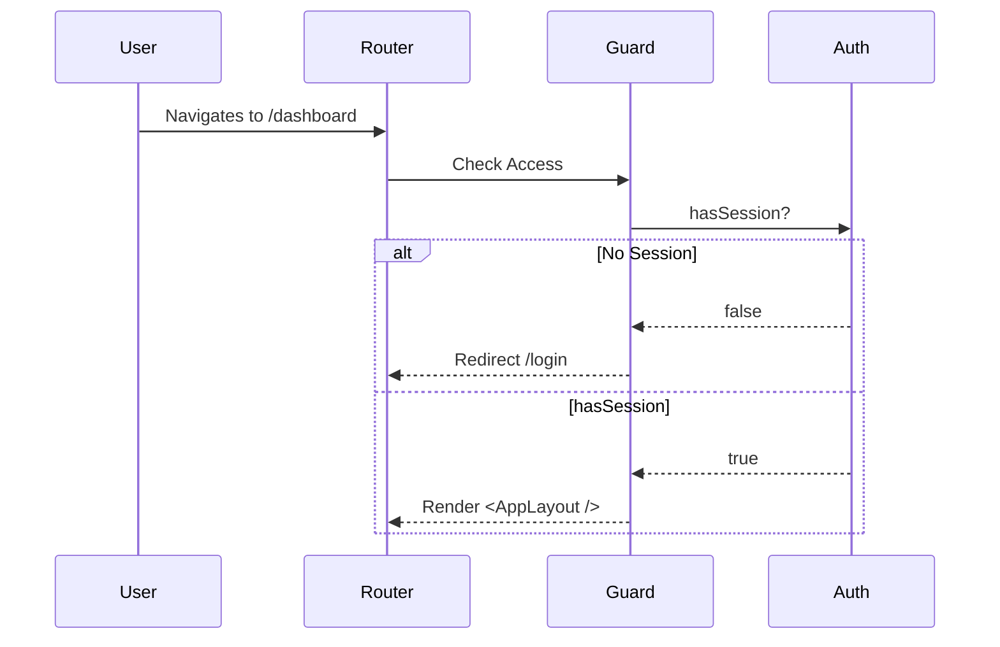

# 03 - Routing & Route Guards

## 📊 Progress Tracker
- [ ] Implement createHashRouter 0%
- [ ] Setup ProtectedRoute 0%
- [ ] Configure Org-Context Guard 0%

## 📋 Implementation Order
| Step | Task | Logic |
| :--- | :--- | :--- |
| 1 | HashRouter | router.tsx |
| 2 | Auth Guard | ProtectedRoute.tsx |
| 3 | Org Guard | useOrgGuard.ts |

## 🛠️ Multi-Step Prompts

### Prompt A: Router Strategy
> Implement `createHashRouter` in `src/router.tsx` to ensure stable reloads on static hosting. Define top-level layouts for `PublicLayout` and `AppLayout`. Map all routes from the Registry, including `/onboarding`, `/dashboard`, and `/pitch-decks/:id`.

### Prompt B: Protected Routes
> Create a `ProtectedRoute` component. Logic: If no `supabase.auth` session exists, redirect to `/login`. If session exists but no `org_id` is present in the profile, redirect to `/onboarding`.

## 🏗️ Screens Involved
*   `/login`
*   `/signup`
*   `/onboarding` (Context-aware entry point)

## 🧜‍♂️ Diagrams

