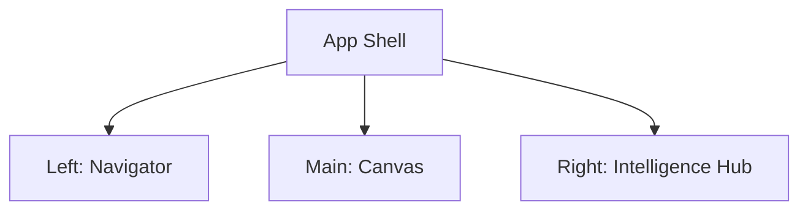

# 04 - 3-Panel Layout Shell

## 📊 Progress Tracker
- [ ] Build Main Grid System 0%
- [ ] Implement Navigator (Left) 0%
- [ ] Implement Canvas (Main) 0%
- [ ] Implement Intelligence Hub (Right) 0%

## 📋 Implementation Order
| Step | Task | Responsive Rule |
| :--- | :--- | :--- |
| 1 | Flex Container | 100vh, overflow-hidden |
| 2 | Left: Navigator | Sticky 280px, hide on mobile |
| 3 | Main: Canvas | Flex-grow, scrollable |
| 4 | Right: Hub | Sticky 380px, hide on mobile |

## 🛠️ Multi-Step Prompts

### Prompt A: Layout Frames
> Design the `AppLayout` as a 3-panel grid system. Left Panel (280px) is the Navigator for scope control. Center Panel (Flex-1) is the Work Canvas. Right Panel (380px) is the Intelligence Hub. Use `z-index` layers for mobile drawer fallbacks. Ensure backgrounds are high-contrast neutral (#1A1A1A sidebar vs #F7F7F5 canvas).

### Prompt B: Responsive Logic
> Implement a `usePanelState` hook. On screens < 1024px, the Navigator and Hub must be collapsible drawers. The Canvas must remain the primary touch surface. Toggle buttons for Nav and Hub should appear in a sticky top header.

## 🏗️ Screens Involved
*   **Global App Shell**: Wraps all `/dashboard`, `/crm`, `/pitch-decks` routes.

## 🧜‍♂️ Diagrams

