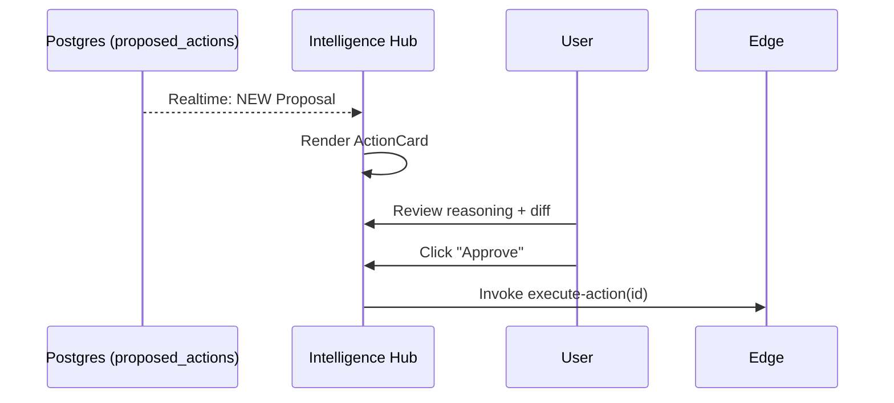

# 05 - Right Panel Intelligence Hub

## 📊 Progress Tracker
- [ ] Build Agent Status UI 0%
- [ ] Build Proposed Action Cards 0%
- [ ] Wire Realtime Notifications 0%

## 📋 Implementation Order
| Step | Task | UI Element |
| :--- | :--- | :--- |
| 1 | Thinking State | Skeleton + Pulse |
| 2 | Proposal Card | Diff View + Approve Button |
| 3 | Citations | Clickable URL chips |

## 🛠️ Multi-Step Prompts

### Prompt A: Intelligence Hub Component
> Build `src/components/agents/IntelligenceHub.tsx`. It must subscribe to the `proposed_actions` table for the current `startup_id`. When an agent returns a 'proposed' action, render a card showing the reasoning and the proposed change.

### Prompt B: The Proposal Card
> Design the `ProposedActionCard`. It must show: 1) Agent Icon/Name (e.g., The Scout), 2) Reasoning (Markdown), 3) Confidence Score, 4) A visual "Diff" of the proposed write, 5) Primary "Approve" button.

### Prompt C: Citations & Search Grounding
> Implement a `CitationsList` component. When Gemini 3 Pro returns search grounding data, parse the `groundingMetadata` and render real URLs as clean badges that open in new tabs.

## 🏗️ Screens Involved
*   Persistent on all protected routes.

## 🧜‍♂️ Diagrams

