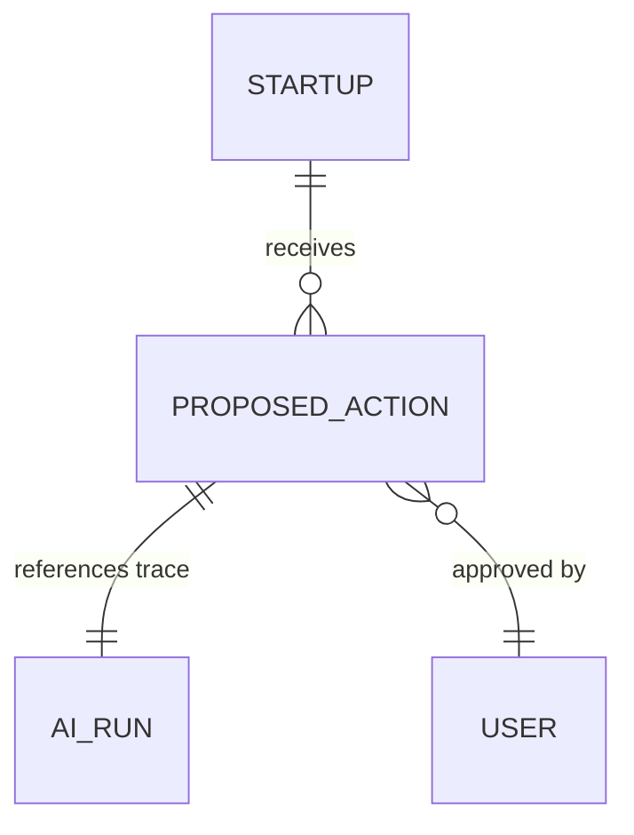

# 06 - Governance: Proposed Actions Schema

## 📊 Progress Tracker
- [ ] Create `proposed_actions` table 0%
- [ ] Create `ai_runs` table 0%
- [ ] Configure RLS Policies 0%

## 📋 Implementation Order
| Step | Task | SQL Logic |
| :--- | :--- | :--- |
| 1 | Migration | `proposed_actions` + `ai_runs` |
| 2 | Enums | action_status, agent_name |
| 3 | Security | RLS: auth.uid() scoping |

## 🛠️ Multi-Step Prompts

### Prompt A: Governance Migration
> Write a SQL migration for Supabase. Create `proposed_actions` table: `id`, `org_id`, `startup_id`, `entity_type`, `entity_id`, `payload` (JSONB), `reasoning` (Text), `citations` (JSONB), `status` (proposed, approved, rejected, executed). Enable RLS.

### Prompt B: Audit Log Migration
> Create `ai_runs` table: `id`, `agent_name`, `model`, `input_tokens`, `output_tokens`, `latency_ms`, `tools_used` (Text[]). This table is write-only for the `service_role` to prevent user tampering with audit logs.

## 🏗️ Screens Involved
*   `/agents` (Audit Log Dashboard)

## 🧜‍♂️ Diagrams

