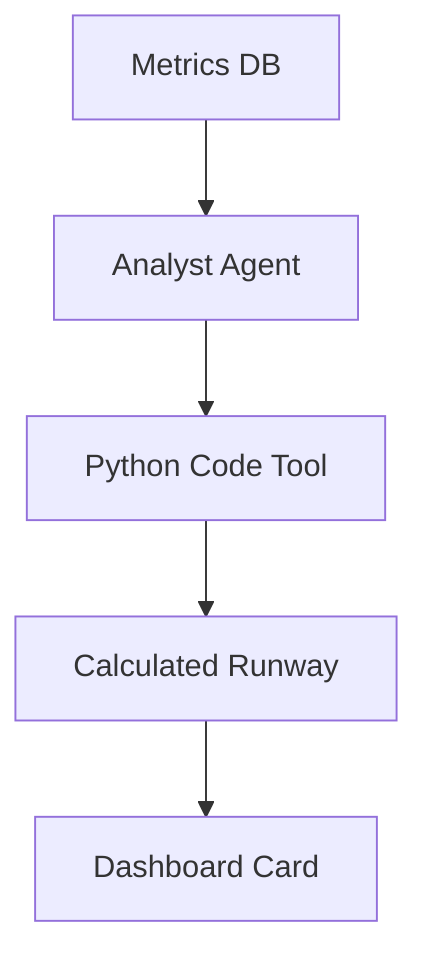

# 09 - Dashboard Command Center

## 📊 Progress Tracker
- [ ] Financial Runway Widget 0%
- [ ] Health Scoreboard 0%
- [ ] AI Coach Widget 0%

## 📋 Implementation Order
| Step | Task | AI Tool |
| :--- | :--- | :--- |
| 1 | Runway Forensics | Code Execution |
| 2 | Health Logic | Analyst Agent |
| 3 | Charts | Recharts |

## 🛠️ Multi-Step Prompts

### Prompt A: Command Center UI
> Build the `/dashboard` Main Canvas. Feature a prominent "Runway" typography (Months left). Below it, render an ARR Trend chart. Right Panel: "AI Coach" proposing cost-saving tasks if burn is too high.

### Prompt B: Forensic Math Agent
> Wire the "Analyst" agent. Use Gemini 3 Pro with `codeExecution`. Pass a CSV string of mock transactions. AI must generate Python code to calculate true Monthly Burn and Remaining Runway.

## 🏗️ Screens Involved
*   `/dashboard`

## 🧜‍♂️ Diagrams

